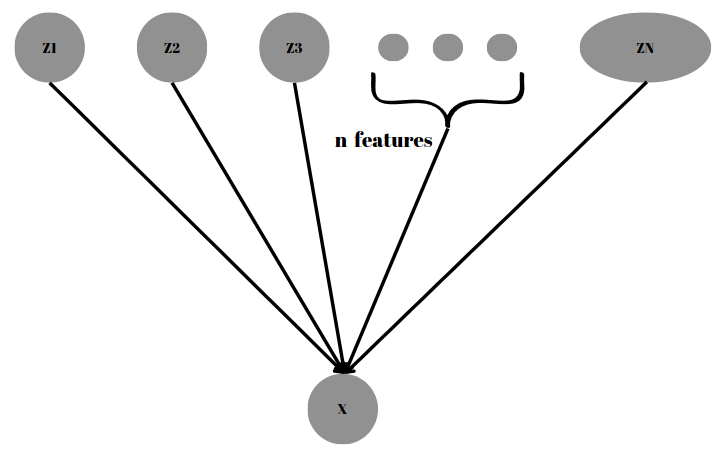
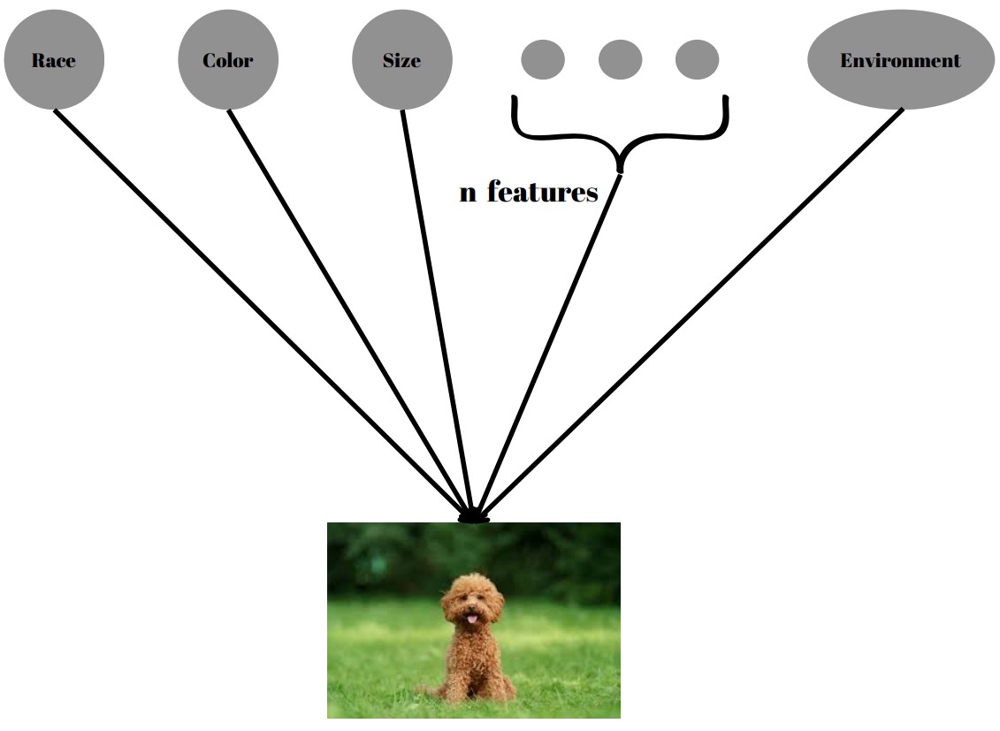
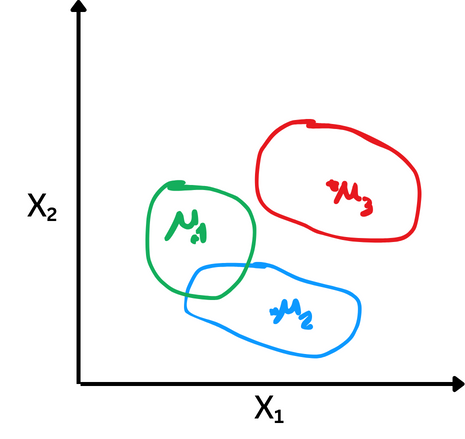
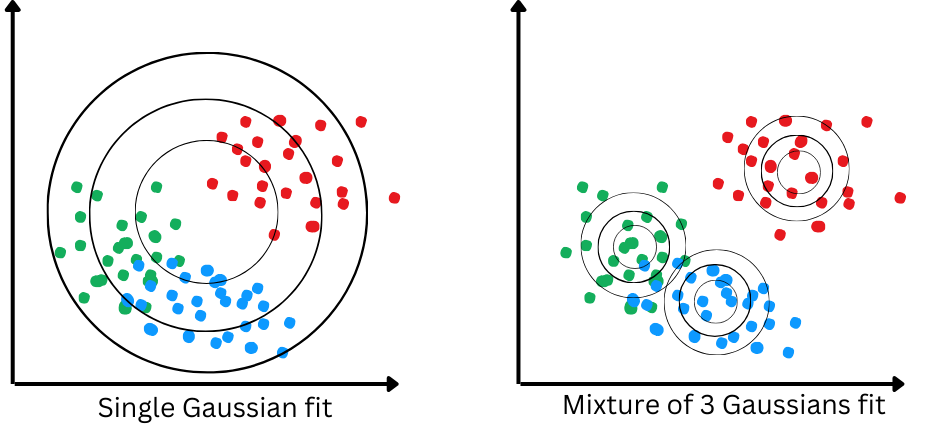
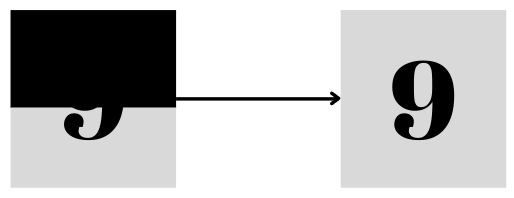
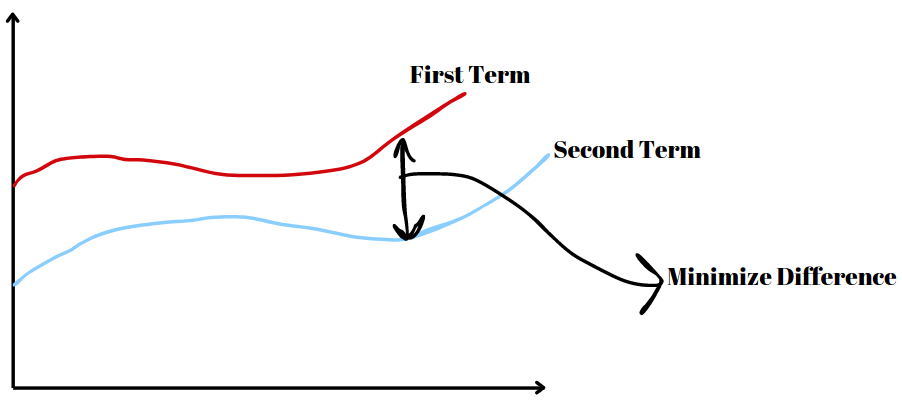
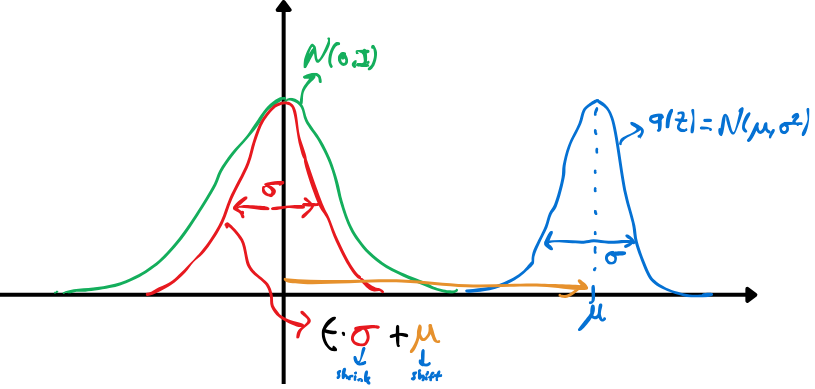
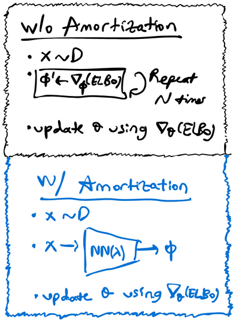
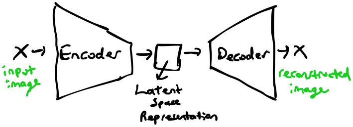

# Table of Contents

1. [Introduction and Motivation](#1-introduction-and-motivation)
   - [What are Latent Variable Models (LVMs)?](#what-are-latent-variable-models-lvms)
   - [Importance and Applications in Machine Learning and Statistics](#importance-and-applications-in-machine-learning-and-statistics)
   - [Motivation Behind Using Latent Variable Models](#motivation-behind-using-latent-variable-models)

2. [Mixture Models](#2-mixture-models)
   - [Mixture of Gaussians: A Shallow Latent Variable Model](#21-mixture-of-gaussians-a-shallow-latent-variable-model)
     - [Generative Process](#generative-process)
     - [Use Cases](#use-cases)
     - [Advantages](#advantages)
   - [Variational Autoencoders (VAEs)](#22-variational-autoencoders-vaes)
     - [VAEs as a Generative Model](#vaes-as-a-generative-model)
     - [Difference Between Deterministic and Stochastic Latent Representations](#difference-between-deterministic-and-stochastic-latent-representations)

3. [Inference and Marginal Probability](#3-inference-and-marginal-probability)
   - [Marginal Likelihood](#31-marginal-likelihood)
     - [Importance of Marginal Likelihood in Variational Probabilistic Modeling](#importance-of-marginal-likelihood-in-variational-probabilistic-modeling)
   - [Sampling Techniques](#32-sampling-techniques)
     - [Naive Monte Carlo](#naive-monte-carlo)
     - [Importance Sampling](#importance-sampling)
   - [Evidence Lower Bound (ELBO)](#33-evidence-lower-bound-elbo)
     - [Introduction to ELBO as an Objective Function in VAEs](#introduction-to-elbo-as-an-objective-function-in-vaes)
     - [ELBO’s Role in Variational Inference and Model Training](#elbos-role-in-variational-inference-and-model-training)

4. [Learning Latent Variable Models](#4-learning-latent-variable-models)
   - [Learning via Stochastic Variational Inference (SVI)](#41-learning-via-stochastic-variational-inference-svi)
     - [Optimization Objective](#optimization-objective)
     - [Likelihood Function](#likelihood-function)
     - [Optimization Steps](#optimization-steps)
     - [Gradient Computation](#gradient-computation)
     - [Key Assumption](#key-assumption)
   - [Reparameterization Trick](#42-reparameterization-trick)
     - [Gradient Computation Objective](#gradient-computation-objective)
     - [Equivalence in Sampling](#equivalence-in-sampling)
     - [Gradient Estimation](#gradient-estimation)
     - [Practical Implementation](#practical-implementation)
   - [Amortized Inference](#43-amortized-inference)
     - [Amortization](#amortization)
     - [Learning with Amortized Inference](#43-learning-with-amortized-inference)
     - [Optimization Steps](#optimization-steps)

5. [Autoencoder Perspective](#5-autoencoder-perspective)
   - [Comparing VAE with Traditional Autoencoders](#51-comparing-vae-with-traditional-autoencoders)
     - [Contrast Between VAEs and Standard Autoencoders in Representation Learning](#contrast-between-vaes-and-standard-autoencoders-in-representation-learning)
     - [VAE vs. AE](#vae-vs-ae)

6. [Conclusion](#6-conclusion)
   - [Summary of Key Concepts Covered in the Discussion of Latent Variable Models](#summary-of-key-concepts-covered-in-the-discussion-of-latent-variable-models)
   - [Pros and Cons of Latent Variable Models](#pros-and-cons-of-latent-variable-models)

7. [Acknowledgements](#acknowledgements)

# Latent Variable Models & Variational Inference
Topic Summary for CENG796 by Enes Şanlı &amp; Hamza Etcibaşı. Prepared as an activity of the [Middle East Technical University - CENG 796 Deep Generative Models course](<https://user.ceng.metu.edu.tr/~gcinbis/courses/Spring24/CENG796/index.html>).

# 1. Introduction and Motivation
## What are Latent Variable Models (LVMs)?
Latent Variable Models (LVMs) are statistical models that include variables that are not directly observed but are inferred from other variables that are observed (measured). These unobserved variables are termed "latent variables." LVMs are used to model complex phenomena where the observed data is believed to be generated from underlying factors that are not directly measurable.  
In terms of a mathematical explanation, Latent Variable Models aim to obtain the observed data $X$ by utilizing the latent variables $Z$. This is because directly finding $P(X)$ is more challenging compared to finding $P(X∣Z)$. Hence, LVMs generally exploit the following equality: $P(X)=P(X∣Z)P(Z)$

  
  
Fig 1. Latent Variables

## Importance and Applications in Machine Learning and Statistics
LVMs play a crucial role in various fields within machine learning and statistics due to their ability to model complex and high-dimensional data in a more interpretable and compact form. Some key applications include:
- **Dimensionality Reduction:** Techniques like PCA reduce the number of variables under consideration, making the data easier to visualize and analyze while retaining its essential properties.
- **Data Imputation:** LVMs can be used to estimate missing values in datasets by leveraging the relationships between observed and latent variables.
- **Clustering:** Models like GMMs are used for identifying subgroups within data by assuming that data points belong to different latent clusters.
- **Time Series Analysis:** HMMs and other sequential LVMs are essential for modeling and predicting time-dependent phenomena in fields like speech recognition, finance, and bioinformatics.
- **Topic Modeling:** LDA is widely used in natural language processing to uncover the hidden thematic structure in large text corpora.
 
## Motivation Behind Using Latent Variable Models

  
  
Fig 2. Latent Variables Models

Like in Fig 2. suppose we want to generate an image of a dog. We know that dogs have certain features, such as color, breed, and size. However, can we limit these features? Or can we identify every feature for each image? The answer to this question is of course no. A single image can have an infinite number of latent features, and it is impossible for us to identify all of them accurately. However, if we can learn the most important of these features, we can use them to generate images much more easily. This is because estimating probability distributions based on an image's features is much easier than estimating from a complete probability distribution. This logic is the motivation behind Latent Variable Models. 
  
# 2. Mixture Models
## 2.1 Mixture of Gaussians: A Shallow Latent Variable Model

The Mixture of Gaussians (MoG) model is a probabilistic model that assumes data points are generated from a mixture of several Gaussian distributions. Each Gaussian distribution represents a cluster or component within the overall data distribution. This model is often used for clustering and density estimation.

In a Mixture of Gaussians model, we have a latent variable \(z\) that determines which Gaussian component a data point belongs to. The generative process can be represented as a simple Bayesian network: z → x 

Here:
- \(z\) is the latent variable.
- \(x\) is the observed data.

  
  
Fig 3. Mixture of Gaussians

#### Generative Process

1. **Select a Gaussian component:**
   - Sample **z** from a categorical distribution with **k** components.
   

        $z \sim \text{Categorical}(1, \ldots, k)$
   

2. **Generate a data point:**
   - Given **z = k**, sample **x** from the corresponding Gaussian distribution.
   

        $p(x \mid z = k) = \mathcal{N}(x \mid \mu_k, \Sigma_k)$
   

When training a Mixture of Gaussians model, we start with like a single Gaussian fit. As training progresses, assuming the distribution isn't too complex and we have a good estimate for the number of clusters, the model performs effective clustering. Similar points end up with similar z estimates, resulting in soft clustering. This approach is also useful in unsupervised learning. The approach is illustrated in Fig 4. below:

  
  
Fig 4. Mixture of 3 Gaussians

By following these steps, the Mixture of Gaussians model generates data points that can represent complex, multimodal distributions through the combination of multiple Gaussian components.

- **Use Cases and Advantages of MoG in Modeling Data Distributions**

The Mixture of Gaussians (MoG) model is a versatile and powerful tool in various data analysis tasks. Here are some key use cases and advantages of using MoG:

#### **_Use Cases:_**

1. **Clustering:** MoG is commonly used for clustering data into groups. Each Gaussian component can be seen as representing a cluster, allowing for effective identification of subpopulations within the data.
   
2. **Density Estimation:** It is useful for estimating the probability density function of a dataset, especially when the data distribution is complex and multimodal (having multiple peaks).

3. **Anomaly Detection:** By modeling the normal data distribution with MoG, points that fall in low-probability regions can be identified as anomalies or outliers.

4. **Image Segmentation:** In image processing, MoG can be used to segment images by clustering pixels based on color or intensity values.

#### **_Advantages:_**

1. **Flexibility:** MoG can model a wide range of data distributions by combining multiple Gaussian components, making it suitable for complex datasets.

2. **Soft Clustering:** Unlike hard clustering methods, MoG provides soft clustering where each data point has a probability of belonging to each cluster, offering more nuanced insights.

3. **Scalability:** MoG can be scaled to handle large datasets and high-dimensional data, making it practical for real-world applications.

4. **Interpretability:** The parameters of the Gaussian components (mean and covariance) provide meaningful information about the data structure, aiding interpretability.

5. **Probabilistic Framework:** Being a probabilistic model, MoG allows for uncertainty quantification and principled statistical inference.

By leveraging these advantages, the Mixture of Gaussians model is a powerful tool for understanding and analyzing complex data distributions. **However**, the Mixture of Gaussians model has its limitations. It can be sensitive to initialization, making it prone to local optima. Determining the optimal number of components is challenging, and the model assumes Gaussian distributions, which may not always fit the data accurately. Additionally, computational complexity increases with data dimensionality, and overfitting can occur. Despite these challenges, the model remains valuable for understanding complex data distributions.
  
## 2.2 Variational Autoencoders (VAEs)
### VAEs as a Generative Model

While the Gaussian distribution may seem simple on its own, the combination of multiple Gaussians can introduce complexity. Consider a scenario where we possess latent factors indicating whether a data point belongs to a certain Gaussian. In such cases, the conditional distribution given these latent factors, denoted as $p(x|k)$, becomes much simpler compared to the original distribution $p(x)$. Although the original distribution might be complex, given the latent factor of each data point, the conditional distribution needed to fit that latent factor would be comparatively simpler. However, since we lack knowledge of these latent factors, the challenge lies in discovering them concurrently while learning these conditional distributions.

Our aim is to arrive at a robust marginal distribution of $x$ that effectively explains the data. We can express this as:

    $$p(x) = \sum_{z} p(x, z) = \sum_{z} p(z) p(x \mid z) = \sum_{k=1}^{K} p(z = k) \mathcal{N}(x; \mu_k, \Sigma_k)$$

However, instead of employing a fixed number of Gaussian distributions ($K$), we aspire to utilize neural networks to create more expressive models resembling a mixture of an infinite number of Gaussians.

We can represent this using neural networks as follows:
Let the latent variable $z$ be drawn from a standard Gaussian distribution: $z \sim \mathcal{N}(0, I)$.
We define the conditional distribution of $x$ given $z$ using neural networks: $p(x | z) = \mathcal{N}(\mu_{\theta}(z), \Sigma_{\theta}(z))$, where $\mu_{\theta}$ and $\Sigma_{\theta}$ are neural networks parameterized by $\theta$.

This formulation enables us to model complex relationships within the data by learning the parameters of the neural networks $\mu_{\theta}$ and $\Sigma_{\theta}$, allowing for a flexible and adaptive representation of the underlying data distribution.
  
### Difference Between Deterministic and Stochastic Latent Representations
  
__In deterministic latent representations__, each input is mapped to a single, fixed latent representation. This mapping is entirely deterministic, meaning that given the same input and model parameters, the resulting latent representation will always be the same. We can think of it as a straightforward one-to-one mapping where each input corresponds to a specific encoded representation.
  

    $$ z = f(x) $$

Here, $z$ represents the deterministic latent representation, and $f(x)$ denotes the deterministic mapping function from input $x$ to latent representation $z$.

Deterministic latent representations are commonly employed in traditional autoencoders and similar models. While they provide a simple and deterministic way to encode information, they may struggle to capture the inherent variability and uncertainty present in real-world data.

In contrast, __stochastic latent representations__ introduce randomness or stochasticity into the mapping from input to latent representation. Rather than producing a single fixed value, the mapping generates a probability distribution over possible latent representations. This distribution captures the uncertainty and variability inherent in the data, allowing for more flexible and expressive representations.

    $$ z \sim p(z \mid x) $$

Here, $z$ represents the stochastic latent representation sampled from the distribution $p(z \mid x)$, which is conditioned on the input data $x$.

**Variational Autoencoders (VAEs)** are a prime example of models that leverage stochastic latent representations. In VAEs, the encoder network outputs the parameters of a probability distribution (e.g., mean and variance) instead of a fixed value. The latent representation is then sampled from this distribution, introducing randomness into the encoding process.

  
# 3. Inference and Marginal Probability

Suppose we are working with an image during the training phase where the pixel values in the upper half are missing, and our goal is to reconstruct the original image. Let $X$ be our observed random variables, and $Z$ be our unobserved random variables. We have a joint model that utilizes these $Z$. We can express this model as $P(X,Z;θ)$, where $X$ represents the observed variables, $Z$ represents the unobserved random variables, and $θ$ denotes the weights of our model.  

    
    
Fig 5. Marginal Likelihood

Can we determine the value of $P(X=x;θ)$ in this manner?  
Mathematically, yes, we can. However, the process to find this can be expressed as follows: $\sum_{z}P(X=x,Z=z;θ)$, meaning we need to perform this operation for all possible values of $Z$. While this is theoretically possible, it is practically infeasible. This is because, even for a binary image, there are $2^Z$ possible states.

## 3.1 Marginal Likelihood
### Importance of Marginal Likelihood in Variational Probabilistic Modeling

Can we solve this problem using Maximum Log-Likelihood?  
Suppose we have a dataset $D$ where for each datapoint our $X$ variables (pixel values) are observed and $Z$ variables are unobserved (e.g., class, etc.).  
Our maximum log-likelihood is given by:

$$\log \prod_{D} P(x;θ)$$

which we can express using latent variables as:

$$\log \prod_{D} P(x;θ) = \sum_{D} \log P(x;θ) = \sum_{D} \log \sum_{z} P(x,z;θ)$$

Is it possible to compute this?

For instance, if we have $Z$ latent features, even if each of them is binary, there are $2^Z$ possible states, making this computation intractable and preventing us from calculating the gradients. This is because the number of possible states grows exponentially with the number of latent features. To solve this, we need to use an **approximation**.

## 3.2 Sampling Techniques

### Naive Monte Carlo

As mentioned in the previous section, we need to make an approximation. This approximation will make our formula tractable. Specifically, we will use the Naive Monte Carlo method to make this      formula tractable. Let's rewrite $p(x)$. We have:

$$P_{θ}(x) = \sum_{z} p_{θ}(x,z) = |Z|\sum_{z} \frac{1}{|Z|}p_{θ}(x,z) = |Z| E_{z \sim Uniform(z)}[p_{θ}(x,z)]$$

Thus, we have transformed our model into an expectation. However, this expectation is still intractable. To address this, we will use the Naive Monte Carlo method. Our assumption is that these latent features are uniformly distributed. By sampling, we will find an average expectation, i.e.,

$$\sum_{z} p_{θ}(x,z) = |Z| \frac{1}{k} \sum_{j=1} p_{θ}(x,z_j)$$

In this way, we have made our model tractable. But does this approach serve our purpose?

Of course, No, because for most $Z$, $p_{θ}(x,z)$ is very low. So, most of Z states don't make sense. Some are very large but when we sampling the probabilty of hitting this state is very low.  
For example, suppose we want to generate an image of a girl. Some of our latent features might be hair color and eye color. However, there are many possible colors, and it is highly improbable for a girl to have both red eyes and red hair. In contrast, it is more likely for a girl to have brown hair and brown eyes. In our approximation, these two probabilities are treated as equal, which is not very realistic. Now, assume we sampling features and getting equation like that :

$$\sum_{z} p_{θ}(x,z) =  p_{θ}(x,red hair , red eyes) +  p_{θ}(x, red hair , purple eyes) +  p_{θ}(x,red hair, white eyes) + ... +  p_{θ}(x,white hair, orange eyes) $$

In the sampling mentioned above, for instance, the probability of nearly all terms is close to zero, indicating that we have failed to capture important latent features. This is the reason why this approximation, while theoretically sound, does not work in practice.

So we need a clever way to select $Z_j$.

### Importance Sampling

Now let's try another way, remember our equation: 

$$p_{θ}(x) = \sum_{z} p_{θ}(x,z)$$  

We can add some terms to this equation with preserving the equation, so introduce this term: $$\frac{q(z)}{q(z)}$$  
Then our equation will be: $$p_{θ}(x) = \sum_{z} p_{θ}(x,z) = \sum_{z} \frac{q(z)}{q(z)} p_{θ}(x,z)$$  
Now, we can convert this equation to an expected value term: $$\sum_{z} \frac{q(z)}{q(z)} p_{θ}(x,z) = E_{z \sim q(z)}[\frac{p_{θ}(x,z)}{q(z)}]$$  
But, why we do that?  
The main intuition is that, in previous sections we selected $Z$ terms from Uniform sampling, but now we are sampling $Z$ from $q(z)$. In this way, our $q(z)$ behaves like a frequency term. And our $q(z)$ can be anything. For all $q(z)$, the equation holds.  
Now, we use the Naive Monte Carlo method again. The equation will be like this:

$$p_{θ}(x) =  \frac{1}{k} \sum_{j=1}\frac{p_{θ}(x,z^{j})}{q(z^{j})}$$

Finally, we have a method for cleverly selecting z (latent variables), but what should be $q(z)$? The answer is in the upcoming section.

## 3.3 Evidence Lower Bound (ELBO)
### Introduction to ELBO as an Objective Function in VAEs

Now, let's take log of previous equation

  $$\log (\sum_{z} p(x,z)) = \log (\sum_{z} \frac{q(z)}{q(z)} p_{θ}(x,z)) = \log (E_{z \sim q(z)}[\frac{p_{θ}(x,z)}{q(z)}])$$  

With this, we now have an additional feature. We know that the logarithm is a concave function, which means it satisfies Jensen's Inequality. What does this imply and how can we use it?

First, let's recall Jensen's Inequality. For concave functions, 

$$\log ( tx_1 + (1-t)x_2) \geq t \log (x_1) + (1-t) \log (x_2)$$

Now, let's apply this to our equation.

$$\log (E_{z \sim q(z)}[f(z)]) = \log (\sum_{z} q(z)f(z)) \geq \sum_{z} q(z) \log(f(z))$$

Now, how can we use this?

Let us put $f(z) = \frac{p_{θ}(x,z)}{q(z)}$, then the equation will be:

$$\log (E_{z \sim q(z)}[\frac{p_{θ}(x,z)}{q(z)}])  \geq (E_{z \sim q(z)}[\log (\frac{p_{θ}(x,z)}{q(z)})]$$

When we look at this equation, the first term will not change; it always equals $p_{θ}(x,z)$. The value of $q(z)$ is not important; it will not change anything. And we know that finding first term is not tractable, so instead of that if we try to maximize second term we can approximate the first term because it behaves like a constant.

  
  
Fig 6. Evidence Lower Bound

Like in this figure, we try to maximize second term, and because of first term behaves like a constant we can minimize the difference between actual $p_{θ}(x,z)$ and approximated $p_{θ}(x,z)$

So, we can simply say that this second term our lower bound, and from now on, we will refer to this term as ELBO (Evidence Lower Bound).

Now, let's rewrite the equation for simplicity:

$$\log (p(x))  \geq \sum_{z} q(z) \log (\frac{p_{θ}(x,z)}{q(z)})$$

$$\log (p(x))  \geq \sum_{z} q(z) \log (p_{θ}(x,z)) - q(z) \log (q(z))$$

$$H(q) =  - q(z) \log (q(z))$$

$$\log (p(x))  \geq \sum_{z} q(z) \log (p_{θ}(x,z)) - q(z) \log (q(z))$$

### ELBO’s Role in Variational Inference and Model Training
As mentioned in previous sections, equation holds for all $q(z)$ terms. So, let's choose $q = p(z|x;θ)$ because it makes sense to sample the most "explanatory" z values.

Also using this terms give us equality instead of greater equal. Let's look at the equation with $q = p(z|x;θ)$ term.

$$\sum_{z} q(z) \log (\frac{p(x,z;θ)}{q(z)}) = \sum_{z} p(z|x;θ) \log (\frac{p(x,z;θ)}{ p(z|x;θ)})$$

$$\sum_{z} p(z|x;θ) \log (\frac{p(x,z;θ)}{ p(z|x;θ)}) = \sum_{z} p(z|x;θ) \log (\frac{ p(z|x;θ) * p(x;θ) }{ p(z|x;θ)})$$

$$\sum_{z} p(z|x;θ) \log (\frac{ p(z|x;θ) * p(x;θ) }{ p(z|x;θ)}) = \sum_{z} p(z|x;θ) \log (p(x;θ))$$

$$\sum_{z} p(z|x;θ) \log (p(x;θ)) =  \log (p(x;θ)) \sum_{z} p(z|x;θ)$$

$$\log (p(x;θ)) \sum_{z} p(z|x;θ) = \log (p(x;θ))$$

So, the best $q(z)$ is $p(z|x;θ)$, but what happens if we choose different $q(z)$, can we measure how bad this $q(z)$ is?

The answer is:

$KL[q(z) || p(z|x)]$

$= E_{q}[ \log (q(z))] - E_{q}[\log (p(z|x))]$

$= -H[q] - E_{q}[\log (\frac{p(x,z)}{p(x)})]$

$= E_{q}[\log (p(x))] -  E_{q}[\log (p(x,z))] -H[q]$

$= \log (p(x)) -  ELBO$

$\log (p(x)) = ELBO + KL[q(z) || p(z|x)]$

So, using KL divergence we can simply calculate the error of our $q(z)$

  
  
Fig 7. Evidence Lower Bound

Now, if we look at the figure we mentioned earlier, and the equation we found lastly: $\log (p(x)) = ELBO + KL[q(z) || p(z|x)]$, we can find a way for finding good $q(z)$. In the figure, the blue line represents our ELBO, while the red line represents our $\log (p(x))$ value. The difference between them gives us KL divergence. However, the KL divergence is not tractable, and as we mentioned earlier, the $p(x)$ value is constant. Therefore, instead of minimizing the KL divergence, if we try to maximize the ELBO value, we will achieve the same result—minimizing the KL divergence and thus approximating our $p(x)$ value.

  
# 4. Learning Latent Variable Models
## 4.1 Learning via Stochastic Variational Inference (SVI)

Stochastic Variational Inference (SVI) is a technique used to optimize a probability distribution $P$ over some latent variables given observed data $D$. Let's break down of how it works:

### Optimization Objective

The goal is to optimize the likelihood function $L(x_i; \theta, \phi_i)$ as a function of model parameters $\theta$ and variational parameters $\phi_1, ..., \phi_M$. We use stochastic gradient descent to achieve this optimization.

### Likelihood Function

The likelihood function is defined as:

$$L(x_i; \theta, \phi_i) = \sum_{z} q(z; \phi_i) \log p(z, x_i; \theta) + H(q(z; \phi_i))$$

where $q(z; \phi_i)$ is the variational distribution over latent variables $z$, $p(z, x_i; \theta)$ is the joint distribution of latent variables and observed data, and $H(q(z; \phi_i))$ is the entropy of the variational distribution.

### Optimization Steps

1. **Initialization**: Initialize model parameters $\theta$ and variational parameters $\phi_1, ..., \phi_M$.
2. **Sampling**: Randomly sample a data point $x_i$ from the dataset $D$.
3. **Variational Inference**: Optimize $L(x_i; \theta, \phi_i)$ with respect to $\phi_i$ using gradient ascent until convergence.
4. **Update Model Parameters**: Compute the gradient of $L(x_i; \theta, \phi_i^*)$ with respect to $\theta$ and update $\theta$ in the gradient direction.
5. **Repeat**: Repeat steps 2-4 until convergence.

### Gradient Computation

- **Gradient with respect to $\theta$**: Compute the gradient using Monte Carlo sampling to estimate the expectation.
- **Gradient with respect to $\phi$**: This is more complex as the expectation depends on $\phi$. We still use Monte Carlo sampling for estimation, but with a trick called **the reparametrization trick**.

### Key Assumption

The variational distribution $q(z; \phi)$ is tractable, meaning it's **easy to sample** from and evaluate.

This approach allows us to learn latent variable models efficiently by iteratively optimizing model parameters and variational parameters using stochastic gradient descent.

## 4.2 Reparameterization Trick

The reparameterization trick is a clever technique used in stochastic variational inference to compute gradients with respect to the parameters $\phi$ when dealing with continuous latent variables. Let's break down how it works:

### Gradient Computation Objective

We aim to compute the gradient with respect to $\phi$ of the expectation:

$\mathbb{E}_{z \sim q(z; \phi)} [r(z)] = \int q(z; \phi) \, r(z) \, dz$

where $z$ is continuous and follows a Gaussian distribution $\mathcal{N}(\mu, \sigma^2 I)$ with parameters $\phi = (\mu, \sigma)$.

### Equivalence in Sampling
Let's assume $q(z; \phi) = \mathcal{N}(\mu, \sigma^2 I)$ is Gaussian with parameters $\phi = (\mu, \sigma)$. Using the equivalance, we can:
- Sample $z$ directly from $q_{\phi}(z)$.
- **or equivalently** sample $\epsilon$ from $\mathcal{N}(0, I)$ and transforming it into $z = \mu + \sigma \epsilon = g(\epsilon; \phi)$.

Thus, we compute the expectation by integrating over $\epsilon$ after transforming into $z$ using $g(\epsilon; \phi)$.

We illustrate the idea in Figure 8. in 1-D case, and the trick works in multi-dimensional case as well:

  
  
Fig 8. Reparametrization Trick

### Gradient Estimation

Using the reparameterization trick, we can compute the gradient with respect to $\phi$ as follows:
- Compute the gradient of the expectation with respect to $\phi$ by applying the chain rule.
- Use Monte Carlo sampling to estimate the gradient if $r$ and $g$ are differentiable with respect to $\phi$ and $\epsilon$ is easy to sample from.

### Practical Implementation

In our context of learning latent variable models, where the expectation depends on both $z$ and $\phi$, we can still employ the reparameterization trick by assuming $z = \mu + \sigma \epsilon = g(\epsilon; \phi)$. Then, we estimate the expectation as a Monte Carlo average over samples of $\epsilon$.

This technique enables efficient computation of gradients with respect to the variational parameters $\phi$, thereby facilitating the optimization of latent variable models.

## 4.3 Amortized Inference
Performing stochastic variational inference can be costly. At each training stage, to achieve a good approximation, we need to perform gradient descent over the parameters $\phi$ to optimize the Evidence Lower Bound (ELBO) before updating $\theta$. Without sufficient gradient updates, we risk having a poor lower bound with a large gap, leading to imprecise or noisy updates for $\theta$.

This process requires extensive gradient descent on the variational parameters just to make a single gradient update on the model parameters, which is very costly. The solution to this problem is called **amortized inference**.

### Amortization
To address this, we introduce amortized inference. Instead of learning individual variational parameters for each data point, we learn a single parametric function $f_\lambda$ that maps each $x_i$ to a set of variational parameters $\phi_i$. This is akin to performing regression from $x_i$ to $\phi_i^*$.

For instance, if $q(z|x_i)$ are Gaussians with different means $\mu_1, \cdots, \mu_m$, we learn a single neural network $f_\lambda$ that maps $x_i$ to $\mu_i$. We then use this function to approximate the posteriors $q(z|x_i)$ using the distribution $q_\lambda(z|x)$.

Amortized inference thus scales efficiently to large datasets by sharing parameters across all data points through the learned function $f_\lambda$.

We visualize the process showing the differences between with/without amortization below:

  
  
Fig 9. With/Without Amortization

## 4.3 Learning with Amortized Inference

In amortized inference, we optimize $\sum_{x_i \in D} L(x_i; \theta, \phi)$ as a function of $\theta$ and $\phi$ using stochastic gradient descent. The likelihood function is defined as:

$$L(x; \theta, \phi) = \sum_z q_\phi(z|x) \log p(z, x; \theta) + H(q_\phi(z|x)) = \mathbb{E}_{q_\phi(z|x)} [\log p(z, x; \theta) - \log q_\phi(z|x)]$$

### Optimization Steps

1. **Initialization**: Initialize $\theta^{(0)}$ and $\phi^{(0)}$.
2. **Sampling**: Randomly sample a data point $x_i$ from $D$.
3. **Gradient Computation**: Compute $\nabla_\theta L(x_i; \theta, \phi)$ and $\nabla_\phi L(x_i; \theta, \phi)$.
4. **Update Parameters**: Update $\theta$ and $\phi$ in the gradient direction.

To compute the gradients, we use the reparameterization trick as before, which allows for efficient and low-variance gradient estimates.

This approach leverages amortized inference to efficiently optimize the model parameters and variational parameters across large datasets.

  
# 5. Autoencoder Perspective
## 5.1 Comparing VAE with Traditional Autoencoders
### Contrast Between VAEs and Standard Autoencoders in Representation Learning
In a standard autoencoder, the architecture involves an encoder that maps input images $x$ to a latent space representation $z$, followed by a decoder that reconstructs the input image. This setup aims to minimize the reconstruction error between the original input and the reconstructed output. We illustrate the autoencoder architecture below:

  
  
Fig 10. Autoencoder Architecture

In contrast, a Variational Autoencoder (VAE) incorporates probabilistic principles into the autoencoder framework. The VAE introduces a recognition network (variational encoder) and a generator network (variational decoder). Here's how it works:

**Training Objective**:

    $$L(x; \theta, \phi) = \mathbb{E}_{q_{\phi}(z|x)}[\log p(x|z; \theta)] - D_{KL}(q_{\phi}(z|x)||p(z))$$

- The first term encourages the reconstructed output $\hat{x}$ to resemble the input $x$ by minimizing the reconstruction error.
- The second term encourages the latent representation $z$ to follow a prior distribution $p(z)$, promoting a well-structured latent space.

**Inference Stage:**
   - Given an input $x$, the recognition network (variational encoder) produces parameters $\phi$.
   - Using the reparameterization trick, $z$ is sampled from the inferred distribution.
   - $z$ is then fed into the generator (decoder network) to generate $\hat{x}$.

  
  
Fig 11. Variational Autoencoder

### VAE vs. AE
  - **Latent Space:** VAE explicitly models the distribution of latent variables, enabling meaningful interpolation and sampling. AE typically lacks such structure.
  - **Regularization:** VAE incorporates a regularization term, promoting disentangled and interpretable representations. AE relies solely on reconstruction error.
  - **Sample Generation:** VAEs can generate diverse samples by sampling from the latent space. AEs are limited to interpolation between training examples.
  - **Robustness to Noise:** VAEs are often more robust to noisy inputs due to the probabilistic nature of their encoding.

  
# 6. Conclusion
### Summary of Key Concepts Covered in the Discussion of Latent Variable Models

1. **Combining Models**: Create more flexible models by combining simpler ones (e.g., mixture of Gaussians).
2. **Directed Models**: Enable efficient generation through ancestral sampling: sample $z \sim p(z)$, then $x \sim p(x|z; \theta)$.
3. **Intractable Log-Likelihood**: Direct computation of log-likelihood is generally intractable, making learning difficult.
4. **Joint Learning**: Learn both the model parameters $\theta$ and an amortized inference component $(\phi$ by optimizing the Evidence Lower Bound (ELBO) for tractability.
5. **Latent Representations**: Infer latent representations for any $x$ using the variational distribution $q_\phi(z|x)$.
   
### Pros and Cons of Latent Variable Models

**Pros:**
- Can model complex distributions by combining simpler ones, enhancing flexibility and expressiveness.
- Enable efficient data generation through ancestral sampling, allowing for practical applications in generative tasks.
- Learn meaningful latent representations that can capture the underlying structure of the data.
- They can generalize well to new data, making them powerful tools for various generative tasks in machine learning.

**Cons:**
- Direct computation of log-likelihood is often intractable, making the learning process more difficult.
- Require sophisticated optimization techniques, such as ELBO and reparameterization tricks, to learn effectively.
- Can be computationally intensive, especially for large datasets, leading to higher resource consumption.
- The quality of the approximations used (e.g., variational inference) can affect the model's performance and accuracy, sometimes resulting in suboptimal solutions.
  
Latent variable models are powerful but come with computational and methodological challenges that require careful handling.

  
# Acknowledgements
We followed the slides by Stefano Ermon and Aditya Grover when preparing this topic summary. For more information, visit [Deep Generative Models](https://deepgenerativemodels.github.io/). Additionally, [Chat Gpt-3.5](https://chatgpt.com/) was used to correct grammatical errors and misunderstandings.

