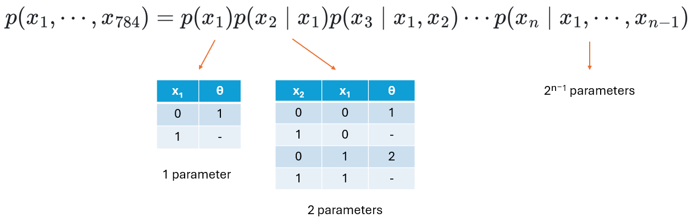
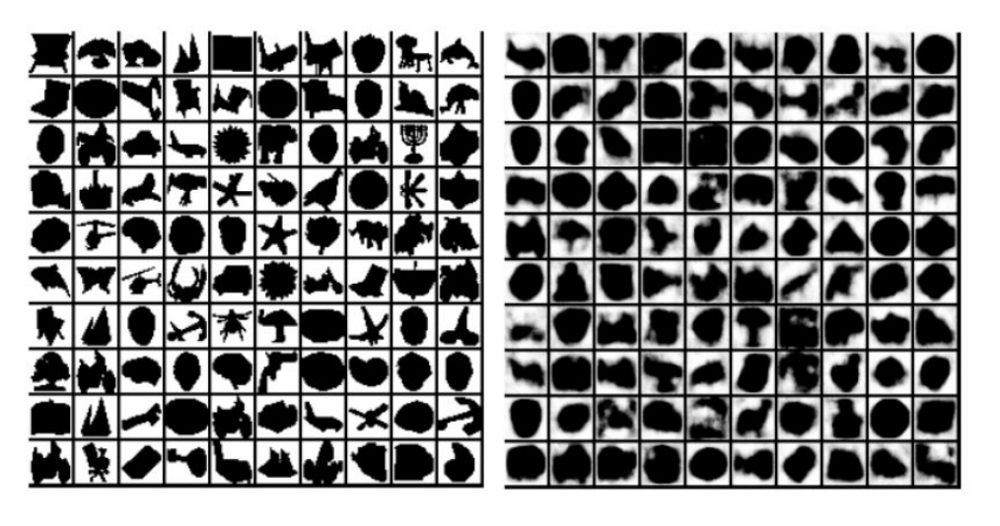
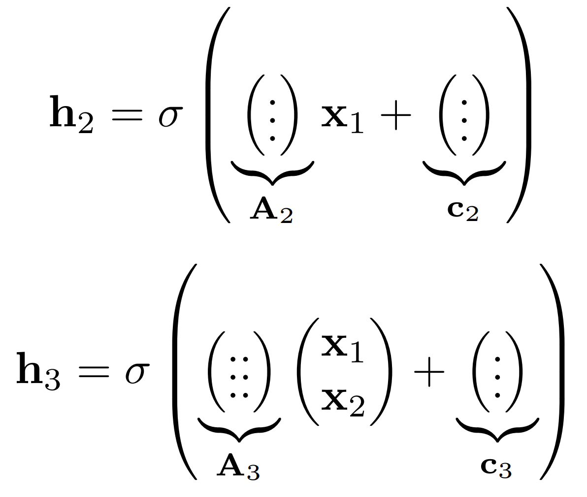
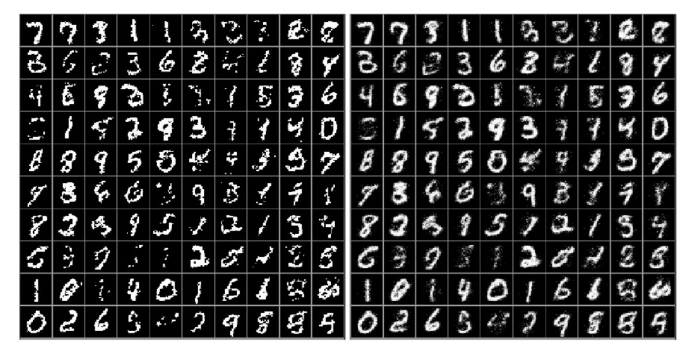
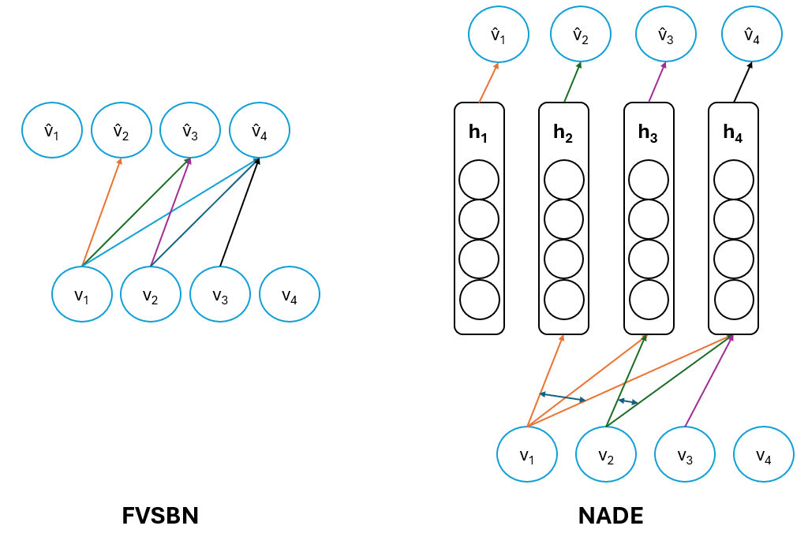
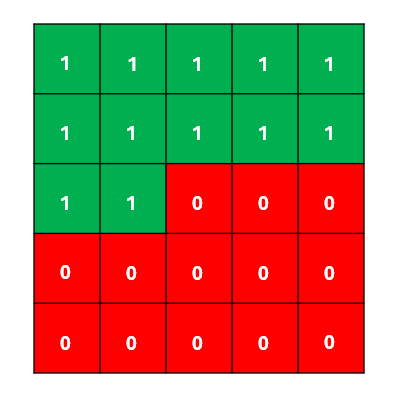
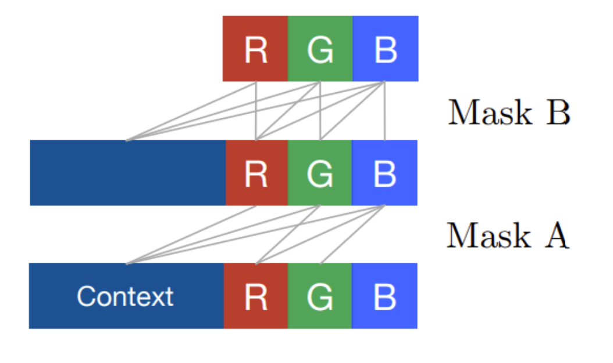
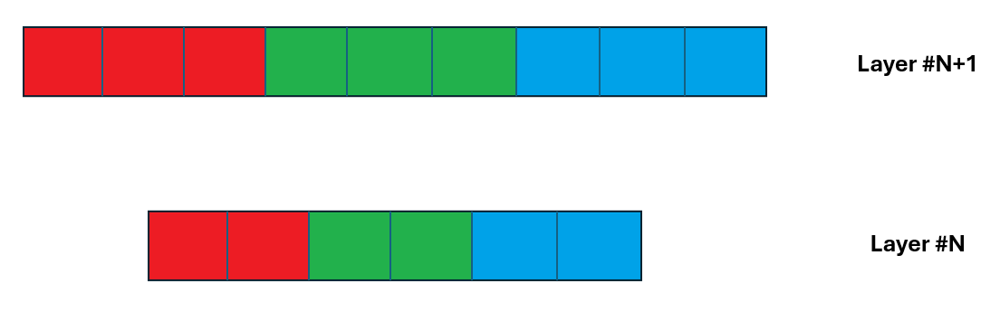
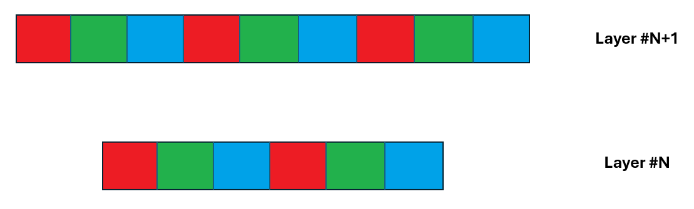

# Autoregressive Models, Maximum Likelihood Estimation Topic Summary 
CENG796 Deep Generative Models

Barış Sarper Tezcan, Furkan Genç

Prepared as an activity of the [Middle East Technical University - CENG 796 Deep Generative Models course](<https://user.ceng.metu.edu.tr/~gcinbis/courses/Spring24/CENG796/index.html>).

## Table of Contents
1. [Introduction to Autoregressive Models](#introduction-to-autoregressive-models)
   - [What are autoregressive models?](#what-are-autoregressive-models)
   - [Motivating Example: MNIST](#motivating-example-mnist)
2. [Structure of Autoregressive Models](#structure-of-autoregressive-models)
   - [Chain Rule Factorization](#chain-rule-factorization)
     - [Why Use Chain Rule Factorization?](#why-use-chain-rule-factorization)
   - [Number of Parameters](#number-of-parameters)
   - [Total Number of Parameters](#total-number-of-parameters)
   - [Implications](#implications)
3. [Bayesian Networks vs. Neural Models Comparison](#bayesian-networks-vs-neural-models-comparison)
   - [Bayesian Networks](#bayesian-networks)
   - [Neural Models](#neural-models)
4. [Advantages of Neural Autoregressive Models](#advantages-of-neural-autoregressive-models)
5. [How to Model Autoregressive Models?](#how-to-model-autoregressive-models)
   - [Logistic Regression](#logistic-regression)
     - [More Explicitly](#more-explicitly)
   - [Fully Visible Sigmoid Belief Networks (FVSBN)](#fully-visible-sigmoid-belief-networks-fvsbn)
     - [Evaluating the Joint Probability](#evaluating-the-joint-probability)
     - [Sampling from the Joint Distribution](#sampling-from-the-joint-distribution)
     - [Number of Parameters](#number-of-parameters-1)
     - [Likelihood Evaluation and Generation](#likelihood-evaluation-and-generation)
6. [Neural Autoregressive Density Estimation (NADE)](#neural-autoregressive-density-estimation-nade)
   - [Hidden Layer Calculation](#hidden-layer-calculation)
   - [Output Layer Calculation](#output-layer-calculation)
   - [Parameter Tying](#parameter-tying)
   - [Computational Efficiency](#computational-efficiency)
   - [Total Number of Parameters](#total-number-of-parameters-1)
7. [General Discrete Distributions](#general-discrete-distributions)
   - [Modeling RGB Images](#modeling-rgb-images)
8. [Autoregressive Models vs. Autoencoders](#autoregressive-models-vs-autoencoders)
   - [Similarities on the Surface](#similarities-on-the-surface)
   - [Loss Function](#loss-function)
   - [Ensuring Meaningful Representations](#ensuring-meaningful-representations)
   - [Vanilla Autoencoder vs. Generative Model](#vanilla-autoencoder-vs-generative-model)
   - [Autoregressive Autoencoders](#autoregressive-autoencoders)
   - [MADE: Masked Autoencoder for Distribution Estimation](#made-masked-autoencoder-for-distribution-estimation)
9. [Case Study: PixelCNN](#case-study-pixelcnn)
   - [Autoregressive Architecture](#autoregressive-architecture)
   - [Model Structure](#model-structure)
   - [Training](#training)
   - [Sampling](#sampling)
10. [Summary of Autoregressive Models](#summary-of-autoregressive-models)
    - [Advantages of Autoregressive Models](#advantages-of-autoregressive-models)
    - [Challenges](#challenges)
    - [Applications in Generative AI](#applications-in-generative-ai)
11. [Learning a Generative Model](#learning-a-generative-model)
    - [Goal of Learning](#goal-of-learning)
    - [Learning as Density Estimation](#learning-as-density-estimation)
12. [Maximum Likelihood Estimation (MLE)](#maximum-likelihood-estimation-mle)
    - [KL Divergence](#kl-divergence)
      - [Jensen's Inequality](#jensens-inequality)
      - [Interpretations of KL Divergence](#interpretations-of-kl-divergence)
    - [Relation of KL Divergence and Expected Log-Likelihood](#relation-of-kl-divergence-and-expected-log-likelihood)
      - [Monte Carlo Estimation](#monte-carlo-estimation)
13. [Finding Optimal Parameters with MLE](#finding-optimal-parameters-with-mle)
    - [Analytical Derivation (Coin Example)](#analytical-derivation-coin-example)
    - [MLE Learning with Gradient Descent in Neural Models](#mle-learning-with-gradient-descent-in-neural-models)
14. [Empirical Risk and Overfitting](#empirical-risk-and-overfitting)
15. [Conclusion](#conclusion)
16. [References](#references)

## Introduction to Autoregressive Models

### What are autoregressive models?
Autoregressive models are a type of generative model used for sequential data, where the future values of the series are predicted based on its past values. These models generate data by sequentially predicting each value in the series conditioned on the previous values.

In the context of generative models, autoregressive models can be extended to generate sequences of data points, such as text, audio, or even images. By modeling the probability distribution of each data point conditioned on the previous points, these models can generate highly realistic sequences.

### Motivating Example: MNIST

The MNIST dataset, which consists of handwritten digits, can be used as a motivating example to explain the concept of autoregressive generative models.

Given the dataset D of binarized MNIST images, each image has n = 28 x 28 = 784 pixels. Each pixel can either be black (0) or white (1).

The goal is to learn a probability distribution $p(x) = p(x_1, x_2, ..., x_{784})$ over x in $\\{0,1\\}^{784}$ such that when x is drawn from p(x), it looks like a digit. In other words, we want to generate new images that resemble the original handwritten digits.

This process is done in two steps:

1. **Parameterize a model family $\{ p_θ(x), \theta \in \Theta\}$:** This involves defining a model where the probability of each pixel is conditioned on the previous pixels. This means that the value of each pixel is dependent on the values of the pixels that came before it. This is the essence of an autoregressive model, where the output is a function of its own previous values.

2. **Search for model parameters $\theta$ based on training data D:** This involves optimizing the parameters to best fit the observed data, typically using methods like maximum likelihood estimation. This step is about training the model on the dataset to find the best parameters that make the model generate images as close as possible to the original ones.

## Structure of Autoregressive Models
### Chain Rule Factorization
In autoregressive models, the joint probability distribution of a sequence of variables is factorized into a product of conditional probabilities using the chain rule of probability. This factorization allows us to model the complex dependencies between variables in a sequential manner.

#### Why Use Chain Rule Factorization?
The chain rule factorization is used in autoregressive models because it provides a systematic way to decompose the joint distribution of a sequence into simpler, conditional distributions. This decomposition allows us to generate each value in the sequence one at a time, conditioned on the previous values.

Given a sequence of variables $x = (x_1, x_2, ..., x_n)$, the joint probability p(x) can be factorized as:
$$p(x) = p(x_1) p(x_2 | x_1) p(x_3 | x_1, x_2) ... p(x_n | x_1, x_2, ..., x_{n-1}) $$

This factorization makes it feasible to model and generate sequences by sequentially sampling each variable conditioned on the previously generated variables.

We can also consider different orderings of the variables in the chain rule factorization. For instance, p(x) can also be factorized as:
$$p(x) = p(x_n) p(x_{n-1} | x_n) p(x_{n-2} | x_{n-1}, x_n) ... p(x_1 | x_2, x_3, ..., x_n) $$

These are two examples of chain rule factorization. While in theory, all factorizations are equivalent in terms of representing the joint distribution, it is more logical to choose the first one when modeling MNIST images. This is because the first example follows a natural and sequential dependency where each pixel depends on the previous ones in a raster scan order. This logical ordering simplifies the modeling process and aligns better with the structure of image data. Choosing this ordering is a modeling assumption that can make the model more interpretable and efficient.

### Number of Parameters

The number of parameters required to model the joint distribution depends on the number of conditional distributions we need to learn. Let's consider a binary sequence of length $n$ as an example. In this case, each variable $x_i$ can take two values (0 or 1). For each variable $x_i$, we need to estimate the conditional probability $p(x_i \mid x_1, x_2, \ldots, x_{i-1})$.



<div align="center">
Figure 1: Number of Parameters to Learn
</div>

1. **For $x_1$:**
   - $p(x_1)$ requires 1 parameter (since it is unconditional).

2. **For $x_2$:**
   - $p(x_2 \mid x_1)$ requires 2 parameters (since $x_2$ can take two values, 0 or 1, given $x_1$).

3. **For $x_3$:**
   - $p(x_3 \mid x_1, x_2)$ requires 4 parameters (since $x_3$ can take two values given each combination of $x_1$ and $x_2$).

4. **General Case for $x_i$:**
   - $p(x_i \mid x_1, x_2, \ldots, x_{i-1})$ requires $2^{i-1}$ parameters.

In the image, this is illustrated using tables that show the conditional probabilities for each variable based on the preceding variables.

### Total Number of Parameters

To find the total number of parameters required to model the entire sequence, we sum the parameters for each conditional distribution:

$$ \text{Total Parameters} = 1 + 2 + 4 + \ldots + 2^{n-1} $$

This is a geometric series with the first term $a = 1$ and the common ratio $r = 2$. The sum of the first $n$ terms of a geometric series is given by:

$$ S_n = a \frac{r^n - 1}{r - 1} $$

For a binary sequence of length $n$, the total number of parameters is given by:

$$ \text{Total Parameters} = \frac{2^{n} - 1}{2 - 1} = 2^{n} - 1 $$

### Implications

- **Exponential Growth**: The number of parameters grows exponentially with the number of variables. This can make the model very complex and computationally expensive.
- **Scalability**: For large sequences, such as images with many pixels, this exponential growth can become impractical. For instance, for a 28x28 image, the number of parameters would be $2^{784} - 1$, which is practically impossible to learn even for such low resolution images.

### Bayesian Networks vs. Neural Models Comparison

To model the conditional distributions in chain rule factorization, Bayesian networks and neural models are commonly used. Let's compare these two approaches in the context of autoregressive models.

#### Bayesian Networks

<!-- 
*Figure: Bayesian Network*
- Bayes Net -->

$$ p(x_1, x_2, x_3, x_4) \approx p_{CPT}(x_1) p_{CPT}(x_2 \mid x_1) p_{CPT}(x_3 \mid \cancel{x_1}, x_2) p_{CPT}(x_4 \mid x_1, \cancel{x_2, x_3}) $$


- **Conditional Independence Assumptions**: Bayesian Networks rely on conditional independence assumptions, which simplify the model by assuming that certain variables are independent of others given their parents.
- **Graphical Structure**: They use a directed acyclic graph (DAG) to represent the dependencies between variables.
- **Inference**: The inference process can be computationally intensive due to the need to marginalize over multiple variables.

#### Neural Models

<!-- 
*Figure: Neural Models* -->

$$ p(x_1, x_2, x_3, x_4) \approx p(x_1) p(x_2 \mid x_1) p_{Neural}(x_3 \mid x_1, x_2) p_{Neural}(x_4 \mid x_1, x_2, x_3) $$

- **No Conditional Independence Assumptions**: Neural autoregressive models do not assume conditional independence. Instead, they use neural networks to directly model the conditional distributions.
- **Flexibility**: Neural models can capture complex dependencies and interactions between variables without predefined independence assumptions.
- **Scalability**: Neural networks can efficiently handle large and high-dimensional datasets, making them suitable for modern generative modeling tasks.

### Advantages of Neural Autoregressive Models
- **Expressiveness**: Neural networks can model complex, high-dimensional data distributions.
- **Learning Efficiency**: Neural networks can leverage large amounts of data to learn accurate models.
- **Generative Power**: They can generate highly realistic sequences by capturing intricate dependencies in the data.

## How to Model Autoregressive Models?
To model autoregressive models, we start by using the chain rule of probability to factorize the joint probability distribution of a sequence of variables into a product of conditional probabilities. For a sequence of variables $x = (x_1, x_2, \dots, x_{n})$, without loss of generality, we can write the joint probability as:

$$
p(x_1, \ldots, x_{n}) = p(x_1) p(x_2 \mid x_1) p(x_3 \mid x_1, x_2) \ldots p(x_{n} \mid x_1, \ldots, x_{n-1})
$$

Some conditional distributions can be too complex to be stored in tabular form. Instead, we assume parameterized forms for these conditionals. This approach allows us to model the complex dependencies between variables more efficiently. For instance, we can use logistic regression or neural networks to parameterize the conditional distributions. Let's look at some models used for autoregressive density estimation. 

### Logistic Regression
For instance, we can use a logistic regression model to parameterize the conditionals as follows:

$$
p(x_1, \ldots, x_{n}) = p_{\text{CPT}}(x_1; \alpha^1) p_{\text{logit}}(x_2 \mid x_1; \alpha^2) p_{\text{logit}}(x_3 \mid x_1, x_2; \alpha^3) \cdots p_{\text{logit}}(x_n \mid x_1, \ldots, x_{n-1}; \alpha^n)
$$

#### More Explicitly
- For the first pixel:

$$ p_{\text{CPT}}(X_1 = 1; \alpha^1) = \alpha^1, \quad p(X_1 = 0) = 1 - \alpha^1 $$

- For the second pixel:

$$ p_{\text{logit}}(X_2 = 1 \mid x_1; \alpha^2) = \sigma(\alpha_0^2 + \alpha_1^2 x_1) $$

- For the third pixel:
 
$$ p_{\text{logit}}(X_3 = 1 \mid x_1, x_2; \alpha^3) = \sigma(\alpha_0^3 + \alpha_1^3 x_1 + \alpha_2^3 x_2) $$

where $\sigma$ is the logistic sigmoid function:

$$ \sigma(z) = \frac{1}{1 + e^{-z}} $$

- **$\alpha_0^i$**: The bias term, representing the inherent probability of a pixel being 1 without considering the influence of other pixels.
- **$\alpha_1^i, \alpha_2^i, \ldots$**: These are weights representing the influence of the corresponding previous pixels on the current pixel's value. Each $\alpha$ parameter is associated with a specific previous pixel, indicating how strongly that pixel affects the probability of the current pixel being 1. Note that the superscript $i$ denotes the modeling of the $i$-th pixel, as indicated by the superscript. For example, $\alpha_0^2$ and $\alpha_1^2$ are used for modeling $X_2$, while $\alpha_0^3$, $\alpha_1^3$, and $\alpha_2^3$ are used for modeling $X_3$.

### Fully Visible Sigmoid Belief Networks (FVSBN)

In FVSBN's the conditional variables $X_i \mid X_1, \ldots, X_{i-1}$ are Bernoulli random variables with parameters:

<!-- <div align="center">

</div> -->

$$ \hat{x}_i = p(X_i = 1 \mid x_1, \ldots, x\_{i-1}; \alpha^i) = p(X_i = 1 \mid x\_{\lt i}; \alpha^i) = \sigma \left( \alpha_0^i + \sum\_{j=1}^{i-1} \alpha_j^i x_j \right) $$

$\hat{x}_ {i}$ represents the probability of the $i$-th pixel being 1 given the previous pixels. The parameters $α^i = (α_0^ {i}, α_1^ i, \ldots, α_{i-1}^i)$ are learned during training.

#### Evaluating the Joint Probability
To evaluate the joint probability $p(x_1, \ldots, x_{n})$, multiply all the conditionals (factors). For example:

$$
p(X_1 = 0, X_2 = 1, X_3 = 1, X_4 = 0) = (1 - \hat{x}_1) \hat{x}_2 \hat{x}_3 (1 - \hat{x}_4)
$$

$$
= (1 - \hat{x}_1) \hat{x}_2 (X_1 = 0) \hat{x}_3 (X_1 = 0, X_2 = 1) (1 - \hat{x}_4 (X_1 = 0, X_2 = 1, X_3 = 1))
$$

Observe that the probability of each pixel being 1 is conditioned on the previous pixels. This sequential dependency is a key characteristic of autoregressive models.

#### Sampling from the Joint Distribution
To sample from $p(x_1, \ldots, x_{n})$:
1. Sample $x_1 \sim p(x_1)$ (e.g., np.random.choice([1,0], p = [x̂₁, 1 - x̂₁]))
2. Sample $x_2 \sim p(x_2 \mid x_1 = x_1)$
3. Sample $x_3 \sim p(x_3 \mid x_1 = x_1, x_2 = x_2)$
4. Continue this process for all subsequent pixels.

#### Number of Parameters
The total number of parameters in the network is given by the sum of the series:

$$ 1 + 2 + 3 + \ldots + n \approx \frac{n^2}{2} $$

#### Likelihood Evaluation and Generation
- **Likelihood evaluation**: The likelihood of the entire sequence can be evaluated in parallel because the conditionals are independent given the previous values. So, in training, we can evaluate the likelihood of the entire sequence in parallel since we know the previous values, i.e., the entire sequence/image.
- **Generation**: The generation process is sequential because each value is generated based on the previous values.


<div align="center">
Figure 2: FVSBN Results from "Learning Deep Sigmoid Belief Networks with Data Augmentation" by Gan et al. (2015). Left: Training Data (Caltech 101 Silhouettes), Right: Samples from the model 
</div>

### Neural Autoregressive Density Estimation (NADE)
NADE, or Neural Autoregressive Density Estimation, is a model introduced by Hugo Larochelle and Iain Murray in their paper "The Neural Autoregressive Distribution Estimator" at AISTATS 2011. NADE is an autoregressive model that uses neural networks to model the probability distribution of high-dimensional data.

To improve the modeling accuracy, NADE uses a two-layer neural network instead of logistic regression. The conditional distribution for each variable $X_i$ is modeled using the following equations.

#### Hidden Layer Calculation
The hidden layer activations $h_i$ are computed as:

<!-- $$ h_i = \sigma(A_{i} x_ {<i} + c_{i}) $$ -->

$$ h_i = σ(A_{i}  x_ {< i} + c_{i}) $$

where:
- $A_i$ is a matrix of weights.
- $x_{< i}$ denotes all variables preceding $X_i$.
- $c_i$ is a bias term.
- $\sigma$ is the sigmoid activation function.



<div align="center">
Figure 3: NADE Hidden Layer Calculation 
</div>

#### Output Layer Calculation
The conditional probability $\hat{x}_i$ is then computed as:

<!-- $$ \hat{x}_i = p(x_i \mid x_1, \ldots, x_{i-1}; A_i, c_i, \alpha_i, b_i) = \sigma(\alpha_i \cdot h_i + b_i) $$ -->

$$ \hat{x}_ i = p(x_i \mid x_1, \ldots, x_{i - 1}; A_i, c_i, \alpha_i, b_i) = \sigma(\alpha_i \cdot h_i + b_i) $$

where:
- $\alpha_i$ and $b_i$ are parameters for the output layer and $h_i$ is a d-dimensional hidden layer vector which is used to compute $p(x_i \mid x_1, \ldots, x_{i-1})$.

For example:
- For $h_2$:

$$ h_2 = σ(A_2 x_1 + c_2) $$

- For $h_3$:

$$ h_3 = σ(A_3 (x_1, x_2)^T + c_3) $$


<div align="center">
Figure 4: NADE Parameter Sharing 
</div>

#### Parameter Tying
To reduce the number of parameters, NADE ties the weights across different conditionals. This means that the same weights are used for different conditional distributions. For example, the weights multiplied with $x_1$ in the hidden layer are shared across all conditionals that depend on $x_1$. So, the weights $A_2$ and $A_3$ share the same weights for $x_1$ and the weights $A_3$ and $A_4$ share the same weights for $x_2$. This parameter sharing reduces the number of parameters and helps in learning more efficiently.

#### Computational Efficiency
- Each $h_j$ calculation has an additional cost of $O(d)$. So the cost to compute $h_1, \ldots, h_n$ is $O(nd)$.
- Given all needed $h$ values, the cost to compute $p(x_i \mid \ldots)$ is $O(d)$. The total cost to compute all conditional probabilities given precomputed $h$ vectors is $O(nd)$.
- Therefore, the total cost for $p(x)$ is $O(nd)$.

### Total Number of Parameters
If $h_i \in \mathbb{R}^d$, the total number of parameters is linear in $n$:
- Weights $W \in \mathbb{R}^{d \times n}$
- Biases $c \in \mathbb{R}^d$
- $n$ logistic regression coefficient vectors $\alpha_i, b_i \in \mathbb{R}^{d+1}$




<div align="center">
Figure 5: NADE Results from "The Neural Autoregressive Distribution Estimator" by Hugo Larochelle and Iain Murray (2011). Left: Samples, Right: Conditional Probabilities x̂ᵢ 
</div>




<div align="center">
Figure 6: FVSBN vs. NADE 
</div>

## General Discrete Distributions

To model non-binary discrete random variables $X_i \in \{1, \ldots, K\}$ such as pixel intensities varying from 0 to 255, we can use a categorical distribution for $\hat{x}_i$.

To model the conditional distribution of $X_i$, we can use a neural network to parameterize a categorical distribution as follows:

#### Hidden Layer Calculation
The hidden layer activations $h_i$ are computed as:

$$ h_i = \sigma(W_{. , < i} x_{< i} + c) $$

where:
- $W_{. , < i}$ is a weight matrix used to compute the hidden layer activations.
- $x_{< i}$ denotes all variables preceding $X_i$.
- $c$ is a bias term.
- σ is the sigmoid activation function.

#### Output Layer Calculation
The conditional probability $\hat{x}_i$ is computed as a categorical distribution:

$$ p(x_i \mid x_1, \ldots, x_{i-1}) = \text{Cat}(p_i^1, \ldots, p_i^K) $$

where:
- $\hat{x}_i = (p_i^1, \ldots, p_i^K) = \text{softmax}(X_i h_i + b_i)$

#### Softmax Function
The softmax function generalizes the sigmoid/logistic function $\sigma(\cdot)$ and transforms a vector of $K$ numbers into a vector of $K$ probabilities (non-negative, summing to 1):

$$ \text{softmax}(a) = \text{softmax}(a^1, \ldots, a^K) = \left( \frac{\exp(a^1)}{\sum_i \exp(a^i)}, \ldots, \frac{\exp(a^K)}{\sum_i \exp(a^i)} \right) $$

In NumPy, this can be implemented as:

```python
np.exp(a) / np.sum(np.exp(a))
```

### Modeling RGB Images
When dealing with RGB images, where each pixel consists of three color channels (red, green, and blue), we need to extend our modeling approach. Here are some example options for modeling RGB:

#### Option 1: Single Random Variable
Treat the RGB triplet $(r_i, g_i, b_i)$ as a single random variable:

$$ p(\text{rgb}_ i \mid x_{< i}) = \text{Softmax}([1, 256^3]) $$

In this approach, the RGB value is seen as a single random variable with $256^3$ different discrete variations.

#### Option 2: Conditional Independence
Assume conditional independence between the channels:

$$ p(x_i \mid x_{< i}) = p(r_i \mid x_{< i}) p(g_i \mid x_{< i}) p(b_i \mid x_{< i}) $$

In this approach, each color channel is modeled independently, given the previous pixels. Note that with this approach green channel will not know about the red channel, and blue channel will not know about the red and green channels during generation. This can lead to less coherent results but we can sample r, g and b channels in parallel.

#### Option 3: Autoregressive Modeling
Model the RGB channels sequentially in an autoregressive manner:

$$ p(r_i, g_i, b_i \mid x_{< i}) = p(r_i \mid x_{< i}) p(g_i \mid x_{< i}, r_i) p(b_i \mid x_{< i}, r_i, g_i) $$

This approach models the red channel first, then the green channel conditioned on the red channel, and finally the blue channel conditioned on both the red and green channels. In this option, the generation process is also sequential for channels, i.e., we first generate the red channel, then the green channel, and finally the blue channel.

## Autoregressive Models vs. Autoencoders

### Similarities on the Surface
On the surface, FVSBN and NADE look similar to an autoencoder:
- **Encoder $e(\cdot)$**: Transforms the input $x$ into a latent representation $h$.
  
$$ e(x) = σ(W^2 (W^1 x + b^1) + b^2) $$
  
- **Decoder $d(\cdot)$**: Reconstructs the input from the latent representation.
  
$$ d(h) \approx x \quad \text{e.g.,} \quad d(h) = σ(Vh + c) $$

### Loss Function
The loss function ensures that the reconstruction is close to the original input. For binary random variables:

<!-- \min_{W^1, W^2, b^1, b^2, V, c} \sum_{x \in D} \sum_{i} \left( -x_i \log \hat{x}_i - (1 - x_i) \log (1 - \hat{x}_i) \right) -->

$$ \text{min}_{W ^ 1 , W ^ 2 , b ^ 1 , b ^ 2 , V , c} \sum\_{x\in D} \sum_i \left( -x_i \log \hat{x}_i - (1 - x_i) \log (1 - \hat{x}_i) \right) $$

<!-- <div align="center">

</div> -->

For continuous random variables:
<!-- \text{min}_{W ^ 1 , W ^ 2 , b ^ 1 , b ^ 2 , V , c} \sum_{x \in D} \sum_i \left( x_i - \hat{x}_i \right) ^ 2 -->
$$ \text{min}_{W ^ 1 , W ^ 2 , b ^ 1 , b ^ 2 , V , c} \sum\_{x\in D} \sum_i \left( x_i - \hat{x}_i \right) ^ 2 $$

<!--
<div align="center">

</div>
-->

### Ensuring Meaningful Representations
The encoder $e$ and decoder $d$ are constrained so that we don't learn identity mappings. The goal is to ensure that $e(x)$ is a meaningful, compressed representation of $x$, useful for feature learning.

### Vanilla Autoencoder vs. Generative Model
A vanilla autoencoder is not a generative model. It does not define a distribution over $x$ that we can sample from to generate new data points.

### Autoregressive Autoencoders
To turn an autoencoder into a generative model, we need to make sure it corresponds to a valid Bayesian Network (DAG structure). This requires an ordering:

1. **Ordering**: If the ordering is 1, 2, 3, then:
   - $\hat{x}_1$ cannot depend on any input $x$. At generation time, we don't need any input to get started.
   - $\hat{x}_2$ can only depend on $x_1$.
   - $\hat{x}_3$ can only depend on $x_1$ and $x_2$.
   - And so on.

2. **Single Neural Network**: We can use a single neural network (with $n$ outputs) to produce all the parameters. In contrast, NADE requires $n$ passes. This is much more efficient on modern hardware.

### MADE: Masked Autoencoder for Distribution Estimation
1. **Challenge**: An autoencoder that is autoregressive (DAG structure).
2. **Solution**: Use masks to disallow certain paths (Germain et al., 2015). Suppose ordering is $x_2, x_3, x_1$:
   - The unit producing the parameters for $p(x_2)$ is not allowed to depend on any input.
   - The unit for $p(x_3 | x_2)$ only depends on $x_2$.
   - The unit for $p(x_1 | x_2, x_3)$ depends on $x_2$ and $x_3$.

   Steps to achieve this:
   1. For each unit in a hidden layer, pick a random integer $i$ in $[1, n-1]$. The unit is allowed to depend only on the first $i$ inputs.
   2. Add a mask to preserve this invariant: Connect to all units in the previous layer with smaller or equal assigned numbers (strictly less in the final layer).

## Case Study: PixelCNN
PixelCNN is an autoregressive generative model for images introduced by van den Oord et al. in their paper "Pixel Recurrent Neural Networks" at ICML 2016. PixelCNN models the joint distribution of pixel values in an image using a deep convolutional neural network. The model generates images pixel by pixel, conditioning each pixel on the previously generated pixels.

PixelCNN is a deep learning model designed for image generation. It is an autoregressive model, meaning it generates images pixel-by-pixel, conditioning each pixel on the previously generated pixels. The model was introduced by van den Oord et al. in their paper "Pixel Recurrent Neural Networks."

### Autoregressive Architecture
In Pixel CNN, RGB images are modeled such that each color channel is conditioned on the previous channels as well as all the previously generated pixels. The authors rewrite the distribution $p(x_i \mid x_{< i})$ as the following product:

$$
p(x_{i , R} \mid x_{< i}) p(x_{i , G} \mid x_{< i}, x_{i , R}) p(x_{i , B} \mid x_{< i}, x_{i , R}, x_{i , G})
$$

Each of the colors is thus conditioned on the other channels as well as on all the previously generated pixels.

### Model Structure
PixelCNN uses a convolutional neural network (CNN) with masked convolutions to ensure the autoregressive property is maintained. The key components are:

1. **Masked Convolutions**: These are used to prevent the model from looking at future pixels during training. There are two types of masks:
   - **Mask A**: Used in the first layer to ensure the current pixel does not depend on itself.
   - **Mask B**: Used in subsequent layers to ensure the current pixel depends only on the previous pixels in the raster-scan order.


<p align="center">
  
</p>

<div align="center">
Figure 7: 5x5 Masked Convolution Filter for Single Channel (Grayscale) Image
</div>



<div align="center">
Figure 8: Mask A and B used in PixelCNN from "Pixel Recurrent Neural Networks" by van den Oord et al. (2016).
</div>

2. **Residual Blocks**: PixelCNN employs residual blocks to allow for deeper architectures and better gradient flow. Each residual block consists of two masked convolutional layers followed by a skip connection.

3. **Gated Activation Units**: Gated activation units are used to improve the model's ability to capture complex dependencies. The activation function is a combination of tanh and sigmoid functions, which control the flow of information through the network.

### Splitting Convolution Filters for RGB Channels

In Pixel CNN, convolution filters (hidden dimensions) are split into three groups to handle RGB images. Each group corresponds to one color channel: red (R), green (G), and blue (B). There are two main ways to achieve this:

1. **Reserving Filters**: Reserve the first $N/3$ filters for the red channel, the next $N/3$ filters for the green channel, and the rest for the blue channel.
2. **Virtual Splitting**: Virtually split the filters into groups of three, with each group corresponding to a different color channel.



<div align="center">
Figure 9: Reserving Filters for RGB Channels
</div>



<div align="center">
Figure 10: Virtual Splitting of Filters for RGB Channels
</div>

Either method can be used, but the second method (virtual splitting) is often preferred. This approach groups the filters in a way that corresponds to each color channel.

Once the filters are split, they are connected appropriately to enforce the desired computational paths. Masks are applied to ensure that each pixel is conditioned only on the relevant preceding pixels and color channels.

Masks help enforce proper computational paths between the underlying image colors and filters, ensuring that each pixel's prediction is based on the correct dependencies.


### Training
During training, the model learns to predict the intensity of each pixel given the previous pixels. The loss function used is the negative log-likelihood of the observed pixels:

$$
\mathcal{L} = -\sum_{i=1}^{n} \log p(x_i \mid x_1, x_2, \ldots, x_{i-1})
$$

For RGB images, the model learns to predict the red channel first, followed by the green channel conditioned on the red, and finally the blue channel conditioned on both the red and green channels:

<!-- \mathcal{L} = - \sum_{i=1}^{n} \left[ \log p(x_{i,R} \mid x_{<i}) + \log p(x_{i,G} \mid x_{<i}, x_{i,R}) + \log p(x_{i,B} \mid x_{<i}, x_{i,R}, x_{i,G}) \right] -->

$$ \mathcal{L} = - \sum\_{i=1}^{n} \left[ \log p(x\_{i,R} \mid x\_{\lt i}) + \log p(x\_{i,G} \mid x\_{\lt i}, x\_{i,R}) + \log p(x\_{i,B} \mid x_{\lt i}, x\_{i,R}, x\_{i,G}) \right] $$

<!--
<div align="center">

</div>
-->

This ensures that the model captures the dependencies between the color channels and all previously generated pixels during training.


### Sampling
To generate an image, Pixel CNN samples pixel values sequentially from the learned conditional distributions. Starting from the top-left corner, each pixel is sampled based on the previously generated pixels, until the entire image is generated. For RGB images, this process involves sampling the red channel first, then the green channel conditioned on the red, and finally the blue channel conditioned on both the red and green channels:

1. Sample $x_{i , R}$ based on $x_{< i}$.
2. Sample $x_{i , G}$ based on $x_{< i}$ and $x_{i , R}$.
3. Sample $x_{i , B}$ based on $x_{< i}$, $x_{i , R}$, and $x_{i , G}$.

This ensures that each pixel's color channels are generated in a manner that captures the dependencies between them and all previously generated pixels.


## Summary of Autoregressive Models
### Advantages of Autoregressive Models
- **Flexibility**: Can model complex dependencies in sequential data.
- **High-Quality Outputs**: Often produce high-quality and coherent sequences.
- **Interpretability**: The coefficients $( \phi_i )$ provide insight into the influence of past values.

### Challenges
- **Computationally Intensive**: Sequential prediction can be slow and computationally expensive.
- **Dependency on Previous Values**: Errors can propagate through the sequence, affecting later predictions.

#### Applications in Generative AI
- **Text Generation**: Autoregressive models like GPT (Generative Pre-trained Transformer) predict the next word in a sequence, conditioned on the previous words.
- **Image Generation**: PixelRNN and PixelCNN are autoregressive models that generate images pixel by pixel.
- **Music Generation**: Models like WaveNet generate audio samples in an autoregressive manner.


## Learning a Generative Model

### Goal of Learning
The primary goal of learning in the context of generative models is to estimate the underlying probability distribution of the data. By doing this, we can generate new data points that resemble the training data. The learned model should capture the complexities and nuances of the data distribution, allowing for the generation of realistic and coherent samples.

### Learning as Density Estimation
Learning a generative model can be viewed as a density estimation problem. We aim to find a probability distribution $p_{\theta}(x)$ parameterized by $\theta$ that approximates the true data distribution $p_{\text{data}}(x)$. This involves adjusting the parameters $\theta$ to maximize the likelihood of the observed data.

## Maximum Likelihood Estimation (MLE)

### KL Divergence
KL divergence (Kullback-Leibler divergence) is a measure of how one probability distribution diverges from a second, expected probability distribution. It is defined as:

$$
D_{\text{KL}}(p \| q) = \sum_{x} p(x) \log \frac{p(x)}{q(x)}
$$

For continuous distributions, it is defined as:

$$
D_{\text{KL}}(p \| q) = \int p(x) \log \frac{p(x)}{q(x)} \ dx
$$

KL divergence is always non-negative and is zero if and only if $p = q$ almost everywhere.

#### Jensen's Inequality
Jensen's Inequality is fundamental in the proof of the properties of KL divergence. Jensen's Inequality states that for a convex function $f$, the following inequality holds:

$$
f(\mathbb{E}[X]) \leq \mathbb{E}[f(X)]
$$

Since the negative logarithm function $-\log(x)$ is convex, applying Jensen's Inequality to the expectation of $\log$ functions gives us:

$$
-\log \mathbb{E}[X] \leq \mathbb{E}[-\log X]
$$

When used in the context of KL Divergence, it helps to show that the KL divergence is non-negative:

$$
D_{\text{KL}}(p \| q) = \sum_{x} p(x) \log \frac{p(x)}{q(x)} \geq 0
$$

#### Interpretations of KL Divergence
1. **Information Gain**: KL divergence represents the expected amount of information gained when using distribution $q$ instead of the true distribution $p$.
2. **Relative Entropy**: It measures the inefficiency of assuming that the distribution is $q$ when the true distribution is $p$.
3. **Probability Distance**: Although not a true metric, it provides a measure of how one distribution diverges from another.

### Relation of KL Divergence and Expected Log-Likelihood

Minimizing the KL divergence is equivalent to maximizing the expected log-likelihood. This relationship is derived from the definition of KL divergence:

<!-- D_{KL}(p_{\text{data}} \parallel p_{\theta}) = -\mathbb{E}_{p_{\text{data}}} [\log p_{\theta}(x)] + \mathbb{E}_{p_{\text{data}}} [\log p_{\text{data}}(x)] -->

$$
D\_{KL}(p_{\text{data}} \parallel p_{\theta}) = -\mathbb{E}\_{p_{\text{data}}} [\log p_{\theta}(x)] + \mathbb{E}\_{p_{\text{data}}} [\log p_{\text{data}}(x)]
$$

<!--
<div align="center">


</div>
-->

Since the second term is constant with respect to $\theta$, minimizing KL divergence is equivalent to maximizing the expected log-likelihood:

<!--

<div align="center">


</div>
-->

$$ \mathbb{E}\_{p_{\text{data}}} [\log p_{\theta}(x)] $$

#### Monte Carlo Estimation

In practice, the expected log-likelihood can be estimated using Monte Carlo methods by averaging the log-likelihood over a finite set of samples from the data distribution:

<!--
$$
\mathbb{E}_{p_{\text{data}}} [\log p_{\theta}(x)] \approx \frac{1}{N} \sum_{i=1}^{N} \log p_{\theta}(x_i)
$$

<div align="center">


</div>
-->

$$ \mathbb{E}\_{p_{\text{data}}} [\log p_{\theta}(x)] \approx \frac{1}{N} \sum_{i=1}^{N} \log p_{\theta}(x_i) $$

where $x_{i}$ are samples from the data distribution.

## Finding Optimal Parameters with MLE

### Analytical Derivation (Coin Example)
Consider a coin with probability $\theta$ of landing heads. Given a set of observations $D = \\{x_1, x_2, \ldots, x_n\\}$, where $x_i \in \\{0, 1\\}$ (0 for tails, 1 for heads), the likelihood of the data is:

$$
p(D|\theta) = \prod_{i=1}^{n} \theta^{x_i} (1 - \theta)^{1 - x_i}
$$

The log-likelihood is:

$$
\log p(D|\theta) = \sum_{i=1}^{n} \left[ x_i \log \theta + (1 - x_i) \log (1 - \theta) \right]
$$

To find the maximum likelihood estimate of $\theta$, we take the derivative of the log-likelihood with respect to $\theta$ and set it to zero:

$$
\frac{\partial}{\partial \theta} \log p(D|\theta) = \sum_{i=1}^{n} \left[ \frac{x_i}{\theta} - \frac{1 - x_i}{1 - \theta} \right] = 0
$$

Solving for $\theta$, we get:

$$
\hat{\theta} = \frac{1}{n} \sum_{i=1}^{n} x_i
$$

This is the sample mean of the observed data, which makes intuitive sense as the best estimate for the probability of heads.

### MLE Learning with Gradient Descent in Neural Models
For more complex models, especially those involving neural networks, we often use gradient ascent to maximize the log-likelihood since there is usually no closed-form solution. The gradient of the log-likelihood with respect to the parameters $\theta$ is computed, and the parameters are updated iteratively:

$$
\theta \leftarrow \theta + \eta \nabla_{\theta} \log p(D|\theta)
$$

where $\eta$ is the learning rate, and $\nabla_{\theta} \log p(D|\theta)$ is the gradient of the log-likelihood with respect to $\theta$.

In neural models, this process involves backpropagation to compute the gradients and updating the weights and biases of the network to maximize the log-likelihood of the observed data.

## Empirical Risk and Overfitting
In machine learning, empirical risk is the average loss over the training data. It is defined as:

$$
\hat{R}(\theta) = \frac{1}{n} \sum_{i=1}^{n} L(f_{\theta}(x_i), y_i)
$$

where $L$ is the loss function, $f_{\theta}$ is the model parameterized by $\theta$, and $(x_i, y_i)$ are the training examples.

Overfitting occurs when a model learns the noise in the training data instead of the underlying distribution. This results in poor generalization to new, unseen data. Regularization techniques, such as L2 regularization, dropout, or early stopping, are often used to mitigate overfitting. These techniques add a penalty term to the loss function or modify the training process to prevent the model from fitting the noise in the training data.

## Conclusion
Autoregressive models are powerful tools in generative modeling, capable of producing realistic sequences by leveraging past data points. Key concepts include chain rule factorization, the distinction between Bayesian and neural models, and the use of maximum likelihood estimation to learn model parameters. Understanding these principles is crucial for advancing generative AI techniques.

In this topic summary, we have explored:
1. The definition and examples of autoregressive models.
2. The structure and factorization of autoregressive models using the chain rule.
3. The comparison between Bayesian networks and neural models.
4. Detailed modeling techniques, including FVSBN and NADE.
5. The process of modeling general discrete distributions, including RGB images.
6. The relationship between autoregressive models and autoencoders.
7. A case study on PixelCNN, showcasing the application of CNNs in autoregressive modeling.
8. The goal of learning generative models as a density estimation problem.
9. The principles of Maximum Likelihood Estimation (MLE) and its implementation in neural models.
10. The importance of empirical risk minimization and techniques to prevent overfitting.

By understanding and applying these concepts, we can build robust generative models capable of creating high-quality and realistic data, pushing the boundaries of generative AI.

### Note
Figures 1, 3, and 4 have been created based on similar ones appearing in "Slide by Stefano Ermon, Aditya Grover. Autoregressive Models, Maximum Likelihood Estimation".

## References
1. van den Oord, Aäron, et al. "Pixel recurrent neural networks." *International Conference on Machine Learning*. PMLR, 2016.
2. Hugo Larochelle, Iain Murray. *The Neural Autoregressive Distribution Estimator.* AISTATS 2011.
3. Gan, Zhe, et al. "Learning deep sigmoid belief networks with data augmentation." *Artificial Intelligence and Statistics.* PMLR, 2015.
4. [PixelCNN Explained](https://sergeiturukin.com/2017/02/22/pixelcnn.html)
5. Slide by Stefano Ermon, Aditya Grover. *Autoregressive Models, Maximum Likelihood Estimation*
6. Parts of this summary have been generated using ChatGPT 4.0. The information has been verified for accuracy and relevance.


