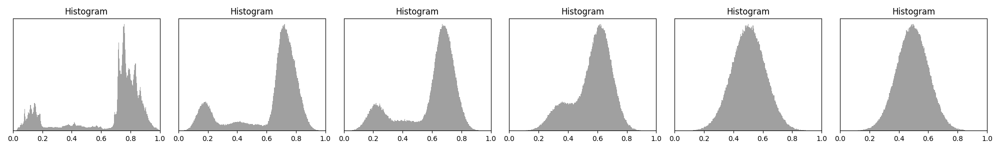
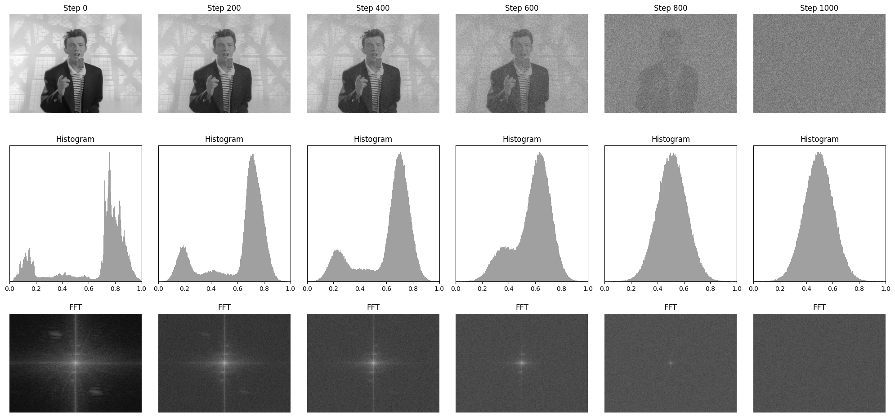

# Diffusion Mechanism


Authors:

* Alper Bahçekapılı (On the right in Figure 1)
* Furkan Küçük (On the left in Figure 1)

Prepared as an activity of the Middle East Technical University - [CENG 796 Deep Generative Models course](https://user.ceng.metu.edu.tr/~gcinbis/courses/Spring24/CENG796/index.html).


## Table of Content

1. [Introduction to Diffucion](#what-is-diffusion-?)
    1. [Forward Diffusion Process](#forward-diffusion-process)
    2. [Backward Diffusion](#backward-diffusion)
2. [Learning how to Diffuse](#learning-how-to-diffuse)
    1. [Tractability of the Reverse Diffusion](#tractability-of-the-reverse-diffusion)
    2. [Variational Upper Bound](#variational-upper-bound)
    3. [Putting Everything Together](#putting-everything-together)
3. [Known Diffusion Models](#known-diffusion-models)
4. [Discussions](#discussions)
5. [Citations](#citations)


<figure>


<figcaption style="text-align: center">Figure 1: Generated Example [Generated by Suffering Students]</figcaption>
</figure>


Nowadays generative AI is a very hot topic. Of course in preivious years generative AI was being studied in various works starting from 1970s [1][2].  Even tough these foundational research papers are very important and valueable, Generative AI started to be a part of our daily lives especially after [ChatGPT](https://chatgpt.com/) comes out in 2022. The company behind ChatGPT, OpenAI has been working on these technologies beginning from 2015 which is the date when OpenAI is founded. ChatGPT is a generative model in text generation domain. Diffusion models are in image domain on the other hand. 


## What is diffusion ?

Diffusion is a mechanism where the ultimate goal is to generate the beautiful images you see above. Of course the mechanism is not only used to generate images, with proper formulation diffusion models can approximate any type of data distribution.

Diffusion has two main processes:

* **Forward diffusion:** Gradually adds niose to the input
* **Reverse denoising:** Learns to generate the data with denoising
<figure>

<figcaption style="text-align: center">Figure 2: Diffusion Process Overview</figcaption>
</figure>


<br><br><br>


**Theoretical Backgorund**

You can view diffusion as following. The main goal is to convert complex distribution into a simpler target distribution by means of transition kernel $T$.

$$x_0 \sim p_{complex} \to T(x_0)\sim p_{prior}$$

**Explanation:** $p_{complex}$ refers to the target data distribution. Which sis referred as complex because the distribution is which we want to learn and be able to generate at the end. $`p_{prior}`$ refers to the simple distribution or you can wiew it as Gaussian Distribution. This is the distribution we get after applying transition kernel $T$. Below this transition kernel is referred as $q(x|x')$  as well.


This kernels are modeled as repeated actions in diffusion. As you can see from the Figure 2, at each timestep $t_i$ model iteratively denoises the input. Thus at each timestep approaching to the target input distribution. How can we show that mathematically ?

$$p_{prior}(x) = \int q(x|x') p_ {prior}(x')dx'$$

If transition kernel q has the above property, then repeatedly applying this kernel leads samples towards $p_{prior}$.


However we are able to do this operation in discrete timesteps.

$$x_t \sim  q(x|x'= x_{t-1} ), \forall t>0$$

*t* is finite and typically sufficent in practive.

Because transition kernel is repeatedly applied we can see overall process as Markov chain.

$$q(X_t|X_{t-1}) = N(x_t; \sqrt{1-\beta_t} x_{t-1}, \beta_t I) $$

$$q(X_T) = p_{prior}(X_T) = N(x_t; 0, I) $$

We are doing these iterative operations in order to iteratively denoise the samples. To be able to generate the data, we need reverse diffusion process. 

$$x_T \sim N(0,1) \to T^{-1}(x_T) \sim p_{data}$$

Process $T^{-1}$ learns from the data. Below you can see a diffusion model that is trained to generate MNIST data [3].

<figure>

<figcaption style="text-align: center">Figure 3: MNIST dataset Diffusion Example</figcaption>
</figure>


## Forward Diffusion Process

Forward diffusion process is fixed. Starting from data $x_0$, forward diffusion process adds noise to the data with variance $\beta_t$ 

$$q(X_t|X_{t-1}) = N(x_t; \sqrt{1-\beta_t} x_{t-1}, \beta_t I) \to q(x_{1:T}|x_0)=\prod_{t=1}q(X_t|x_{t-1})$$

Using Gaussian's linearity over *t*, we can directly express $q(x_t|x_0)$ as a shortcut. We do not need to sample iteratively in forward process. Thus we can furhter speed up the training process.

Define 
$$\bar{\alpha_t} = \prod_{s=1}^{t}(1-\beta_s) \to q(x_t|x_0) = N(x_t;\sqrt{\bar{\alpha}_t}x_0, (1-\bar{\alpha}_t)I)$$

Sample: 
```math
x_t = \sqrt{\bar{\alpha}_t}x_0+\sqrt{(1-\bar{\alpha}_t)}\epsilon
```
where $`\epsilon \sim N(0,1)`$. Because we can obtain $x_t$ from the $x_0$ the forward process is much faster this way.

<br>

**How are $\beta_t$ values choosen ?**

There are multiple approaches that one can follow. Some of them are as following:

* Linearly schedule $\beta$ values from $\beta_1=10^{-4}$ to $\beta_T=0.02$ [4]
* Learn $\beta$ values together with the model [5]

**What are $\beta$ values and why are they used ?**

Below you may find a couple reasons why $\beta$ values are used and what is the intuition behind it. 

1. **Controlling Noise Addition:**
Forward Process: In the forward process, the diffusion model gradually adds Gaussian noise to an image over several time steps. Beta values, which typically range from a small value near zero to a higher value, determine the variance of the noise added at each step. This gradual increase in noise ensures that the original image is progressively corrupted, eventually turning into pure noise. The sequence of beta values defines the noise schedule, which is critical for training the model to learn how to reverse this process accurately.

2. **Reversing the Diffusion:**
Reverse Process: During the image generation phase, the model learns to reverse the forward process by progressively denoising the noisy image. The beta values again play a role, as they determine how much noise to remove at each step. This controlled removal of noise, guided by the learned parameters from the training phase, allows the model to reconstruct the image from the noise.


3. **Stability and Convergence:**

**Training Stability:** Properly chosen beta values ensure that the diffusion process is stable. If the noise is added too aggressively (large beta values), the model might struggle to learn the reverse process effectively. Conversely, too small beta values might not sufficiently corrupt the image, leading to insufficient training of the reverse process.

**Convergence:** A well-designed noise schedule defined by the beta values helps the model converge more efficiently during training. It ensures that the model can learn to generate high-quality images by balancing the noise addition and reLearning how to diffuse
moval processes.

4. **Fine-tuning Image Quality:**

Perceptual Quality: The specific pattern and magnitude of beta values can affect the perceptual quality of the generated images. Researchers often experiment with different schedules (e.g., linear, cosine) to find the optimal beta sequence that produces the best visual results


**What happens during forward diffusion process ?**


<figure>

<figcaption style="text-align: center">Figure 4: Distribution change during forward diffusion</figcaption>
</figure>


$$q(x_T) = \int q(x_0, x_t) = \int q(x_0) q(x_t | x_0) dx_0$$

We can sample $x_t \sim q(x_t)$ by first sampling $x_0 \sim q(x_0)$ and then sampling $x_t \sim q(x_t | x_0)$
q  in the $x_t \sim q(x_t | x_0)$ is the transition kernel. This trick lets us directly making use of $q(x_t | x_0)$ term.

## Backward Diffusion

At this step the main goal is to denoise the $x_t$ so that at each time step we iteratively denoise the $x_t$ a bit. At the end, we will get rid of the noise and reach to original data $x_0$

<figure>

<figcaption style="text-align: center">Figure 5: Diffusion Process Overview</figcaption>
</figure>


$$p(x_T)=N(x_T;0,I)$$

$$p_\theta(x_{t-1}|x_t)=N(x_{t-1};\mu_\theta(x_t,t),\sigma^2_t I) \to p_\theta(x_{0:T}) = p(x_T) \prod_{t=1}^Tp_{\theta}(x_{t-1}|x_t)$$

$\mu_\theta \to$ is a trainable network to estimate $p(x_{t-1}|x_t)$ This can be U-net like model or denoising autoencoder etc. 

! One important point to note is that network is shared across all time steps. So takes *t* (time step) as input as well.

! As you recall $`\bar{\alpha_t}`$ is defined as follows.: 
```math
\bar{\alpha_t} = \prod_{s=1}^t(1-\beta_s)
```
Because $`\beta`$ values can be predefined and learned troughout the training, $`\bar{\alpha_t}`$ can be fixed or can be learned as well.

# Learning how to diffuse

## Tractability of the Reverse Diffusion

Within forward diffusion, we often use Gaussian noise to add noise to the input. However, in reverse diffusion, we need to learn the noise distribution. This is a challenging task because the noise distribution is not known. Let's remember the reverse diffusion process:

1. We start with a sample $x_T$ from the noise distribution $p(x_T) = N(x_T; 0, I)$
2. We apply the reverse diffusion process by applying the reverse transition kernel $q(x_{t-1}|x_t)$ to the sample $x_T$ to get $x_{T-1}$

That ultimately leads to the following formula:

$$p_{data}(x_0: x_T) = p_{data}(x_0) \prod_{t=1}^{T} q(x_{t-1}|x_t)$$

However, the reverse transition kernel is not recoverable, because it's the true denoising distribution, which is also a function of the real data distribution, and we don't know that. This makes the reverse diffusion process intractable.

To make the reverse diffusion process tractable, we need to approximate the reverse transition kernel. There are 2 main assumptions that make the reverse diffusion tractable:

1. **Assumption 1: Noise is Gaussian:** We assume that the noise distribution is Gaussian, which is a common assumption in diffusion models. This assumption simplifies the reverse diffusion process because we can learn the noise distribution from the data. This is the main assumption that makes the reverse diffusion tractable. 

As we already know the noise distribution is Gaussian, we only need to learn the mean and variance of the noise distribution at each time step. This is done by training a neural network to predict the mean and variance of the noise distribution at each time step, which yields:

$$q(x_{t-1}|x_{t:T}) = N(x_{t-1}; \mu_{\theta}(x_{t:T}), \sigma_{\theta}(x_{t:T})I)$$

We are doing some redundant calculations here, because we are predicting the mean and variance of the noise distribution at each time step. 

**RECALL**: We were delibaretly adding noise to the input at each time step with scheduled variance. So, we may choose to obtain it from the schedule directly.

$$q(x_{t-1}|x_{t:T}) = N(x_{t-1}; \mu_{\theta}(x_{t:T}), \sigma_{t}I)$$

2. **Assumption 2: Noise is Independent:** We assume that the noise at each time step is independent. This assumption simplifies the reverse diffusion process because we can learn the noise distribution at each time step independently. This is also known as the Markovian assumption. 

**It should be known that;** the process was already tractable since the first assumption, but, it's just hard to train all those parameters. Besides of that, as we recall from the forward diffusion process, we were adding noise to each timestep by sampling independently from the previous timesteps. By predicting the noise, instead of the resulting image, we can safely assume the markovian property.

Markovian assumption yields:

$$q(x_{t-1}|x_{t}) = N(x_{t-1}; \mu_{\theta}(x_{t}), \sigma_{t}I)$$

In the end, we can approximate the data distribution by applying the reverse diffusion process with the approximated reverse transition kernel:

$$q(x_{0:T}) = p_{data}(x_0) \prod_{t=1}^{T} q(x_{t-1}|x_t)$$

In a sense, we made it tractable by using an estimator. However, estimator cannot be trained directly, as timesteps still depend on the earlier timesteps. It's useful for the, wait for it, estimation part, which is essentially the inference part. This takes us back to the ground zero: intractable reverse diffusion (for training).

## Variational Upper Bound

So, we still need to calculate the $q(x_{t-1}|x_t)$, which is intractable. To overcome this, we can use a variational upper bound. The variational upper bound is a way to approximate the intractable posterior distribution with a simpler distribution. We can introduce another condition to make it tractable.

$$q(x_{t-1}|x_t, x_0) = N(x_{t-1}; \mu_{\theta}(x_t, x_0), \sigma_{t}I)$$

So, we need to optimize this:

$E_{q(x_0)}[-logp_{\theta}(x_0)]$

which is again, intractable. It's basically a log likelihood of our trainable model, which we don't have any access. We can use the variational upper bound to approximate this:

$$E_{q(x_0)}[-\log p_{\theta}(x_0)] \leq E_{q(x_0)q(x_{1:T}|x_0)}[-\log \frac{p_{\theta}(x_{0:T})}{q(x_{1:T}|x_0)}]$$

Now, let's break this down:

$$= E_q[log \frac{q(x_{1:T}|x_0)}{p_{\theta}(x_{0:T})}]$$
$$= E_q[log \frac{\prod_{t=1}^{T}q(x_{t}|x_{t-1})}{p_{\theta}({x_t})\prod_{t=1}^{T}p_{\theta}(x_{t-1}|x_t)}]$$
$$= E_q[\sum_{t=1}^{T}log \frac{q(x_{t}|x_{t-1})}{p_{\theta}(x_{t})p_{\theta}(x_{t-1}|x_t)} - log p_{\theta}(x_T)]$$
$$= E_q[log \frac{q(x_{1}|x_{0})}{p_{\theta}(x_{0}|x_1)} + \sum_{t=2}^{T}log \frac{q(x_{t-1}|x_{t}, x_0)}{p_{\theta}(x_{t-1}|x_t)} + log \frac{q(x_T|x_0)}{p_q(x_1|x_0)} - log p_{\theta}(x_T)]$$
$$= E_q[-log p_{\theta}(x_0|x_1) - \sum_{t=2}^{T} log \frac{q(x_{t-1}|x_t, x_0)}{p_{\theta}(x_{t-1}|x_t)} + log \frac{q(x_T|x_0)}{p_{\theta}(x_T)}]$$

Each term in the expectation is actually corresponds to different, reducable terms:

Let:

$$L_0 = E_q[-log p_{\theta}(x_0|x_1)]$$
$$L_t = D_{KL}(q(x_{t-1}|x_t, x_0)||p_{\theta}(x_{t-1}|x_t))$$
$$L_T = D_{KL}(q(x_T|x_0)||p_{\theta}(x_T))$$

Then, we can write the variational upper bound as:

$$E_q[L_0 + \sum_{t=2}^{T}L_t + L_T]$$

The term, $L_T$ can be ignored, as $q$ does not depend on model parameters and $p_{\theta}(x_T)$ is just a Gaussian noise. You can think of it as it only shows the q distribution, at the end of the diffusion process, which is only a Gaussian distribution, which is not a thing to learn.

Now, let's discuss $L_t$ term. It simply measures how far the predicted noise $p_{\theta}(x_{t-1}|x_t)$ is from the true noise $q(x_{t-1}|x_t, x_0)$. Luckily, $q(x_{t-1}|x_t, x_0)$ is a tractable distribution, which simply tries to model the "less nosiy" version by looking at the "current noisy" version and the "original" version, which we have access to. Another good thing about it is that, it actually is a Gaussian distribution.

$$q(x_{t-1}|x_t, x_0) = N(x_{t-1}; \tilde{\mu}_{t}(x_t, x_0), \tilde{\beta}_t I)$$

where $\tilde{\mu}(x_t, x_0)$ is the weighted average of the current noisy version and the original version, and $\beta_t$ is the variance of the noise.

As both $q(x_{t-1}|x_t, x_0)$ and $p_{\theta}(x_{t-1}|x_t)$ are Gaussian distributions, we can calculate the KL divergence between them analytically:

```math
D_{KL}(q(x_{t-1}|x_t, x_0)||p_{\theta}(x_{t-1}|x_t)) = E_q[\frac{1}{2\sigma_t^2}||\tilde{\mu}_{t}(x_t, x_0) - \mu_{\theta}(x_t,t)||^2] + C
```

Where C is a constant term that does not depend on the model parameters, and $\tilde{\mu}_{t}(x_t, x_0)$ is the weighted average of the current noisy version and the original version, which is calculated as:
```math
\tilde{\mu}_{t}(x_t, x_0) = \frac{\sqrt{\bar{\alpha}_t}x_0 * \beta_t}{1 - \bar{\alpha}_t}x_0 + \frac{\sqrt{1 - \beta_t}(1 - \bar{\alpha}_{t-1})}{1 - \bar{\alpha}_t}x_t
```
Normally, we would like to optimize this as is, as this is the most straight-forward way. However, [5] has some better ideas. Since $x_t = \sqrt{\bar{\alpha}_t}x_0 + \sqrt{1 - \bar{\alpha}_t}\epsilon$, we can simplify the equation as:

```math
\tilde{\mu}_{t}(x_t, x_0) = \frac{1}{\sqrt{1 - \beta_t}}(x_t - \frac{\beta_t}{\sqrt{1 - \bar{\alpha}_t}} \epsilon)
```
So, in another sense, we are substracting a scaled version of the noise ($\epsilon$) from the current noisy version to obtain the mean.

<!-- $$\tilde{\beta}_{t} = \frac{1 - \bar{\alpha}_{t-1}}{1 - \bar{\alpha}_t}$$ -->

However, we don't know that noise, so we estimate it, and that's the part we are trying to learn, and make it closer to the real mean. Here's a nice trick:

```math
$$\mu_{\theta}(x_t, t) = \frac{1}{\sqrt{1 - \beta_t}}(x_t - \frac{\beta_t}{\sqrt{1 - \bar{\alpha}_t}} \epsilon_{\theta}(x_t, t))$$
```

So, instead of directly estimating the mean, we estimate the noise, that generates the mean. 

Now, we can calculate the KL divergence between the two Gaussian distributions:

$$L_t = E_q[||\epsilon - \epsilon_{\theta}(x_t, t)||^2]$$

$$= E_{x_0 \sim q(x_0), \epsilon \sim N(0, I)}[||\epsilon - \epsilon_{\theta}(\sqrt{\bar{\alpha}_t}x_0 + \sqrt{1 - \bar{\alpha}_t} + \sqrt{1 - \bar{\alpha}_t}\epsilon, t)||^2]$$

Note that, we omitted the scaling of the real noise, as it's been observed in [5] that it's not having those improves the sample quality.

## Putting everything together

By now, we have discussed the theoretical background of diffusion models, the forward and reverse diffusion processes, and how to make the reverse diffusion process tractable. We have also discussed the variational upper bound and how to calculate the KL divergence between the predicted noise and the true noise. Now, let's put everything together and discuss the training and inference algorithms for diffusion models.

### Training algorithm:

1. Sample a batch of data $x_0$ from the data distribution $q(x_0)$, $x_0 \sim q(x_0)$
2. Sample time steps $t$ from uniform distribution, $t \sim U(1, T)$
3. Apply noise to the data $x_0$ to get $x_t$, $x_t = \sqrt{\bar{\alpha}_t}x_0 + \sqrt{1 - \bar{\alpha}_t}\epsilon$, $\epsilon \sim N(0, I)$
4. Calculate the KL divergence between the predicted noise and the true noise, $L_t = E_q[||\epsilon - \epsilon_{\theta}(x_t, t)||^2]$
5. Update the model parameters by minimizing the loss, $\theta = \theta - \alpha \nabla_{\theta}L_t$
6. Repeat steps 1-5 for a number of iterations

### Inference algorithm:
1. Sample noise to start the reverse diffusion process, $X_T \sim N(0, I)$
2. Apply the reverse diffusion process to get the data, $X_{t-1} = \mu_{\theta}(X_t, t) + \sigma_t \epsilon$, $\epsilon \sim N(0, I)$
3. Repeat step 2 for a number of iterations until you get the original data $X_0$


# Known diffusion models

There are a lot of diffusion models out there. Denoising diffusion probabilistic models, score based generative models, continuous time diffusion models, latent diffusion models... Below you can see a few examples which are very popular lately.

## DALL-E 3


<figure>

<figcaption style="text-align: center">Figure 6: DALL-E Generated Image</figcaption>
</figure>

Original name of the paper is [
Improving Image Generation with Better Captions
](https://cdn.openai.com/papers/dall-e-3.pdf)

Overview:

DALL-E 3 represents a significant leap in the capabilities of text-to-image models. Building upon the success of its predecessors, DALL-E 3 enhances the quality, coherence, and variety of generated images, offering even more precise and contextually relevant outputs from given text prompts.

Key Improvements:

DALL-E 3 generates higher resolution images with more detail and fewer artifacts compared to DALL-E 2. DALL-E 3 has been trained on a more diverse and extensive dataset, enabling it to generate images across a wider range of subjects and styles.


## Stable Diffusion

<figure>

<figcaption style="text-align: center">Figure 7: Stable Diffusion Generated Image</figcaption>
</figure>


Latest stable diffusion 3 paper: [here](https://stability.ai/news/stable-diffusion-3-research-paper)


Stable Diffusion, developed by Stability AI, is a powerful text-to-image generative model. It operates using Latent Diffusion Models (LDMs), where the diffusion process occurs in a lower-dimensional latent space rather than directly in the pixel space. This method enhances computational efficiency and scalability, enabling the generation of high-resolution images quickly and effectively. Applications range from digital art and design to healthcare and education, making it a versatile tool in various industries. However, challenges such as maintaining image consistency and addressing data biases remain key areas for ongoing research and improvement


# Discussions

## Other type of noises

We have been using Gaussian noise to add noise to the data in the forward diffusion process, which relies heavily on variational inference. However, models like Cold Diffusion [6] have shown that we can use other types of noise; even the deterministic degredations like blur, masking, etc. can be employed.

## Content-Detail Tradeoff


<figure>


<figcaption style="text-align: center">Figure 8: Content-Detail Tradeoff</figcaption>
</figure>

As it can be seen from the image, the diffusion process first destroys the high frequency content, and then the low frequency content. This is a tradeoff between the content and the details. The content is preserved, but the details are lost. So, the reverse diffusion process also attempts to do so, by first recovering the low frequency content, and then the high frequency content. So, the weighting of the loss terms should be carefully chosen for different time steps.

## Noise Scheduling

Adding noise at different timesteps, introduces some implicit mechanisms, just like the things we've just discussed within the content-detail tradeoff part. So, we lose different portions of the data, when applying the same noise at different timesteps, which also yields we can take different steps to recover them at each timestep. To do this, we can schedule the variance of the noise, $\beta_t$, to be different at each timestep. [7][8][9]

## Network Architectures

Traditionally, we use autoencoders, or U-nets to model the noise distribution. How the model architecture can be altered is (and probably always will be) an open question. 

What's can be altered is a matter of imagination. Here're some examples:

- Different types of autoencoders [basically most of the diffusion papers]
- Different layer types [basically most of the diffusion papers]
- Representing input data(time, etc.) in a different way [10]
- Conditioning the model with some other data or even modalities [11]-[14]

# Citations

[1] L. E. Baum, T. Petrie, G. Soules, and N. Weiss, “A maximization technique occurring in the statistical analysis of probabilistic functions of Markov chains,” Annals of Mathematical Statistics, vol. 41, no. 1, pp. 164–171, Feb. 1970, doi: 10.1214/aoms/1177697196.

[2] G. E. Hinton and T. J. Sejnowski, “Learning and relearning in Boltzmann machines,” in The MIT Press eBooks, 2001, pp. 45–76. doi: 10.7551/mitpress/3349.003.0005.

[3] Y. Lecun, L. Bottou, Y. Bengio, and P. Haffner, “Gradient-based learning applied to document recognition,” Proceedings of the IEEE, vol. 86, no. 11, pp. 2278–2324, Jan. 1998, doi: 10.1109/5.726791.

[4] J. Ho, A. Jain, and P. Abbeel, “Denoising diffusion probabilistic models,” arXiv (Cornell University), Jan. 2020, doi: 10.48550/arxiv.2006.11239.

[5] J. Sohl-Dickstein, E. Weiss, N. Maheswaranathan, and S. Ganguli, “Deep Unsupervised Learning using Nonequilibrium Thermodynamics,” Deep Unsupervised Learning Using Nonequilibrium Thermodynamics. Proceedings of the 32nd International Conference on Machine Learning, pp. 2256–2265, Jul. 2015, [Online]. Available: http://ganguli-gang.stanford.edu/pdf/DeepUnsupDiffusion.pdf

[6] A. Bansal et al., “Cold diffusion: inverting arbitrary image transforms without noise,” arXiv (Cornell University), Jan. 2022, doi: 10.48550/arxiv.2208.09392.

[7] D. P. Kingma, T. Salimans, B. Poole, and J. Ho, “Variational diffusion models,” arXiv (Cornell University), Jan. 2021, doi: 10.48550/arxiv.2107.00630.

[8] A. Q. Nichol and P. Dhariwal, “Improved denoising diffusion probabilistic models,” arXiv (Cornell University), Jan. 2021, doi: 10.48550/arxiv.2102.09672.

[9] F. Bao, C. Li, J. Zhu, and B. Zhang, “Analytic-DPM: an Analytic Estimate of the Optimal Reverse Variance in Diffusion Probabilistic Models,” arXiv (Cornell University), Jan. 2022, doi: 10.48550/arxiv.2201.06503.

[10] P. Dhariwal and A. Nichol, “Diffusion models beat GANs on image synthesis,” arXiv (Cornell University), Jan. 2021, doi: 10.48550/arxiv.2105.05233.

[11] R. Rombach, A. Blattmann, D. Lorenz, P. Esser, and B. Ommer, “High-Resolution Image Synthesis with Latent Diffusion Models,” arXiv (Cornell University), Jan. 2021, doi: 10.48550/arxiv.2112.10752.

[12] L. Zhang and M. Agrawala, “Adding conditional control to Text-to-Image diffusion models,” arXiv (Cornell University), Jan. 2023, doi: 10.48550/arxiv.2302.05543.

[13] C. Mou et al., “T2I-Adapter: Learning Adapters to Dig out More Controllable Ability for Text-to-Image Diffusion Models,” arXiv (Cornell University), Jan. 2023, doi: 10.48550/arxiv.2302.08453.

[14] X. Hu, R. Wang, Y. Fang, B. Fu, P. Cheng, and G. Yu, “ELLA: Equip Diffusion Models with LLM for Enhanced Semantic Alignment,” arXiv (Cornell University), Mar. 2024, doi: 10.48550/arxiv.2403.05135.

### Acknowledgemets

Figure 1 is generated via DALL-E.

Scripts for obtaining timesteps for the diffusion models (Figure 3) we trained is given in the test.py and train.py is the script that we used during training of our diffusion model.

Experiments.ipynb notebook was used to obtain Figure 2, 4, 5 and 8.
