Prepared as an activity of the [Middle East Technical University - CENG 796 Deep Generative Models course](<https://user.ceng.metu.edu.tr/~gcinbis/courses/Spring24/CENG796/index.html>).

**GENERATIVE ADVERSERIAL NETWORKS (GANs)**

**CENG796 Deep Generative Models (Spring 2024) Topic Summary**
**Authors:** Yiğit Ekin and Mustafa Utku Aydoğdu

### Table of Contents
- [Table of Contents](#table-of-contents)
- [Introduction](#introduction)
- [Motivation Behind GANs](#motivation-behind-gans)
- [Mathematical Description of Motivation Behind GANs](#mathematical-description-of-motivation-behind-gans)
- [Distance Between Distributions](#distance-between-distributions)
- [Adversarial Training](#adversarial-training)
- [Discriminator Update:](#discriminator-update)
- [Generator Update:](#generator-update)
- [GAN Objective](#gan-objective)
  - [Optimal Bayesian Discriminator](#optimal-bayesian-discriminator)
  - [Insertion of the Optimal Discriminator into GAN MLE Objective](#insertion-of-the-optimal-discriminator-into-gan-mle-objective)
- [KLD as a Mode Covering Measure:](#kld-as-a-mode-covering-measure)
- [JSD as a Mode Seeking Measure:](#jsd-as-a-mode-seeking-measure)
- [Jensen-Shannon Divergence (JSD) and Mode Collapse:](#jensen-shannon-divergence-jsd-and-mode-collapse)
- [Kullback-Leibler Divergence (KLD) and Mode Covering:](#kullback-leibler-divergence-kld-and-mode-covering)
- [Mode Collapse in GANs](#mode-collapse-in-gans)
    - [1st Alternative:](#1st-alternative)
    - [2nd Alternative:](#2nd-alternative)
- [GAN Papers Worth Mentioning Over the Years](#gan-papers-worth-mentioning-over-the-years)
    - [DCGAN (Deep Convolutional GAN)](#dcgan-deep-convolutional-gan)
    - [Improved Training of GAN’s](#improved-training-of-gans)
    - [Wasserstein GAN (WGAN)](#wasserstein-gan-wgan)
    - [How to ensure Lipschitz Continuity:](#how-to-ensure-lipschitz-continuity)
    - [Spectral Normalization GAN (SNGAN):](#spectral-normalization-gan-sngan)
    - [Self Attention GAN:](#self-attention-gan)
    - [Role of Self-Attention in Deep Learning:](#role-of-self-attention-in-deep-learning)
    - [BigGAN:](#biggan)
    - [StyleGAN V1](#stylegan-v1)
    - [StyleGAN2:](#stylegan2)
    - [StyleGAN 3:](#stylegan-3)
### Introduction
​​Generative Adversarial Networks (GANs) are a class of machine learning frameworks designed by Ian Goodfellow and his colleagues in 2014. GANs consist of two neural networks, the generator and the discriminator, which are trained simultaneously through adversarial processes. The generator creates synthetic data resembling real data, while the discriminator evaluates the authenticity of both real and synthetic data. This dynamic interaction leads to the generator producing increasingly realistic data over time. GANs have revolutionized the field of artificial intelligence, enabling advancements in image and video synthesis, data augmentation, and various creative applications.

### Motivation Behind GANs
Contrary to previous models such as autoregressive models, which focus on likelihood maximization, GANs prioritize the generation of high-quality samples. Autoregressive models aim to predict the next data point in a sequence based on prior data points, optimizing for the likelihood of the sequence. In contrast, GANs, through their adversarial training mechanism, concentrate on producing new data that closely mirrors the training data, without directly estimating the likelihood. This makes GANs particularly suitable for tasks where the primary goal is the creation of realistic new samples rather than likelihood estimation.

In GANs, we sample \( z \) from a fixed noise source distribution, typically uniform or Gaussian. This noise is then passed through a deep neural network to generate a sample \( x \). This process might sound familiar, resembling approaches used in Flow Models and Variational Autoencoders (VAEs). However, the key difference in GANs lies in the learning process of the deep neural network, which occurs without explicit density estimation. Instead, GANs use adversarial training, where the generator and discriminator networks refine each other’s performance through a competitive process, leading to the generation of highly realistic data samples.

### Mathematical Description of Motivation Behind GANs
The conceptualization of Generative Adversarial Networks (GANs) revolves around the fundamental goal of minimizing the disparity between the distribution of real data $(P_{\text{data}})$ and the distribution induced by the generated samples $(P_{\text{model}})$. Initially, the framework operates with samples drawn from the data distribution $(P_{\text{data}})$, denoted as $(x_1, x_2, \ldots, x_n)$. Subsequently, a sampler function $(q_\phi(z))$, dependent on a deep neural network (DNN), comes into play. This sampler receives input from a distribution $(p(z))$, generating data points $(x)$ via learned parameters $(\phi)$. Consequently, this process leads to the induction of a density function $(P_{\text{model}})$ from the sampler $(q_\phi(z))$. It's crucial to note that both $(P_{\text{data}})$ and $(P_{\text{model}})$ lack explicit forms; thus, only samples can be drawn from them. The overarching objective then becomes the minimization of the discrepancy between $(P_{\text{model}})$ and $(P_{\text{data}})$ by iteratively adjusting the parameters $(\phi)$, aiming for the model distribution $v((P_{\text{model}}))$ to closely approximate the data distribution $((P_{\text{data}}))$. This encapsulates the essence of learning a model distribution via a neural network-based sampler, with a primary emphasis on diminishing the disparity between the distributions.

### Distance Between Distributions
With density models, we used the Kullback-Leibler divergence $\( KL(p_{\text{data}} \parallel p_{\text{model}}) \)$, leading to the objective 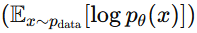

 , where $\( p_{\theta}(x) \)$ is explicitly modeled. However, in the context of GANs, we do not have an explicit form for $\( p_{\theta}(x) \)$. 

This absence necessitates the use of alternative distance measures that may behave differently from maximum likelihood estimation. Examples of such distance measures include Maximum Mean Discrepancy (MMD), Jensen-Shannon Divergence (JSD), and Earth Mover’s Distance (EMD), among others.

### Adversarial Training
The min-max game is a concept primarily used in game theory, optimization, and machine learning, particularly in the context of Generative Adversarial Networks (GANs). In a GAN, two neural networks, the generator and the discriminator, are trained simultaneously through a min-max game. The objective of the generator is to produce realistic data samples, while the discriminator aims to distinguish between real and fake samples. 

The min-max game can be mathematically represented as follows:

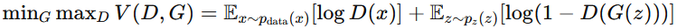

Let's break down this equation:

- \( D \) represents the discriminator network, which tries to maximize its ability to distinguish between real (\( x \)) and generated (\( G(z) \)) data.
  
- \( G \) represents the generator network, which tries to minimize the ability of the discriminator to distinguish between real and generated data.

- \( V(D, G) \) is the value function, representing the performance of the discriminator and the generator. This function is defined as the following objective function, which is to be maximized by \( D \) and minimized by \( G \):

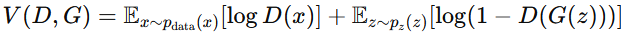
- $\( p_{\text{data}}(x) \)$ represents the distribution of real data samples.
  
- $\( p_z(z) \)$ represents the prior distribution of the input noise vector \( z \), usually a simple distribution such as uniform or Gaussian.

- \( G(z) \) represents the generated data sample obtained by passing random noise \( z \) through the generator network.

- The first term 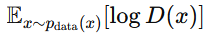 calculates the expected value of the log-probability that the discriminator assigns to real data samples. The discriminator wants to maximize this value, indicating that it correctly classifies real data as real.
  
- The second term 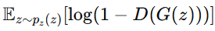 calculates the expected value of the log-probability that the discriminator assigns to generated (fake) data samples. The generator wants to minimize this value, indicating that it successfully fools the discriminator into classifying fake data as real.

By iteratively updating the parameters of the generator and the discriminator networks using gradient descent/ascent based on this min-max objective, the GAN training process seeks a Nash equilibrium where the generator produces samples that are indistinguishable from real data, and the discriminator cannot reliably differentiate between real and fake samples.

### Discriminator Update:

The objective for the discriminator \( D \) is to maximize the value function \( V(D, G) \). Therefore, the update rule for the discriminator parameters $\( \theta_D \)$ is obtained by taking the gradient of \( V(D, G) \) with respect to $\( \theta_D \)$.

The update rule for the discriminator involves ascending the gradient of the loss function with respect to its parameters:

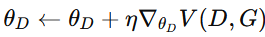

Where:
- $\( \eta \)$ is the learning rate.

The gradient of \( V(D, G) \) with respect to $\( \theta_D \)$ can be computed as:

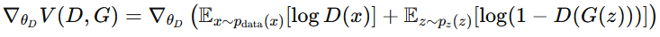
### Generator Update:

The objective for the generator \( G \) is to minimize the value function \( V(D, G) \). Therefore, the update rule for the generator parameters $\( \theta_G \)$ is obtained by taking the gradient of \( -V(D, G) \) (since we're minimizing) with respect to $\( \theta_G \)$.

The update rule for the generator involves descending the gradient of the negative loss function with respect to its parameters:

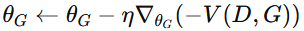
Where:
- $\( \eta \)$ is the learning rate.

The gradient of \( -V(D, G) \) with respect to $\( \theta_G \)$ can be computed as:

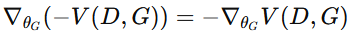

### GAN Objective

#### Optimal Bayesian Discriminator 
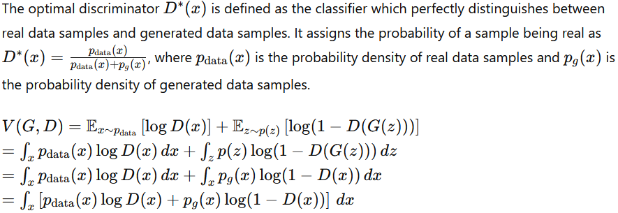

#### Insertion of the Optimal Discriminator into GAN MLE Objective 
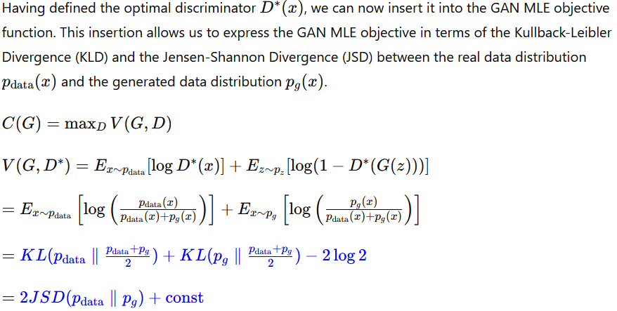

Hence, although not defining density explicitly, GANs can be seen as minimizing the Jensen-Shannon Divergence between the real data distribution and the generated data distribution. This approach allows GANs to generate high-quality samples without explicitly estimating the likelihood of the data.

In the context of Generative Adversarial Networks (GANs), understanding the role of divergence measures such as the Kullback-Leibler Divergence (KLD) and the Jensen-Shannon Divergence (JSD) is crucial for comprehending the dynamics of training and the phenomenon of mode collapse.

### KLD as a Mode Covering Measure:

The Kullback-Leibler Divergence (KLD) is a measure of how one probability distribution diverges from a second distribution in a setting where the first distribution is accepted as ground truth . KLD is used to encourage the model to cover as many modes (distinct data distributions) of the real data distribution as possible. By minimizing the KLD between the distribution of generated samples and the distribution of real samples, the generator aims to match the overall distribution of the real data

### JSD as a Mode Seeking Measure:

The Jensen-Shannon Divergence (JSD) is a symmetrized and smoothed version of the KLD, which measures the similarity between two probability distributions. In the context of GANs, the JSD is used as the objective function when training the discriminator. It encourages the discriminator to distinguish between real and generated samples effectively. However, it also seeks to minimize the divergence between the two distributions. As a result, it indirectly encourages the generator to collapse modes and produce samples that resemble only a subset of the modes present in the real data distribution. 

### Jensen-Shannon Divergence (JSD) and Mode Collapse:

- **Cause of Mode Collapse:** JSD, utilized in GANs as a measure of similarity between probability distributions, aims to encourage the generator to produce samples that resemble real data while making it difficult for the discriminator to differentiate between real and generated samples. However, this objective can inadvertently lead to mode collapse. When the generator focuses on producing samples that fool the discriminator by generating a limited set of modes, it may ignore less dominant modes present in the real data distribution. As a result, the diversity of generated samples decreases, leading to mode collapse.

- **High-Quality Generation:** Despite its tendency to cause mode collapse, JSD enables the generation of high-quality samples in GANs. By focusing on generating samples that closely resemble real data, JSD encourages the generator to capture fine details, textures, and overall realism in the generated images. This emphasis on producing realistic samples contributes to the high perceptual quality of the generated images, making them visually appealing and indistinguishable from real data in many cases.

### Kullback-Leibler Divergence (KLD) and Mode Covering:

- **Mode Covering Objective:** KLD encourages the generator to cover as many modes present in the real data distribution as possible. By covering a wide range of modes, the generator produces diverse samples that capture the full spectrum of variability present in the real data.

- **Lower Quality Examples:** While KLD promotes mode covering and diversity in the generated samples, it may lead to lower quality examples compared to JSD. This is because the emphasis on covering all modes can sometimes result in the generation of unrealistic or less coherent samples. Since KLD does not prioritize producing samples that closely resemble real data, the generated samples may lack fine details, textures, or overall realism, leading to a perceptual decrease in quality.

The Kullback-Leibler Divergence (KLD) between two probability distributions $\( p_{\text{data}}(x) \)$ and $\( p_{\text{generated}}(x) \)$ can be expressed as:

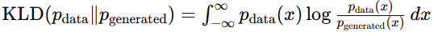
This formula quantifies the divergence between the probability distribution of real data $(\( p_{\text{data}}(x) \))$ and the probability distribution of generated data $(\( p_{\text{generated}}(x) \))$. It measures the average logarithmic difference between the two distributions over all possible values of the random variable $\( x \)$.

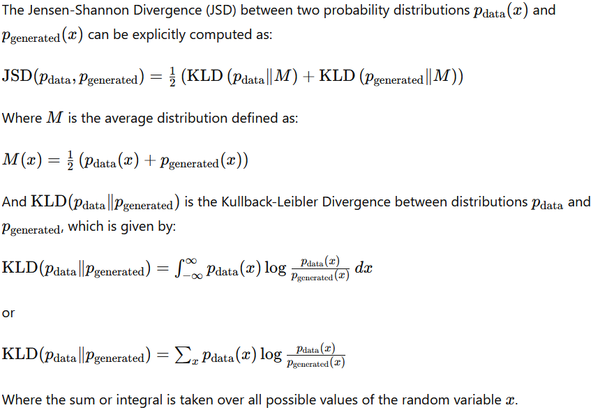

**KLD:** Heavily penalizes assigning very low density to real data samples

**Reverse KLD:** Heavily penalizes assigning very low density to generated samples

**JSD:** Mode seeking, encourages the covering mode of the real data distribution. Can be seen as something in between KLD and Reverse KLD.

### Mode Collapse in GANs
One important problem in GAN training  is the saturation problem. It  refers to a situation where the discriminator becomes overly confident in its predictions, leading to ineffective training and instability. 
When the discriminator becomes too effective at distinguishing between real and generated samples, it may start assigning extreme probabilities (close to 0 or 1) to all samples, regardless of their actual authenticity. As a result, the gradients provided to the generator during backpropagation become very small or even vanish entirely. This makes it difficult for the generator to learn from the discriminator's feedback and improve its sample generation process.

##### 1st Alternative:
Original Issue: Generator samples confidently classified as fake by the discriminator receive no gradient for the generator update.

**Fix**: Avoid fully training the discriminator (\(D\)) in inner optimization.

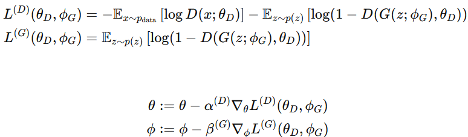

##### 2nd Alternative:
Original Issue: Generator samples confidently classified as fake by the discriminator receive no gradient for the generator update.

**Fix**: Use non-saturating loss for when the discriminator is confident about fake.

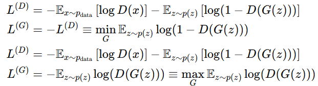

**Interpretation:** Instead of minimizing the probability of being fake, the non-saturating loss aims to maximize the probability of being real. This helps to provide gradients for the generator even when the discriminator is confident about the fakeness of generated samples.

### GAN Papers Worth Mentioning Over the Years

##### DCGAN (Deep Convolutional GAN)

DC-GAN, short for Deep Convolutional Generative Adversarial Network, represents a significant advancement over the original GAN architecture, introducing a series of enhancements to foster more stable and effective training processes. 

At its core, the architecture of DC-GAN revolves around a carefully crafted generator (G) network, which undergoes several iterations of refinement. The initial layer comprises a fully connected (fc) layer followed by a reshape operation. Subsequent layers leverage the power of "transposed convolution," sometimes ambiguously referred to as deconvolution. This operation, akin to a learned upsampling layer, essentially performs a form of 'locally scaled copy-paste', expanding spatial dimensions while halving the depth. As a result, at each layer, the spatial resolution increases twofold while the depth reduces by half.

During training, input images are rescaled to a range of [-1, +1], and the hyperbolic tangent (tanh) function is applied to ensure that the output of the generator network also adheres to this scale.

A pivotal detail in ensuring the stability of the training process lies in the selection of batch normalization statistics for the discriminator (D). It is advantageous to compute separate batch statistics for both synthetic and real examples, a strategy that helps maintain equilibrium and fidelity in the learning dynamics. You can see the architecture at Figure 1 of the [paper](https://arxiv.org/pdf/1511.06434)

The guidelines for constructing stable Deep Convolutional GANs are meticulously outlined. Pooling layers in the discriminator are replaced with strided convolutions, offering more flexibility and robustness. In the generator, fractional-strided convolutions, also known as transposed convolutions, are preferred, facilitating smoother upsampling operations. Furthermore, batch normalization is applied to both the generator and discriminator, contributing to the regularization and stability of the training process. Fully connected hidden layers, particularly in deeper architectures, are eliminated to streamline the model's complexity and enhance computational efficiency. Activation functions play a crucial role, with ReLU activation favored for the generator's internal layers, while the output layer employs Tanh. Conversely, LeakyReLU activation is recommended for all layers within the discriminator, promoting better gradient flow and mitigating the risk of vanishing gradients.

Remarkably, DC-GAN demonstrates the potential for noise arithmetic, enabling the generation of diverse effects akin to those observed in word embeddings like word2vec. Notably, these effects are achieved without the need for labeled data, underscoring the model's versatility and unsupervised learning capabilities. By averaging multiple input z vectors, the model can generate consistent results, exemplified by its ability to produce variations of a theme, such as a smiling woman, with remarkable stability and fidelity.

##### Improved Training of GAN’s

**Feature Matching**
Feature matching in GANs introduces a supplementary loss term based on the feature representations extracted from an intermediate layer ('f') of the discriminator ('D'). Mathematically, this can be expressed as:

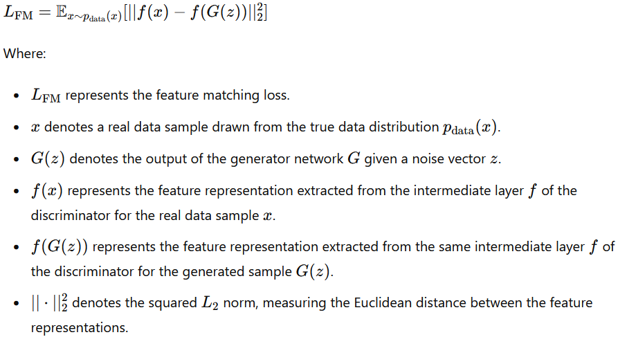

This loss term encourages the generator to produce samples that not only deceive the discriminator but also match the intermediate feature representations of real data samples, thereby enriching GAN training and promoting stability in the learning process.

**Minibatch discriminator:**

1. **Feature Extraction**: The Minibatch Discriminator operates by extracting feature vectors from samples, both generated by the GAN's generator and from the real dataset.

2. **Similarity Analysis**: After obtaining these feature vectors, the discriminator compares them across samples. It looks for similarities among the representations of the generated samples. Essentially, it's assessing whether the generated samples are too similar to each other.

3. **Mode Collapse Detection**: Mode collapse is a phenomenon in GAN training where the generator produces a limited variety of samples, often focusing on only a few modes of the data distribution. By analyzing the similarities across generated samples, the Minibatch Discriminator can detect when the generator is producing samples that are too close to each other, indicating a potential mode collapse scenario.

4. **Diversity Promotion**: When the discriminator identifies that the generated samples are too similar, it can provide feedback to the generator to encourage more diverse output. This feedback mechanism helps promote diversity in the generated samples and prevents the GAN from getting stuck in producing a limited range of outputs.

In essence, the Minibatch Discriminator serves as a mechanism for the GAN to self-monitor and adjust its training process to ensure that it generates diverse and realistic samples, thereby mitigating the risk of mode collapse.

**Historical Averaging in D parameters:**
 Historical averaging in discriminator parameters involves maintaining a running average of past parameter values during training. To regulate and prevent rapid, large changes in the discriminator (D) parameters during GAN training, applying smoothing over time is essential. This is typically achieved through methods like historical averaging. By incorporating historical information into parameter updates, this regularization technique helps stabilize training and promotes smoother transitions in the discriminator's parameters over successive iterations. Below equation demonstrates the implementation of the algorithm:

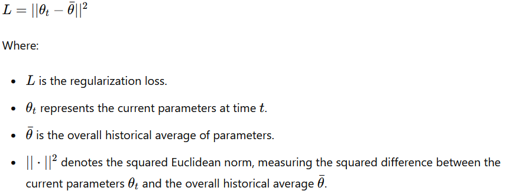

  

**One-sided label smoothing:**

In real-world datasets, imperfections and artifacts are common. If the discriminator (D) becomes too confident in identifying these artifacts as real data, it may overfit, learning nonsensical patterns that could mislead the generator (G) into reproducing these artifacts. One-sided label smoothing addresses this issue by adjusting the labeling of real data. Instead of using a binary [1,0] label, where real samples are labeled as completely certain (1) and generated samples as completely uncertain (0), this technique introduces a slight adjustment, such as [.9, .1]. By discouraging D from becoming overly confident and penalizing high confidences (e.g., above .9), one-sided label smoothing promotes a more balanced and effective training process in GANs.

**Virtual Batch Normalization (VBN):**
Virtual Batch Normalization  addresses the issue of within-batch coupling in Generative Adversarial Networks (GANs), which stems from traditional Batch Normalization (BN) methods. While BN effectively reduces mode collapse by ensuring a diverse range of generated samples, it introduces the problem of within-batch coupling, where samples within a single batch become too similar. VBN tackles this by fixing the inputs once chosen and using them to compute batch statistics. Unlike BN, where batch statistics are recalculated for each batch, VBN maintains fixed statistics for the chosen inputs throughout training. However, this approach comes with a trade-off: while it mitigates within-batch coupling, it may decrease the quality of batch normalization as the mean and standard deviation statistics are fixed. To mitigate this, two common strategies are employed: using a very large reference batch or appending each example with reference examples to collect per-example virtual batches. Typically applied only in the generator (G) of the GAN, VBN ensures that generated samples cover a diverse range of possibilities, akin to how cookies from a batch can have distinct flavors and textures.

**Semi supervised Learning:**
When training the discriminator **(D)**, in addition to predicting whether an example is real or fake, we also want it to predict the class label. Here are the details:

**Outputs of the Generator (G):**
- The outputs generated by the generator **(G)** are labeled as class **(K+1)**.

**Labeling Real Examples:**
- For labeled real examples, the labels range from **1** to **K**.

**Handling Unlabeled Real Examples:**
- When dealing with unlabeled real examples (where the class is unknown), we use the following approach:
- Compute the log probability of the example belonging to one of the **K** classes: **$$\log p(y \in \{1, \ldots, K\} | x)$$**.
- This probability represents the likelihood that the example is from one of those **K** classes.
- Alternatively, we can express this as **$$1 - p(y = K+1 | x)$$**.

In summary, during training, the discriminator considers both real/fake classification and class label prediction. 
##### Wasserstein GAN (WGAN)

The Wasserstein GAN (WGAN) is a variant of the Generative Adversarial Network (GAN) designed to address issues encountered in traditional GANs, such as training instability and the challenge of effectively evaluating generated sample quality.
In conventional GANs, training involves using the binary cross-entropy loss function to optimize the discriminator and generator networks. This approach can lead to problems like mode collapse and vanishing gradients. WGAN introduces a novel loss function based on the Wasserstein distance, also known as Earth Mover's distance, which measures the dissimilarity between the distributions of real and generated data.
The core concept of WGAN involves replacing the discriminator with a critic network. This critic estimates the Wasserstein distance between the real data distribution and the generated data distribution. The training objective of WGAN focuses on minimizing this Wasserstein distance, which often results in more stable and effective training compared to traditional GANs.
WGAN operates on the premise that the dual of the Earth Mover's distance is the supremum of the difference between the expectations of a 1-Lipschitz function across real and generated samples. 

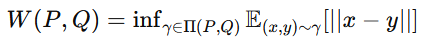
Lipschitz continuity is essential for stability and convergence in optimization, including in Generative Adversarial Networks (GANs). Mathematically, a function \( f \) is Lipschitz continuous if its output change is bounded by a constant multiple of its input change, expressed as:

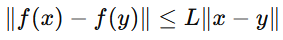
This property ensures that a smooth function exhibits a small change in output for a small change in input. In GANs, particularly in Wasserstein GANs (WGANs), enforcing Lipschitz continuity on the discriminator helps stabilize training. This is achieved by constraining the weights of the discriminator to have a bounded spectral norm, typically through a regularization term:

Wasserstein objective involves maximizing the difference in outputs of a Lipschitz function applied to real and generated samples.

The Kantorovich-Rubinstein duality plays a fundamental role in the formulation of Wasserstein GAN (WGAN) by providing a theoretical framework for optimizing the Wasserstein distance between probability distributions, which is essential for training the WGAN discriminator (critic).

The Kantorovich-Rubinstein duality is a concept from optimal transport theory, specifically relating to the formulation of the Wasserstein distance (also known as Earth Mover's distance). This duality establishes a connection between the Wasserstein distance and the supremum (or maximum) of a certain class of functions.

In the context of WGAN, the goal is to approximate the Wasserstein distance between the distribution of real data (say $\( P_r \)$ ) and the distribution of generated data (say $\( P_g \)$ ). The Wasserstein distance $\( W(P_r, P_g) \)$ is defined as:

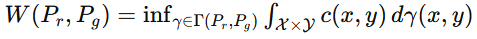
where $\( \Gamma(P_r, P_g) \)$ represents the set of joint distributions whose marginals are $\( P_r \)$ and $\( P_g \)$, and $\( c(x, y) \)$ is a cost function measuring the "distance" between elements \( x \) and \( y \) in the input space.

According to Kantorovich-Rubinstein duality, the Wasserstein distance $\( W(P_r, P_g) \)$ can be expressed as:

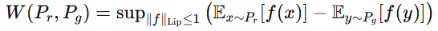

where $\( \| f \|_{\text{Lip}} \leq 1 \)$ denotes that \( f \) is a 1-Lipschitz function (i.e., the Lipschitz constant of \( f \) is less than or equal to 1). This formulation represents the supremum (maximum) of the difference in expectations of a 1-Lipschitz function \( f \) applied to samples from $\( P_r \)$ and $\( P_g \)$.

Intuitively, Lipschitz continuity means that the function \( f \) does not "stretch" distances too much. Specifically, the Lipschitz constant \( L \) provides an upper bound on how much the function value can change relative to changes in the input. If \( L = 0 \), \( f \) is called "locally constant"; otherwise, larger values of \( L \) indicate greater permitted variation in the function's values over its domain.

In WGAN, the discriminator (or critic) network \( f \) is trained to approximate this supremum. During training, the critic's objective is to maximize the difference between 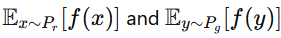
, which effectively estimates the Wasserstein distance between $\( P_r \)$ and $\( P_g \)$.

By leveraging Kantorovich-Rubinstein duality, WGAN provides a principled way to train the discriminator network to estimate the Wasserstein distance, resulting in more stable and meaningful gradients compared to traditional GANs. This theoretical foundation underpins the effectiveness of WGAN in generating high-quality samples and improving training stability.
##### How to ensure Lipschitz Continuity:

**WGAN with Gradient Clipping:**

In gradient clipping, the goal is to control the magnitude of gradients during training to prevent them from becoming too large, which can lead to issues like exploding gradients. This technique involves directly limiting the norm of the gradients of the critic (discriminator) network.

**Implementation:**
During training, after computing the gradients of the critic's parameters with respect to its loss, these gradients are clipped to ensure they do not exceed a specified threshold. This is achieved using operations like:
GANs with gradient clipping aim to prevent exploding gradients by directly limiting the magnitude of the gradients during training. This technique, similar to what was initially used in Wasserstein GANs (WGANs), lacks the theoretical underpinning of the Wasserstein distance. By clipping the gradients of the critic (discriminator) network, denoted as $\( \nabla_{\theta} \)$, to ensure they do not exceed a certain threshold \( c \):

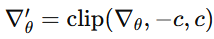

However, this approach is considered suboptimal, as noted by its authors. In contrast, WGAN-GP (WGAN with Gradient Penalty) offers a more sophisticated solution to stabilize training without relying on manual clipping. WGAN-GP extends the WGAN framework by addressing potential issues with weight clipping, which was originally used in WGAN. Instead of clipping weights, which can lead to suboptimal convergence and model behavior, WGAN-GP adds a gradient penalty term to the loss function.

**Relation to Lipschitz Continuity:**
Gradient clipping indirectly enforces a Lipschitz continuity constraint on the critic network by preventing large changes in the network parameters induced by overly large gradients. While effective in mitigating exploding gradients, gradient clipping lacks a theoretical foundation for enforcing Lipschitz continuity and may not guarantee stable convergence.

**WGAN-GP (WGAN with Gradient Penalty):**

**Description:**
WGAN-GP extends the Wasserstein GAN (WGAN) framework by addressing issues associated with weight clipping, which was initially used in WGAN. Instead of manually clipping weights, WGAN-GP introduces a gradient penalty term into the loss function to enforce a Lipschitz constraint on the critic network.

**Implementation:**
The gradient penalty term is added to the WGAN loss function and is calculated based on the norm of the gradients of the critic's output with respect to interpolated samples between real and generated data points. The loss function is modified to include this penalty term, encouraging the critic to be 1-Lipschitz without the need for explicit weight clipping.

**Mathematical Formulation:**
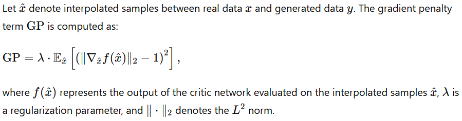

**Relation to Lipschitz Continuity:**
WGAN-GP tries to enforce a Lipschitz continuity by penalizing deviations of the critic's gradient norm from 1. This penalty helps stabilize the training process and avoids issues associated with manual weight clipping, ensuring that the critic remains Lipschitz continuous throughout training.

##### Spectral Normalization GAN (SNGAN):
One important point to notice is that both Gradient Clipping and Gradient Penalty are not strict constraints to enforce 1-Lipschitz continuity. Gradient clipping poses challenges because if the threshold is very small, it violates 1-Lipschitz continuity, while if the threshold is very high, training becomes highly unstable until that threshold is reached. Conversely, the Gradient Penalty method serves as a regularization technique, encouraging the network to adhere to the condition as closely as possible, but it does not guarantee strict enforcement.

To overcome these issues and ensure 1-Lipschitz continuity with a real constraint, the Spectral Normalization method is suggested. The key idea behind spectral normalization is linking the Lipschitzness of the discriminator to the Lipschitzness and spectral norm of each layer.

The neural network can be represented as a combination of layers $\( L_1, L_2, \ldots, L_n \)$, with weight matrices $\( W_1, W_2, \ldots, W_n \)$. Here, the concept of the singular value of a weight matrix is crucial. The largest singular value of each weight matrix represents the maximum amplification that can be applied to the unit vector that it multiplies. To ensure 1-Lipschitz continuity, the weights of each layer are normalized with respect to the largest singular value. 

Intuitively, the Lipschitz norm definition measures the smoothness of the layer in terms of the input that yields the Jacobian matrix with the largest singular value. Thus, this normalization provides 1-Lipschitz continuity for a specific layer. Another important property is that in general, with non-linear activations, if the activation function is 1-Lipschitz (e.g., ReLU, LeakyReLU, and many others), the composition of multiple 1-Lipschitz layers also maintains 1-Lipschitz continuity.

$\[ W_{\text{normalized}} = \frac{W}{\sigma(W)} \]$
Here, $\( \sigma(W) \)$ represents the spectral norm of the weight matrix $\( W \)$. This normalization ensures that the spectral norm of the normalized weight matrix is 1, effectively constraining the Lipschitz constant of the matrix and stabilizing the training process.

A thorough analysis reveals the intricate design decisions underlying Spectral GAN, particularly its adept integration of established techniques. Notably, it implements conditional batch normalization in the generator, drawing upon the seminal works of Dumoulin et al. (2017) and de Vries et al. (2017). Simultaneously, the discriminator employs the innovative projection discriminator method pioneered by Miyato and Koyama (2018). 

**Conditional batch normalization (CBN)** is an extension of the traditional batch normalization technique commonly used in deep learning architectures. In standard batch normalization, the normalization parameters (mean and variance) are calculated based on the statistics of the entire batch of data being processed. However, in conditional batch normalization, these normalization parameters are conditioned on additional information, such as class labels or other attributes relevant to the task at hand. This conditioning allows the model to adapt its normalization process based on specific attributes of the input data, which can improve the model's performance in tasks like image generation where class-specific characteristics are important. For example, in the context of Spectral GAN, conditional batch normalization in the generator enables the model to generate high-quality images that are conditioned on specific classes or attributes, leading to more realistic and diverse outputs.

The projection discriminator is a refinement of the traditional discriminator architecture within generative adversarial networks (GANs) that goes beyond simple concatenation of input data and condition labels. Instead, it introduces a novel approach by computing the inner product between the embedded condition vector, denoted as y, and the feature vector. This modification allows the discriminator to focus on more informative features of the input data, enhancing its ability to discern between real and generated samples. By computing this inner product, the discriminator can effectively project the condition information onto the feature space, enabling it to better capture the nuanced characteristics of the input data. In practical terms, this enhancement significantly improves the quality of class-conditioned image generation within the GAN framework, resulting in more realistic and diverse outputs. Thus, the projection discriminator represents a key advancement in GAN architecture, offering improved performance and stability in class conditional image generation tasks.

This fusion of methodologies results in significant advancements, allowing Spectral GAN to generate high-fidelity, class-conditioned samples on a vast scale, exemplified by its pioneering application on the comprehensive Imagenet dataset, comprised of millions of images. Furthermore, Spectral GAN distinguishes itself as the first GAN framework to operate effectively across the entirety of Imagenet, a notable achievement within the realm of generative modeling. Beyond performance merits, Spectral GAN also showcases computational efficiencies when compared to WGAN-GP, requiring merely a single power iteration and eliminating the need for a backward pass. These strategic refinements solidify Spectral GAN's position as a pioneering framework at the forefront of generative adversarial network research and development.

##### Self Attention GAN:
A self-attention block, also known as a self-attention mechanism or transformer block, is a key component used in modern deep learning architectures, particularly in models designed for natural language processing (NLP) and computer vision tasks. The self-attention block enables the model to capture long-range dependencies and relationships within the input data by learning attention weights dynamically.

**Components of a Self-Attention Block:**

1. **Input Embeddings:**
   The self-attention block takes input embeddings representing different elements (e.g., tokens in NLP or spatial features in images).

2. **Query, Key, and Value Transformations:**
   The input embeddings are transformed into three sets of vectors: query (\( Q \)), key (\( K \)), and value (\( V \)) vectors. These transformations are typically achieved using learned linear transformations (i.e., fully connected layers).

3. **Similarity Scores Calculation:**
   For each query vector $\( q_i \)$, the self-attention block computes a set of similarity scores with all key vectors $\( k_j \)$ using the dot product:

   $\[ \text{Attention}(q_i, k_j) = \frac{q_i \cdot k_j}{\sqrt{d_k}} \]$

   Here, $\( d_k \)$ is the dimensionality of the key vectors.

4. **Softmax and Attention Weights:**
   The similarity scores are passed through a softmax function to obtain attention weights $(\( \alpha_{ij} \))$ that represent the importance of each key vector $\( k_j \)$ relative to the query vector $\( q_i \)$:

   $\[ \alpha_{ij} = \frac{\exp(\text{Attention}(q_i, k_j))}{\sum_j \exp(\text{Attention}(q_i, k_j))} \]$

5. **Weighted Sum of Values:**
   Finally, the attention weights $(\( \alpha_{ij} \))$ are used to compute a weighted sum of the corresponding value vectors $(\( v_j \))$:

   $\[ \text{Output}(q_i) = \sum_j \alpha_{ij} v_j \]$

   The resulting output represents a refined representation of the input based on the learned attention weights.

##### Role of Self-Attention in Deep Learning:

- **Capturing Dependencies:** Self-attention allows the model to capture dependencies between different elements of the input data, enabling it to focus on relevant information for the task at hand.
  
- **Long-Range Context:** Unlike traditional convolutional or recurrent architectures, self-attention can capture long-range dependencies efficiently, making it effective for tasks requiring global context understanding.

- **Parameter Efficiency:** Self-attention is parallelizable and requires fewer parameters compared to recurrent architectures, making it scalable and suitable for large-scale models.

The Self-Attention GAN (SAGAN) builds upon the Spectral Normalization GAN (SNGAN) framework by integrating self-attention mechanisms into both the generator and discriminator networks. The primary motivation behind introducing self-attention is to capture long-distance dependencies within the model, ensuring consistency across distant parts of generated images. This mechanism can be interpreted as a form of feature representation smoothing, enhancing the coherence and quality of generated samples. In SAGAN, self-attention is implemented using attention coefficients $\( \beta_{i,j} \)$, computed as $\( \frac{\exp(s_{ij})}{\sum_j \exp(s_{ij})} \)$, where $\( s_{ij} \)$ represents the pairwise similarity scores between spatial positions \( i \) and \( j \). The output $\( o_{i} \)$ for each position \( i \) is then computed as a weighted sum of the feature vectors $\( h(x_j) \)$ across all positions \( j \), guided by the attention coefficients.

Key features of SAGAN include the application of spectral normalization to both the generator and discriminator weight matrices, contrary to the conventional approach of conditioning only the discriminator in WGAN. This approach helps stabilize training and improve the quality of generated samples. Additionally, SAGAN integrates self-attention into both the generator and discriminator networks, enabling the model to effectively capture spatial relationships and dependencies across image regions.

SAGAN also adopts the hinge loss function for improved training stability and discriminator performance. Notably, SAGAN is recognized as the first GAN architecture capable of producing high-quality, unconditional full ImageNet samples. Moreover, SAGAN supports conditional image generation by incorporating conditional batch normalization in the generator and employing a projection discriminator in the discriminator network. These enhancements contribute to the versatility and effectiveness of SAGAN in generating diverse and realistic images across various applications.

##### BigGAN:

BigGAN, an advanced variant of Generative Adversarial Networks (GANs), incorporates several innovative techniques to enhance the quality and diversity of generated images. One such technique is orthonormal regularization, which encourages the learning of an orthonormal weight matrix. In BigGAN, non-orthonormal terms are strategically utilized, akin to L2 regularization, to further refine the model's performance.

To maximize the effectiveness of BigGAN, certain key strategies are recommended. First, increasing the batch size significantly aids in stabilizing training and improving sample quality. Utilizing Cross-Replica (Sync) Batch Normalization across multiple GPUs ensures consistent and synchronized normalization, further enhancing training stability. Additionally, scaling up the model size, both in terms of width and depth, has been shown to yield significant improvements in image generation quality.

You can see the architecture at figure 16 of the [paper](https://arxiv.org/pdf/1809.11096)

Moreover, BigGAN leverages class information integration at all levels of the model, facilitating the generation of diverse and realistic images across different categories. The utilization of Hinge Loss and Self-attention mechanisms further enhances the model's discriminative capabilities and overall performance.

In summary, BigGAN employs a holistic approach to GAN training, incorporating techniques such as orthonormal regularization and the truncation trick to improve the quality and diversity of generated images. By adhering to salient recommendations like increasing batch size, employing Cross-Replica Batch Normalization, and scaling up model size, BigGAN achieves state-of-the-art results in image generation tasks.

##### StyleGAN V1

You can see the architecture at Figure 1 at the [paper](https://arxiv.org/pdf/1812.04948)

StyleGAN1 stands as a significant breakthrough in the realm of generative adversarial networks (GANs), particularly in the domain of image synthesis. Its innovative techniques have left a notable mark on both artistic expression and scientific exploration. At its essence, StyleGAN1 incorporates progressive growing, a style-based generator, and a mapping network into its architecture. This approach enables the generation of high-resolution images by gradually enhancing detail, starting from lower resolutions. The style-based generator separates the generation process into two components: style and structure, allowing for nuanced control over various image attributes. Furthermore, the mapping network facilitates the manipulation of latent vectors, providing users with the ability to finely adjust the style of generated images. As a result, StyleGAN1 produces high-quality, diverse images with intricate details, making it a versatile tool for creating photorealistic faces, artwork, and more.  The architecture consists of 3 main components, and is as following : 

**Mapping Network:**
Traditionally, in generative models like GANs, a random noise vector (often denoted as z) sampled from a simple distribution like a normal distribution is fed into the generator to produce an image. However, in StyleGAN1, the authors introduced an intermediate space known as the W space. This space is generated by mapping the initial random noise vector z through an 8-layer Multilayer Perceptron (MLP) called the Mapping Network. 

**Purpose of the Mapping Network:**
The introduction of this intermediate space serves a crucial purpose. It enhances the disentanglement of the latent space, meaning each dimension of the resulting w vector holds distinct information about the image. This disentanglement allows for more fine-grained control over the generated images' attributes, contributing to the model's capability to generate diverse and high-quality outputs.

**Progressive Growing:**
Progressive Growing is a technique employed in StyleGAN1 to enhance training stability and enable the generation of high-resolution images. Here's how it works:

- **Iterative Growth**: Instead of training the generator and discriminator on high-resolution images from the outset, the process begins with low-resolution images (e.g., 4x4 pixels) and gradually increases the resolution over multiple training iterations.
- **Stabilized Training**: By incrementally increasing the resolution, the model learns to generate finer details in a more stable manner. This approach mitigates issues such as mode collapse and vanishing gradients commonly encountered in training GANs on high-resolution images.
- **Smooth Transition**: At each stage of growth, a new set of layers is added to both the generator and discriminator to accommodate higher resolutions. This gradual expansion facilitates a smooth transition from generating coarse features to fine details.

Progressive Growing is instrumental in StyleGAN1's ability to produce high-resolution images with intricate details, contributing to its reputation for generating photorealistic outputs.

**AdaIN Style Injection:**

Adaptive Instance Normalization (AdaIN) is a technique used to adjust the style of features in a neural network. It operates by matching the mean and standard deviation of the activations in one layer to those of another layer, effectively transferring style information between them. The formula for AdaIN can be expressed as follows:

Given:
- \( x \): Input feature map from the content layer.
- \( y \): Input feature map from the style layer.
- $\( \mu(x) \)$: Mean of \( x \).
- $\( \sigma(x) \)$: Standard deviation of \( x \).
- $\( \mu(y) \)$: Mean of \( y \).
- $\( \sigma(y) \)$: Standard deviation of \( y \).
- $\( \alpha \)$: Style strength parameter.

The AdaIN operation can be represented as:

$\[ \text{AdaIN}(x, y) = \sigma(y) \left( \frac{x - \mu(x)}{\sigma(x)} \right) + \mu(y) \]$

Where:
- $\( \frac{x - \mu(x)}{\sigma(x)} \)$ normalizes the input feature map \( x \) to have zero mean and unit variance.
- $\( \sigma(y) \)$ scales the normalized feature map to match the standard deviation of the style feature map \( y \).
- $\( \mu(y) \)$ shifts the scaled feature map to match the mean of the style feature map \( y \).
- $\( \alpha \)$ controls the strength of the style transfer.

In the context of StyleGAN1, AdaIN is used to inject style information from the intermediate latent space into the generated images, allowing for fine-grained control over various attributes such as color, texture, and structure.

In the context of StyleGAN1, AdaIN Style Injection is applied hierarchically, injecting style information at different stages of the image generation process. This injection of style information occurs at multiple resolutions as the image generation progresses from coarse to fine. Here's how it works in more detail:

**Coarse Style Injection:**
You can see the effects of this idea at Figure 3 of the [paper](https://arxiv.org/pdf/1812.04948)

- **Global Attributes**: At the initial stages of image generation (e.g., low resolutions), style information is injected to control global attributes of the image, such as overall color tones, broad textures, and large-scale structures.
- **Low-Resolution Vectors**: The vectors used for injecting style information at this stage capture coarse features of the image. These vectors effect lower-dimensional activations and control broad characteristics of the generated image.

**Intermediate Style Injection:**
- **Regional Attributes**: As the image generation progresses and reaches intermediate resolutions, AdaIN Style Injection adjusts style information to control regional attributes of the image. This includes features like facial expressions, pose variations, and medium-scale textures.
- **Intermediate-Resolution Vectors**: The vectors utilized for injecting style information at this stage capture intermediate-level details of the image. They have effects on intermediate activations compared to the vectors used at the coarse stage, enabling finer control over regional attributes.

**Fine Style Injection:**
- **Fine Details**: At the final stages of image generation (e.g., high resolutions), AdaIN Style Injection fine-tunes style information to control fine details of the image, such as facial wrinkles, hair strands, and small-scale textures.
- **High-Resolution Vectors**: The vectors employed for injecting style information at this stage capture intricate details of the image. They enable precise control over fine-grained features, ensuring the generation of realistic and detailed images.

**Advantages:**
- **Hierarchical Control**: AdaIN Style Injection allows for hierarchical control over style attributes, ensuring that global, regional, and fine details are adjusted coherently throughout the image generation process.
- **Customization**: By manipulating style vectors at different stages, users can customize various aspects of the generated images with precision, leading to diverse and highly realistic outputs.
- **Smooth Transitions**: The hierarchical injection of style information facilitates smooth transitions between different levels of detail, resulting in visually pleasing and coherent images.

In summary, AdaIN Style Injection in StyleGAN1 enables the representation of different styles across coarse-to-fine stages using different vectors, offering granular control over global, regional, and fine attributes of the generated images.

##### StyleGAN2:

You can see the architecture at Figure 2 of the [paper](https://arxiv.org/pdf/1912.04958) 

In StyleGAN1, a notable issue is the artifacts in images, which are known as the droplet artifacts shown in Figure 12. This artifact manifested as localized spikes or droplets in the generated images, which detracted from the overall quality and realism of the generated outputs. Researchers hypothesized that this artifact occurred due to the generator trying to manipulate signal strength information past instance normalization. By creating strong, localized spikes in certain areas of the image, the generator could effectively scale the signal as desired elsewhere. This behavior was possibly a result of the generator attempting to deceive the discriminator during training by generating peaky values that persisted even after instance normalization, particularly after centering.

You can see examples of droplet artifacts at Figure 1 of the [paper](https://arxiv.org/pdf/1912.04958) 

To address this issue, StyleGAN2 introduced a novel approach by removing Adaptive Instance normalization.

In StyleGAN1, the addition of noise (denoted as B) occurs after the Adaptive Instance Normalization (AdaIN) step. The image is first scaled or modulated with the style vector A, then convolved, and finally, noise is added. However, the impact of noise on the generated images can vary depending on the scaling of the image. For instance, if the scaling ranges from [-0.01,+0.01] to [-5,+5], the noise may affect the results either too much or too little, leading to inconsistencies in the generated images.

In contrast, StyleGAN2 addresses this issue by adding noise immediately after normalizing the generated tensor with a fixed scale, typically sigma=1. This ensures that the relative numerical scale of the noise remains stable regardless of the scaling of the image. By adding noise at this specific point in the process, StyleGAN2 achieves more consistent and stable results in terms of noise influence, contributing to the overall quality of the generated images.

Additionally, empirical observations in StyleGAN2 suggest that centering, which was previously employed in StyleGAN1, is not necessary. This observation implies that the need for centering, likely implemented to address certain artifacts such as droplets, is mitigated in StyleGAN2. This removal of centering contributes to the improved performance and avoidance of artifacts in the generated images, enhancing the overall robustness and quality of StyleGAN2 compared to its predecessor.

In addition to addressing the droplet artifact problem, StyleGAN2 introduced several other changes. Variance normalization applied to data and data based scaling (modulation) were removed. Instead, scale kernel channels with respect to A and L2 normalization of each kernel were employed. Moreover, rather than operating on feature maps, the kernel values were changed to inject the style, further refining the generation process and improving the quality of the generated images. These modifications collectively contribute to the enhanced performance and stability of StyleGAN2 compared to its predecessor, addressing the droplet artifact issue and advancing the state-of-the-art in image generation.

##### StyleGAN 3:
You can see the architecture at figure 3 of the [paper](https://arxiv.org/pdf/2106.12423).

StyleGAN3 represents a significant advancement over its predecessor, StyleGAN2, by rethinking the underlying signal processing methods within the generator network. In StyleGAN2, certain unintentional positional cues (like image borders, per-pixel noise inputs, and positional encodings) could influence intermediate layers, which in turn affected the generation of image details. StyleGAN3 aims to eliminate these positional references entirely. This overhaul ensures that the network can generate consistent and high-quality details regardless of pixel coordinates, achieving what is described as continuous equivariance to sub-pixel translation and rotation across all layers.

The architecture of StyleGAN3 retains the general framework of StyleGAN2 but focuses on refining numerous low-level signal processing details. By addressing these aspects, StyleGAN3 enhances the overall performance and quality of generated images, emphasizing a more robust and precise method for image synthesis. This comprehensive approach results in a more sophisticated and effective generator network, capable of producing images with greater fidelity and flexibility.

