# Normalizing Flows

A summary content for Normalizing Flows. 

#### Group Info:
- **Group Name:** Group 03
- **Members:**
    - Devrim Çavuşoğlu devrim.cavusoglu@metu.edu.tr
    - Ahmet Burak Yıldırım e270208@metu.edu.tr

Prepared as an activity of the [Middle East Technical University - CENG 796 Deep Generative Models course](https://user.ceng.metu.edu.tr/~gcinbis/courses/Spring24/CENG796/index.html).

**NOTE:** Some of the content is adapted from [Stefano Ermon's CS236: Deep Generative Models slides](https://deepgenerativemodels.github.io/assets/slides/cs236_lecture7.pdf). For the papers, we followed the notation of the paper for better readability.

## Contents
<!-- TOC -->
* [Motivation](#motivation)
* [Change of Variables](#change-of-variables)
  * [Geometry: Determinants and Volumes](#geometry-determinants-and-volumes-)
  * [Generalized Change of Variables](#generalized-change-of-variables-)
  * [Two-Dimensional Example](#two-dimensional-example)
* [Normalizing Flow Models](#normalizing-flow-models-)
  * [Planar Flow](#planar-flow)
  * [Learning and Inference](#learning-and-inference)
  * [Desiderate (Desired Thing) for Flow Models](#desiderate-desired-thing-for-flow-models)
  * [Triangular Jacobian](#triangular-jacobian)
  * [NICE: Non-linear Independent Components Estimation](#nice-non-linear-independent-components-estimation)
    * [General Coupling Layers](#general-coupling-layers)
    * [Additive Coupling Layers](#additive-coupling-layers)
    * [Combining Coupling Layers](#combining-coupling-layers)
    * [Rescaling Layers](#rescaling-layers)
  * [Density estimation using Real NVP](#density-estimation-using-real-nvp)
    * [Masked Convolution](#masked-convolution)
    * [Other Components](#other-components)
    * [Results](#results)
  * [Autoregressive Models as Flow Models](#autoregressive-models-as-flow-models-)
  * [Inverse Autoregressive Flow](#inverse-autoregressive-flow)
    * [Inverse Autroregressive Transformation](#inverse-autroregressive-transformation)
    * [Inverse Autroregressive Flow (IAF)](#inverse-autroregressive-flow-iaf)
    * [Results](#results-1)
  * [Masked Autoregressive Flow (MAF)](#masked-autoregressive-flow-maf)
    * [Relationship with IAF](#relationship-with-iaf)
    * [Relationship with Real NVP](#relationship-with-real-nvp)
    * [Results](#results-2)
  * [Parallel Wavenet](#parallel-wavenet)
    * [Parallelizing WaveNet](#parallelizing-wavenet)
    * [Probability Density Distillation](#probability-density-distillation)
* [Summary](#summary)
  * [Fundamentals](#fundamentals)
  * [Modeling Perspective](#modeling-perspective)
* [References](#references)
<!-- TOC -->

## Motivation
Normalizing flows are a class of generative models that learn to transform a simple probability distribution (e.g., a Gaussian distribution) into a more complex one through a sequence of invertible transformations. This means that every transformation in the flow has a corresponding reverse transformation, which is the result of learning bijection. The dimensions of the mapping spaces should be the same because of the bijection constraint. They cannot be reduced in both directions. This invertibility feature of the Normalizing Flow Models is important for being able to sample data from a simple distribution and efficiently computing the exact log-likelihood of the data.


## Change of Variables

The Change of Variables is a key technique in Normalizing Flows, used to transform a simple initial distribution into a more complex one that represents the actual data. Its formula is essential for understanding how probability densities change under a transformation. If there is a random variable $Z$ with a known distribution and a transformation $f_\theta$ that can be reversed and differentiated, a new random variable $X=f(Z)$ can be defined. In such a case, the probability density function (pdf) changes.

When a random variable is mapped with a function, its pdf also changes depending on the function. This can be shown in a simple example as follows. Let's consider a random variable $Z$ with a uniform distribution in the range of $[-2,2]$ and let the density of $Z$ to be $p_Z$. In this example, $p_Z(0)$ is equal to $\frac{1}{4}$ because the area of the pdf has to be $1$ and the range of the variable is $4$. If we map $Z$ to another random variable $X=3Z$, the range of $X$ becomes $[-6,6]$ and the feature of being uniform distribution does not change. Since the area of the new pdf also has to be $1$, $p_X(n)$ becomes equal to $\frac{1}{12}$ at any point where $n\in[-6,6]$. The visualization of this example showed for a better understanding as follows:

<center>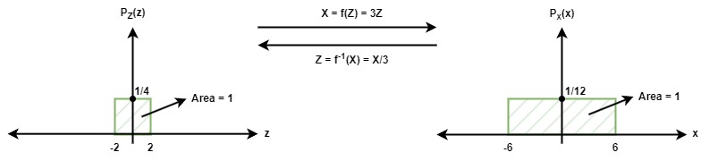</center>

Let's consider this pdf change on an arbitrary complex distribution:

<center>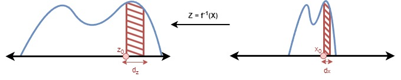</center>


In this mapping, the shaded areas should be equivalent. In other words, $p_X(x_o)dX = p_Z(z_0)dZ$. From this equation, we can derive the following results:

- $p_X(X)dX=p_Z(Z)dZ$
- $p_X(X)=p_Z(Z)\frac{dZ}{dX}$, where $\frac{dZ}{dX}$ is the derivative
- $p_X(X)=p_Z(h(X))|h'(X)|$, where $Z=h(X)=f^{-1}(X)$

Note that $h'(X)$ is the local change in the density as a result of the reverse mapping, which is equal to $\frac{dh(X)}{dX}$.

Returning to our example, we can calculate the probability after mapping by applying this method. Remember that the mapping function was $X=f(Z)=3Z$. Therefore, the derivative of $h(X)=f^{-1}(X)=\frac{X}{3}$ is equal to $h'=\frac{1}{3}$. By putting these values into the equation:

```math
p_X(6) = p_Z(h(6))h'(6) = p_Z(2)h'(6) = \frac{1}{4} \times \frac{1}{3} = \frac{1}{12}$
```

we obtain the same result as the previous calculation.

### Geometry: Determinants and Volumes 

Let $Z$ be defined as a random variable having a uniform distribution in an $n$ dimensional space with the range of $[0,1]$, which corresponds to a unit hypercube $[0,1]^n$. Suppose we multiply $Z$ with a square invertible matrix $A$, i.e. $X=AZ$. In that case, this matrix maps the unit hypercube into a parallelotope having its volume equal to the absolute value of the determinant of matrix $A$. This mapping is visualized with a simple case (2D space) as follows for a better understanding:

<center>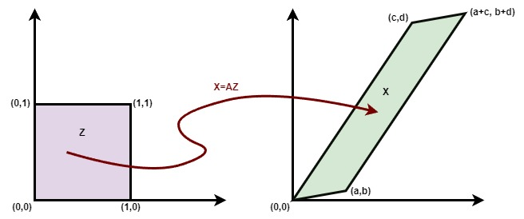</center>

In this figure, the coordinates are defined by the matrix values of 

```math
A = \begin{pmatrix}
a & c\\ 
b & d
\end{pmatrix}
```
where

```math
det(A) = det(\begin{pmatrix}
a & c\\ 
b & d
\end{pmatrix})
= ad - bc \textnormal{ (The area of the mapped distribution $X$)}
```

Considering the change of variable in uniform distribution, $p_X(x)$ can be defined as follows:

```math
\textnormal{let } W = A^{-1}
```
```math
p_X(x) = p_Z(Wx)|det(W)| = p_Z(Wx)/|det(A)|
```

### Generalized Change of Variables 

We can generalize the change of pdf by considering the logic in the previously given examples. The pdf of $X$ can be determined from the pdf of $Z$, where the marginal likelihood $p(x)$ is expressed as:

```math
p_X(x; \theta) = p_Z(f_\theta^{-1}(x)) \left\vert \mathrm{det}\left(\frac{\partial f^{-1}_\theta(x)}{\partial x}\right) \right\vert
```

Here, $f_\theta$ represents the transformation function parameterized by $\theta$. The determinant of the Jacobian matrix captures how the volume changes under the transformation $f$.

### Two-Dimensional Example

In the scenario of more than one random variable calculating joint density function is similar to the 1D case. In order not to mess up the equations, the calculation of joint probability is shown in 2D case in this section. Let us define two different random variables named $Z_1$ and $Z_2$. Their joint distribution is represented as $p_{Z_1, Z_2}$. There should be two different transformation functions defined for each random variable, which are named $f=(f_1,f_2)$ in our case. To keep the notations same, let us name their inverse version as $h=(h_1,h_2)$. In this case, each random variable can be defined as follows:

$X_1=f_1(Z_1,Z_2)$

$X_2=f_2(Z_1,Z_2)$

$Z_1=h_1(X_1,X_2)$

$Z_2=h_2(X_1,X_2)$

Keeping these definitions in mind, the resulting joint density function after the transformation operation can be calculated as follows:

- **Inverse Mapping:**

```math
p_{X_{1},X_{2}}(x_{1},x_{2}) = p_{Z_{1},Z_{2}}(h_{1}(x_{1}, x_{2}),h_{2}(x_{1}, x_{2}))

\det \begin{pmatrix}
\frac{\partial h_1(x_1,x_2)}{\partial x_1} & \frac{\partial h_1(x_1,x_2)}{\partial x_2} \\ 
\frac{\partial h_2(x_1,x_2)}{\partial x_1} & \frac{\partial h_2(x_1,x_2)}{\partial x_2}
\end{pmatrix}
```

- **Forward Mapping:**

```math
p_{X_{1},X_{2}}(x_{1},x_{2}) = p_{Z_{1},Z_{2}}(z_{1},z_{2})

\det \begin{pmatrix}
\frac{\partial f_1(z_1,z_2)}{\partial z_1} & \frac{\partial f_1(z_1,z_2)}{\partial z_2} \\ 
\frac{\partial f_2(z_1,z_2)}{\partial z_1} & \frac{\partial f_2(z_1,z_2)}{\partial z_2}
\end{pmatrix}^{-1}
```


## Normalizing Flow Models 

The name "normalizing flow" can be interpreted as the following:

- **Normalizing** means that the change of variables gives a normalized density after applying an invertible transformation.
- **Flow** means that the invertible transformations can be composed with each other to create more complex invertible transformations.

**The requirements of these models are:**
1. The input and output dimensions must be the same.
2. The transformation must be invertible.
3. Computing the determinant of the Jacobian needs to be efficient (and differentiable).

**The main ideas behind these models are:**
1. Initial distribution is selected as a simple distribution for $z_0$ (e.g. Gaussian).
2. A sequence of M invertible transformations $x \triangleq z_M$ are applied.
3. Considering the change of variables, the following equation is obtained:

```math
    p_X(x; \theta) = p_Z(f_\theta^{-1}(x)) \prod_{m=1}^M \left\vert 
 \mathrm{det}\left(\frac{\partial (f^m_\theta)^{-1}(z_m)}{\partial z_m}\right) \right\vert
```

As a general rule, the determinant of products is equal to the product of the determinants, therefore, the product symbol can be moved into the determinant function in this equation and vice versa.

### Planar Flow
Planar flow defines the invertible transformation in the normalizing flow models as follows:

$x = f_\theta(z) = z + u \cdot h(w^Tz + b)$

where $u$, $w$ and $b$ are learnable parameters. $h(\cdot)$ represents a non-linear function in this equation. For this definition, the absolute value of the Jacobian determinant can be calculated as follows:

$= \det\frac{\partial f_\theta(z)}{\partial z}$ 

$= \det(I+h'(w^Tz+b)uw^T)$

$= \vert 1+h'(w^Tz+b)u^Tw \vert$

In order to be sure that the function is invertible, some restrictions should be applied to this equation by considering the type of non-linearity function. For instance, if $h=tanh()$, the following parameter restriction should be applied:

$h'(w^Tz+b)u^Tw \geq -1$

The number of planar transformations $M$ increases the capacity of the model for learning the complex distributions. The effect of parameter $M$ is visualized [11] for two different simple distributions (Gaussian & Uniform) as follows:

<center>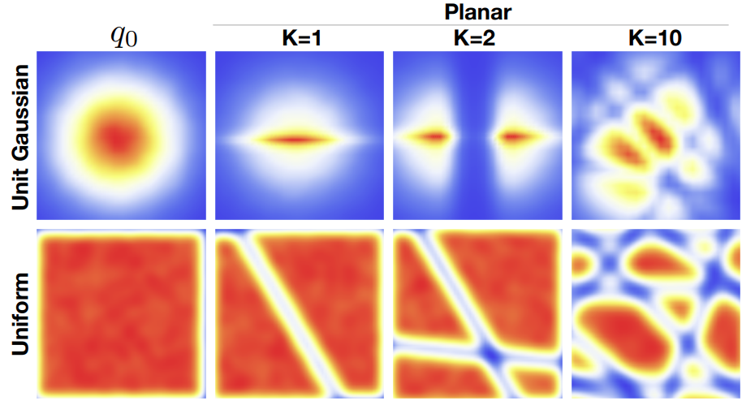</center>


### Learning and Inference
The training objective of the Normalizing Flow Models is the maximum likelihood over the dataset $D$:

```math
\max_{\theta} \log p_X(D; \theta) = \sum_{x \in D} \log p_{Z} (f_{\theta}^{-1}(x)) + \log \left\vert \frac{\partial f_{\theta}^{-1}(x)}{\partial x} \right\vert
```

By using the change of variables, the inverse transformation function $z = f^{-1}(x)$ can be used to calculate the exact likelihood.


In the inference process, we can directly sample data by sampling from the simple distribution $x=f_\theta(z)$ that we learned mapping to the data distribution from it. Since this mapping is constrained to be a bijection, inverse transformation can be easily used for this mapping process.


### Desiderate (Desired Thing) for Flow Models

- Choice of simple prior $p_Z(\mathbf{z})$ allows for efficient sampling and tractable likelihood evaluation (e.g. isotropic Gaussian).
- Invertible transformations:
  - Likelihood evaluation requires efficiency of $\mathbf{x} \rightarrow \mathbf{z}$
  - Likelihood evaluation requires efficiency of $\mathbf{x} \rightarrow \mathbf{z}$
- Computing likelihoods requires the computation of determinants of the Jacobian matrix, which has a high computational overhead hindering the efficient learning phase.
  - Choose a transformation so that the resulting Jacobian matrix has useful properties.

### Triangular Jacobian

Given a function $f$, in the context of Normalizing Flow, we can assume this as the transformation function. Let, $\mathbf{x} = (x_1,x_2, \cdots, x_n)$ and $x = \mathbf{f}(\mathbf{z}) = (f_1(\mathbf{z}), f_2(\mathbf{z}), \cdots, f_n(\mathbf{z})) $, and let $J = \frac{\partial f}{\partial \mathbf{z}}$ is the Jacobian of f.

```math
J = \begin{pmatrix}
\frac{\partial f_1}{\partial z_1} & \cdots & \frac{\partial f_1}{\partial z_n} \\ 
\cdots & \cdots & \cdots \\
\frac{\partial f_n}{\partial z_1} & \cdots & \frac{\partial f_n}{\partial z_n}
\end{pmatrix} 
```

Now, as the Jacobian determinant is the important component of the computation and normalizing flows, restricting the Jacobian so that the determinant computation is fast is desirable. We know that the computational complexity of computing a determinant is at least $O(n^{\log_2 7})$ with certain assumptions has proven by [Strassen](https://en.wikipedia.org/wiki/Computational_complexity_of_matrix_multiplication#Matrix_inversion,_determinant_and_Gaussian_elimination). However, triangular matrices have a property that their determinant is equal to the product of the diagonal elements whose time complexity is $O(n)$.

Suppose $x_i = f_i(\mathbf{z})$ only depends on $\mathbf{z}_{\leq i}$, then

```math
J = \begin{pmatrix}
\frac{\partial f_1}{\partial z_1} & \cdots & 0 \\ 
\cdots & \cdots & \cdots \\
\frac{\partial f_n}{\partial z_1} & \cdots & \frac{\partial f_n}{\partial z_n}
\end{pmatrix} 
```

the Jacobian becomes lower triangular. We can relate this idea to the autoregressive paradigm.

### NICE: Non-linear Independent Components Estimation

NICE [1] inspired by the recent prior work of its proposed a transformation learning schema as a normalizing flow model. The learner (a neural network) are asked to find a transformation $h = f(x)$ such that the resulting distribution factorizes to independent components $h_d$:

```math
p_H(h)=\prod_d p_{H_d}(h_d)
```

f is invertible and the dimension of $h$ is the same as the dimension of $x$. The paper also mention the choice of $f$ such that the determinant of the Jacobian is trivially obtained. Moreover, its inverse $f^{-1}$ is also trivially obtained allowing sampling from $p_X(x)$ easily. The paper marks two main novelty as the transformation $f$ yields **easy determinant of the Jacobian** and **easy inverse**.

The core idea behind the choice of $f$ obeying the easy inverse and easy determinant properties yet lets the learner still learn a complex transformation is that we can split $x$ into two blocks $(x_1, x_2)$ and apply as building block for a transformation $(x_1, x_2)$ to $(y_1, y_2)$.

```math
y_1 = x_1
y_2 = x_2 + m(x_1)
```

where $m$ was a ReLU MLP in the experiments in the paper. The Jacobian determinant of this building block is 1 for any $m$, and hence such transformation is called **volume preserving**. This transformation is trivially invertible as:

```math
x_1 = y_1
x_2 = y_2 - m(y_1)
```

There are key components of NICE:

- General Coupling Layers
- Additive Coupling Layers
- Rescaling Layers


#### General Coupling Layers

Let $x \in \mathcal{X}$, $I_1$, $I_2$ a partition of $[[ 1,D ]]$ s.t. $d=\vert I_1 \vert$ and $m$ a function defined on $\mathbb{R}^d$, we can define $y=(y_{I_1}, y_{I_2})$ where:

```math
y_{I_1} = x_{I_1}
y_{I_2} = g(x_{I_2}; m(x_{I_1}))
```

where $g:\mathbb{R}^{D-d} \; \times \; m(\mathbb{R}^d) \rightarrow \mathbb{R}^{D-d}$ is the coupling law, an invertible map with respect to its first argument given the second.

<center>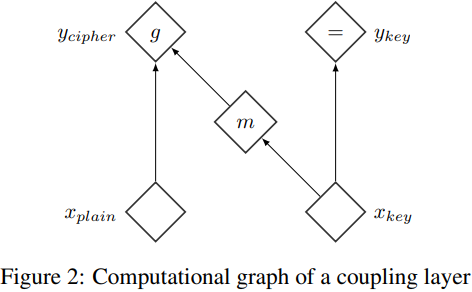</center>

Considering $I_1 = [[ 1,d ]]$ and $I_2 = [[ d,D ]]$, the Jacobian function is

```math
\frac{\partial y}{\partial x} = \left[ {\begin{array}{cc}
   I_d & 0 \\
   \frac{\partial y_{I_2}}{\partial x_{I_1}} & \frac{\partial y_{I_2}}{\partial x_{I_2}} \\
  \end{array} } \right]
```

where $I_d$ is the identity matrix of size $d$. Therefore, $\mathtt{det} \frac{\partial y}{\partial x} = \det \frac{\partial y_{I_2}}{\partial x_{I_2}}$. Also, the inverse mapping:

```math
x_{I_1} = y_{I_1}
x_{I_2} = g^{-1}(y_{I_2}; m(y_{I_1}))
```

The paper calls such a transformation a **coupling layer** with coupling function $m$.

#### Additive Coupling Layers

Additive coupling law is a simple choice of a coupling law, where $g(a; b) = a + b$, where $a=x_{I_2}$ and $b=m(X_{I_1})$.

For the experiments in the paper the additive coupling law/layer is chosen for numerical stability.

#### Combining Coupling Layers

The paper also mentions that there are multiple layers required to learn complex transformations. Moreover, since a coupling layer keeps a part of the input unchanged, the paper proposes to use alternating layers s.t. a composition of two coupling layers modifies every dimension. The authors proceeded to use four layers.

#### Rescaling Layers

The final layer of NICE applies a rescaling transformation, $S$, multiplying the $i$-{th} output $z_i$ with $S_{ii}$.

Forward mapping $z \rightarrow x$:

```math
x_i = S_{ii} * z_i
```

Inverse mapping $x \rightarrow z$:

```math
z_i = \frac{x_i}{S_{ii}}
```

the Jacobian of the (forward) mapping is $J = \mathrm{diag}(s)$, and the determinant:

```math
\det J = \prod_{i=1}^n S_{ii}
```

Some samples generated by the NICE model.

<center>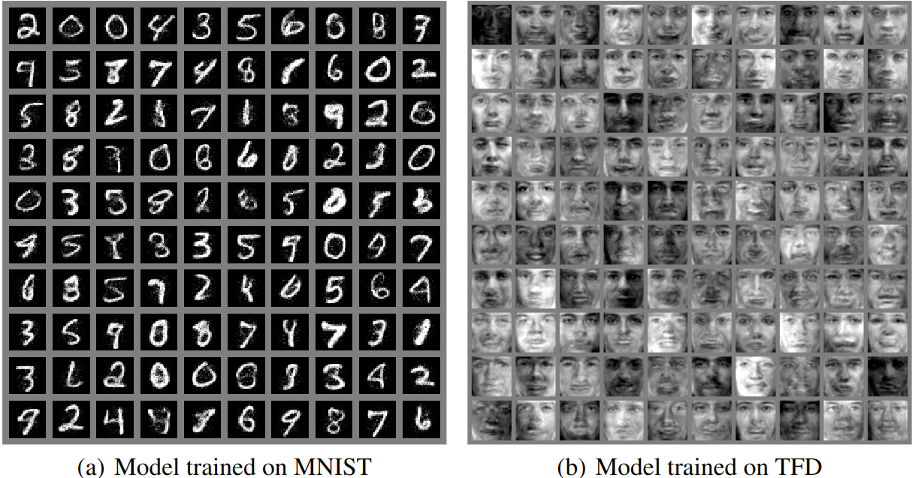</center>


### Density estimation using Real NVP

<center>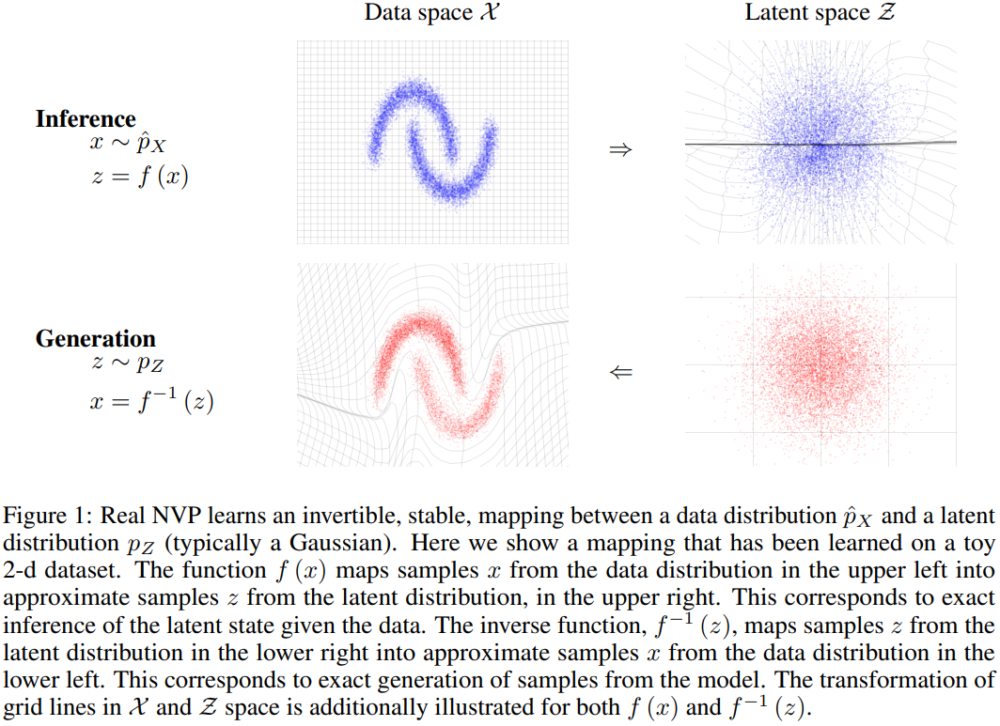</center>

Real NVP [2], acronym for Real-valued Non-Volume Preserving transformations,  is an extension of NICE [1]. Real NVP, proposed to use a different coupling law/layer than NICE as they refer to **affine coupling layer**. 

<center>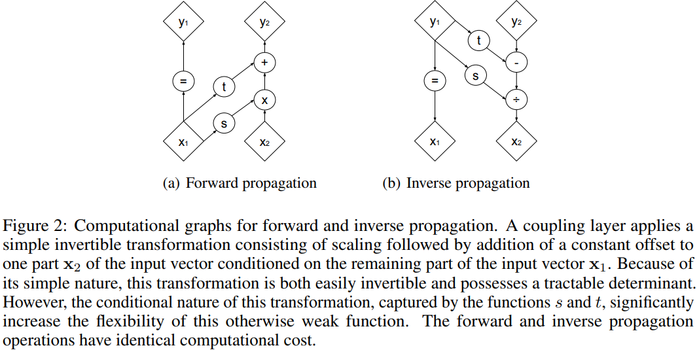</center>

Given a $D$ dimensional input $x$ and $d < D$, the output $y$ of an affine coupling layer is given as:

```math
y_{1:d} = x_{1:d}
y_{d+1:D} = x_{d+1:D} \odot \exp(s(x_{1:d})) + t(x_{1:d})
```

where $s$ and $t$ stand for scale and translation respectively, and are functions from $\mathbb{R}^d \rightarrow \mathbb{R}^{D-d}$, $\odot$ is the element-wise product.

The Jacobian of the transformation is given as:

```math
\frac{\partial y}{\partial x} = \left[ {\begin{array}{cc}
   I_d & 0 \\
   \frac{\partial y_{d+1:D}}{\partial x_{1:d}} & \mathrm{diag}(\exp(s(x_{1:d}))) \\
  \end{array} } \right]
```

Here, note that the Jacobian does not have a unit determinant different from NICE [1]. Also, the Jacobian determinant of the coupling layer operation does not involve computing the Jacobian of $s$ or $t$, those functions can be arbitrarily complex. The paper proposed to use deep convolutional neural networks for $s$ and $t$.

Forward mapping $x \rightarrow y$:

```math
y_{1:d} = x_{1:d}
y_{d+1:D} = x_{d+1:D} \odot \exp(s(x_{1:d})) + t(x_{1:d})
```

Inverse mapping $y \rightarrow x$:

```math
x_{1:d} = y_{1:d}
x_{d+1:D} = (y_{d+1:D} - t(y_{1:d})) \odot \exp( - s(y_{1:d})) 
```

Note again that computing the inverse of the coupling layer does not require computing the inverse of $s$ or $t$.

#### Masked Convolution

<center>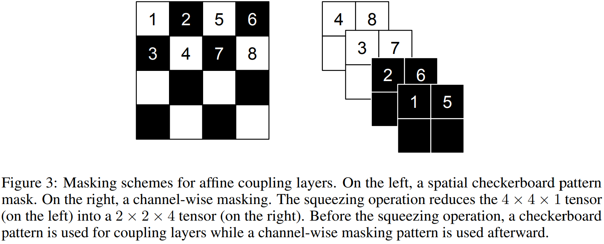</center>

Partitioning of the input can also be implemented using a binary mask $b$, and in the study, authors proposed a binary mask scheme and used that in the experiments.

With the binary mask $b$, a mapping function can be altered in the following way:

```math
y = x_m + (1-b) \odot (x \odot \exp(s(x_m)) + t(x_m))
```

where $x_m = b \odot x$ is the mask applied x. The authors experimented with two masking methods: spatial checkerboard pattern, and channel-wise masking (see Figure 3).

#### Other Components

Without delving in to low-level detail, we will discuss other components of the paper here giving the overview. Real NVP used combined coupling layers as in the prior work NICE [1] in an alternating pattern (§ 3.5). The authors implemented a multiscale architecture trading spatial size for number of channels (§ 3.6). They also utilized batch normalization [3] in the experiments (§ 3.7).

#### Results

Samples generated by Real NVP.

<center>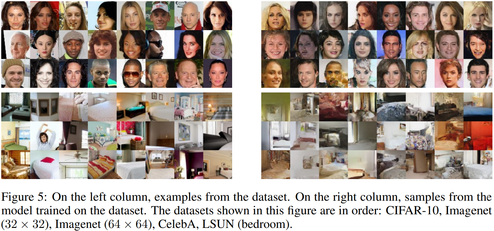</center>

Also, the authors defined a manifold based on four validation examples $(z_{(1)},z_{(2)},z_{(3)},z_{(4)})$ to illustrate smooth semantically consistent meaning of the latent variables, and paramterized the manifold by two parameters $\phi$ and $\phi'$ by,

```math
z = \cos(\phi)(\cos(\phi')z_{(1)} + \sin(\phi')z_{(2)}) + \sin(\phi)(\cos(\phi')z_{(3)} + \sin(\phi')z_{(4)})
```

the resulting manifold is projected back into the data space by $g(z)$. The resulting examples from various datasets are shown in Figure 6.

<center>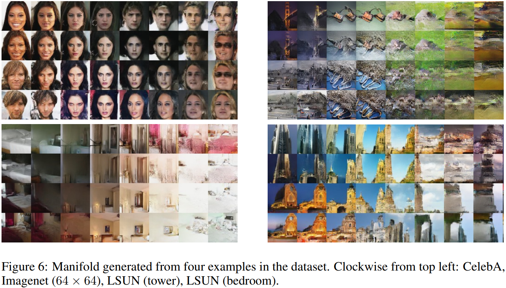</center>

### Autoregressive Models as Flow Models 
Briefly, we will first discuss these two family of neural density estimators: (1) autoregressive models and (2) normalizing flows.

At the core, autoregressive models decompose the joint density as a product of conditionals and model each conditional in turn, while normalizing flows transform a base density (e.g. a standard Gaussian) into the target density using an invertible transformation with a tractable Jacobian [4].

The motivation behind **autoregressive flows** is to leverage the strengths of both autoregressive models and normalizing flows. Autoregressive models are powerful for their ability to model dependencies between variables, but they can be slow in sampling because each dimension depends on the previous ones. Normalizing flows, on the other hand, provide a straightforward way to manipulate and sample from complex distributions by applying a sequence of invertible transformations, but they can struggle with capturing dependencies between variables as effectively as autoregressive models.

By integrating these approaches, autoregressive flows aim to:
1. Improve the expressiveness and flexibility in modeling complex distributions.
2. Maintain efficient and exact likelihood computation.
3. Enable efficient and tractable sampling procedures.

Briefly, an autoregressive flow is a normalizing flow where the flow transformation is designed as an autoregressive model.

### Inverse Autoregressive Flow

Inverse Autoregressive Flow (IAF) [5] is proposed as a new type of flow which scales well to high-dimensional latent space. The paper discusses that autoregressive neural density estimators such as RNNs, MADE [6], PixelCNN [7] or WaveNet [8] can be turned into invertible nonlinear transformations of the input, with simple Jacobian determinant. Thus, making a basis to build a normalizing flow from the autoregressive models.

In the paper, authors demonstrated the proposed framework by deep variational auto-encoders and opted for variational inference and learning.

The authors considered Gaussian versions of autoregressive autoencoders such as MADE [6] and PixelCNN [7]. 

#### Inverse Autroregressive Transformation

Let $y$ be a variable with some chosen ordering on its elements $y = \left \{ y_i \right \}_{i=1}^D$. The paper defines $\left \[ \mu(y),\sigma(y)] \right \]$ to denote the function of the vector y, to the vectors $\mu$ and $\sigma$. Due to the autoregressive strcuture, the Jacobian is a lower triangular matrix with zeros on the diagonal, i.e. $\frac{\partial [\mu_i,\sigma_i]}{\partial y_j} = [0,0] \text{ for } j \ge i$. The elements $\left \[ \mu_i(y_{1:i-1})),\sigma_i(y_{1:i-1}) \right \]$ are predicted mean and standard deviation of the $i$-th element of $y$ that are functions of only the previous elements in $y$.

Sampling from such a model is a sequential transformation from a noise vector $\epsilon \sim \mathcal{N}(0, \textbf{I})$

```math
y_0 = \mu_0 + \sigma_0 \odot \epsilon_0
y_i = \mu_i(y_{1:i-1}) + \sigma_i(y_{1:i-1}) \odot \epsilon_i \: \text{for} \: i > 0
```

The transformation is one-to-one as long as $\sigma_i > 0 \text{ for all } i$, and can be inverted.

Two important remarks here are that: (1) the inverse transformation can be parallelized since the computation of individual $\epsilon_i$ does not depend on each other and can be vectorized (hence faster sampling):

```math
\boldsymbol{\epsilon = \frac{y-\mu(y)}{\sigma(y)}}
```

, and (2) the inverse autoregressive transformation has a simple Jacobian determinant, due to the lower triangular Jacobian. The determinant of a lower triangular matrix equals the product of the diagonal terms. Therefore,

```math
\log \det \left \vert \frac{d\boldsymbol{\epsilon}}{d\mathbf{y}} \right \vert = \sum_{i=1}^D - \log \sigma_i(\mathbf{y})
```

#### Inverse Autroregressive Flow (IAF)

<center>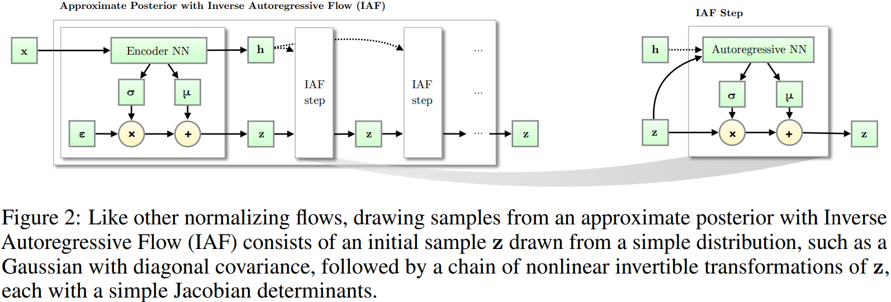</center>

The flow consists of a chain of $T$ of the following transformations:

```math
\mathbf{z}_t = \boldsymbol{\mu}_t + \boldsymbol{\sigma}_t \odot \mathbf{z}_{t-1}
```

The algorithm for computing approximate posterior with IAF is given as below.

<center>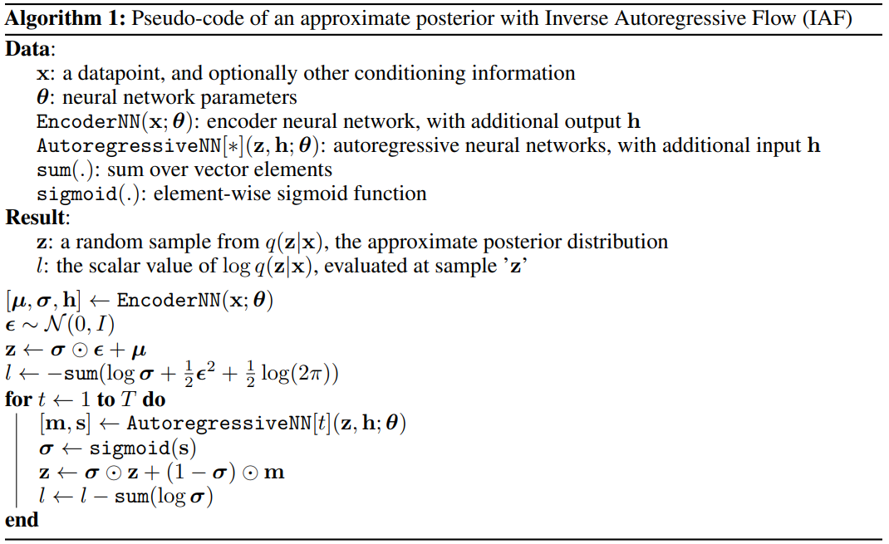</center>


#### Results

Paper does not provide qualitative examples, however below you can see some examples from IAF model trained on MNIST dataset. The following example image is taken from an unofficial repository, [karstenkreis/flow_vae](https://github.com/karstenkreis/flow_vae), an implementation of IAF (and has some minor modifications).

<center>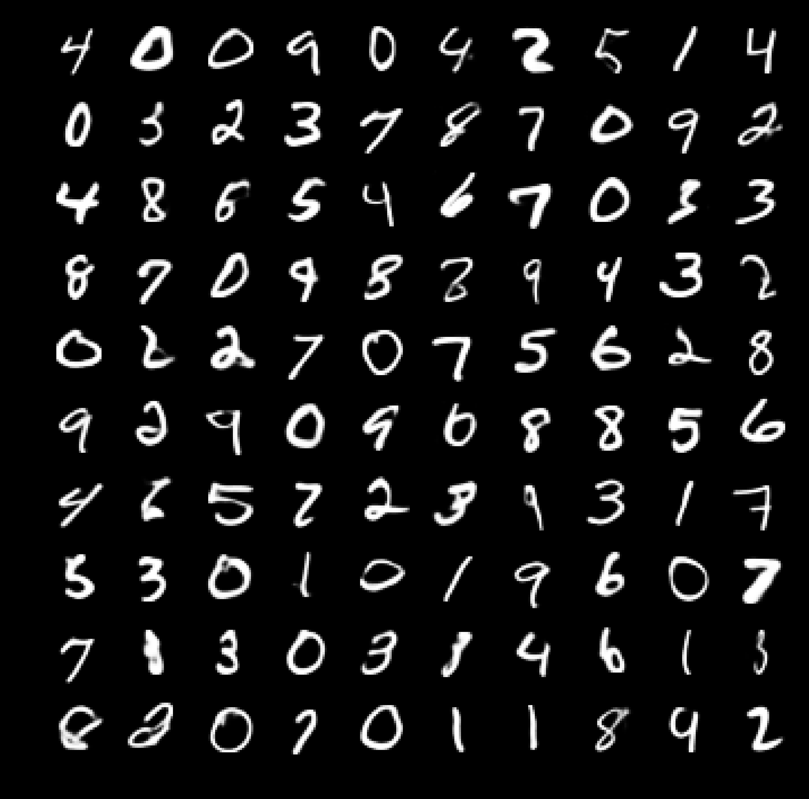</center>

### Masked Autoregressive Flow (MAF)

Masked Autoregressive Flow (MAF) [4] sets the base building block as the study of IAF [5], and remarks that such transformations where autoregressive models are used [5] has a tractable Jacobian by design, and for certain autoregressive models it is also invertible corresponding to a normalizing flow. The authors opted for implementing MADE [6] as a building block in the paper. The paper also discusses that both IAF [5] and MAF [4] are generalizations of Real NVP [2].

MAF considers an autoregressive model conditioned on the parametrized Gaussians. That is, the $i$-th conditional is given by

```math
p(x_i \vert \mathbf{x}_{1:i-1}) = \mathcal{N}(x_i \vert \mu_i, \exp^2(\alpha_i)) \text{ where } \mu_i = f_{\mu_i}(\mathbf{x}_{1:i-1}) \text{ and } \alpha_i = f_{\alpha_i}(\mathbf{x}_{1:i-1})
```

where $f_{\mu_i}$ and $f_{\alpha_i}$ are unconstrained scalar functions that compute the mean and the log standard deviation of the $i$-th conditional given all previous variables. Data can be generated from this model using the following recursion:

```math
x_i = u_i \exp\alpha_i + \mu_i \text{ where } \mu_i = f_{\mu_i}(\mathbf{x}_{1:i-1}), \alpha_i = f_{\alpha_i}(\mathbf{x}_{1:i-1}) \text{ and } \mu_i \sim \mathcal{N}(0,1)
```

In the above, $\mathbf{u} = (u_1,u_2, \cdots, u_I)$ is the vector of random numbers the model uses internally to generate data, RNG is typically `randn()`.

The given mapping and the model can be expressed as $\mathbf{x} = f(\mathbf{u}) \text{ where } \mathbf{u} \sim \mathcal{N}(\mathbf{0}, \mathbf{I})$. By construction $f$ is easily invertible, and given a data point $\mathbf{x}$, $\mathbf{u}$ can be obtanied by the following recursion:

```math
u_i = (x_i - \mu_i) \cdot \exp(-\alpha_i) \text{ where } \mu_i = f_{\mu_i}(\mathbf{x}_{1:i-1}), \alpha_i = f_{\alpha_i}(\mathbf{x}_{1:i-1})
```

the Jacobian of $f^{-1}$ is triangular and the determinant can be obtained by:

```math
\det \left \vert \frac{\partial f^{-1}}{\partial \mathbf{x}} \right \vert = \exp \left( - \sum_i \alpha_i \right) \text{ where } \alpha_i = f_{\alpha_i}(\mathbf{x}_{1:i-1})
```

This is relatable to what we have in the IAF section, the difference is the substitution (e.g. IAF mentioned the log determinant).

#### Relationship with IAF

(The following figure is taken from [Stefano Ermon's CS236: Deep Generative Models slides](https://deepgenerativemodels.github.io/assets/slides/cs236_lecture7.pdf))

<center>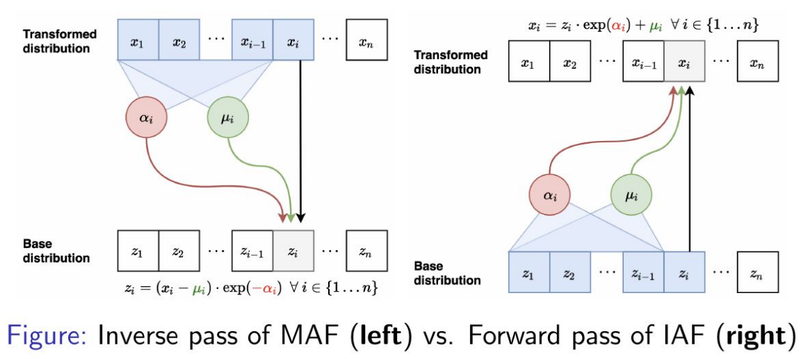</center>

Like MAF, IAF [5] is a normalizing flow which uses MADE [6]. Each layer of IAF is defined by the following recursion:

```math
x_i = \mu_i \exp\alpha_i + \mu_i \text{ where } \mu_i = f_{\mu_i}(\boldsymbol{u}_{1:i-1}) \text{ and } \alpha_i = f_{\alpha_i}(\boldsymbol{u}_{1:i-1})
```

where similar to MAF, functions $\{ f_{\mu_i}, f_{\alpha_i} \}$ are computed using MADE [6] with Gaussian conditionals. The main difference between MAF and IAF is architectural. In MAF $\mu_i$ and $\alpha_i$ are directly computed from previous data variables $\mathbf{x}_ {1:i-1}$, whereas in IAF $\mu_i$ and $\alpha_i$ are directly computed from previous random numbers $\mathbf{u}_ {1:i-1}$.

The crucial difference between MAF and IAF lies in their computational trade-offs. MAF can calculate the density $p(x)$ of any data point $x$ in one pass through the model, but requires $D$ sequential passes to sample from it, where $D$ is the dimensionality of $x$. Conversely, IAF can generate samples and calculate their density in one pass, but requires $D$ passes to calculate the density $p(x)$ of an externally provided data point $x$. Therefore, MAF is more suitable for density estimation, while IAF is better suited for tasks where it only needs to calculate the density of its own samples, such as in stochastic variational inference.

A theoretical equivalence between MAF and IAF is that training a MAF with maximum likelihood corresponds to fitting an implicit IAF to the base density with stochastic variational inference.

#### Relationship with Real NVP

Real NVP [2] is a normalizing flow created by stacking coupling layers, where each layer transforms random numbers $\mathbf{u}$ into data $\mathbf{x}$ with a tractable Jacobian. In a coupling layer, the first $d$ elements are copied directly, while the remaining $D-d$ elements are scaled and shifted based on the first $d$ elements. This transformation is a special case of the autoregressive transformations used by MAF and IAF. Specifically, setting $\mu_i = \alpha_i = 0$ for $i \leq d$ and making $\mu_i$ and $\alpha_i$ functions of only $\mathbf{x}_ {1:d}$ (or $\mathbf{u}_ {1:d}$ for IAF) for $i > d$, recovers the coupling layer from the MAF and IAF transformations. Thus, MAF and IAF are more flexible generalizations of Real NVP, where each element is individually scaled and shifted based on all previous elements. The key advantage of Real NVP is that it can both generate data and estimate densities with a single forward pass, while MAF requires $D$ passes to generate data and IAF requires $D$ passes to estimate densities.

#### Results

Some generated and real images with MAF from MNIST and CIFAR-10. 

<center></center>

<center>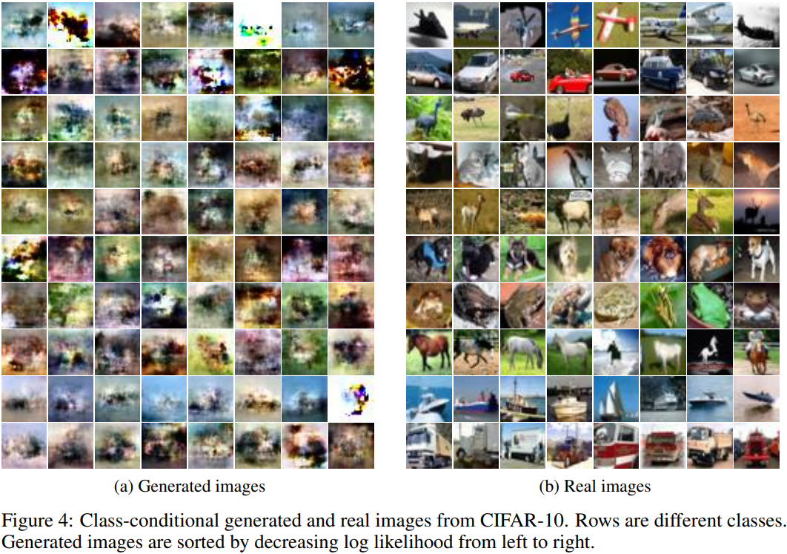</center>

### Parallel Wavenet

Parallel Wavenet [9] starts from the pain point of WaveNet not being well-suited for parallel computing due to relying on sequential generation. The paper introduces **Probability Density Distillation**, a method for training parallel feed-forward network from a pretrained WaveNet [8].

<center>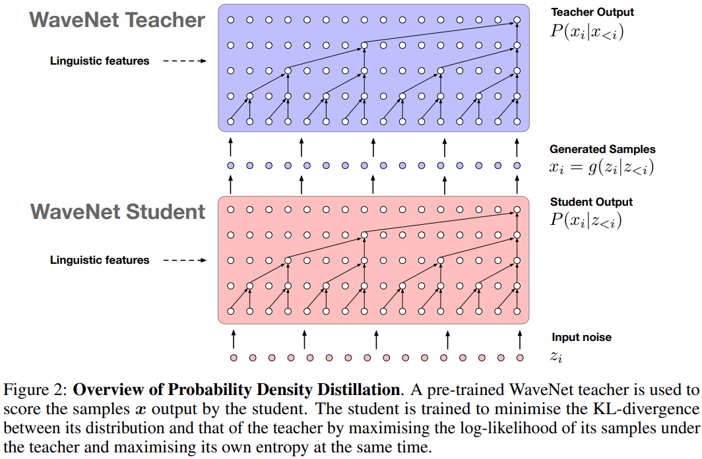</center>

Briefly, the main motivation of Parallel WaveNet [9] is to combine the efficient training capabilities of WaveNet [8] with the efficient sampling capabilities of Inverse Autoregressive Flows (IAFs) [5]. While WaveNet can model raw audio signals with high temporal resolution and process input samples in parallel during training, its sequential nature makes parallel sample generation impossible. IAFs, on the other hand, allow for parallel sampling but require sequential inference for likelihood estimation. Parallel WaveNet aims to leverage the strengths of both models by using a technique called Probability Density Distillation, a form of knowledge distillation (KD) [10],  where a trained WaveNet model acts as a teacher to a feedforward IAF model, enabling efficient training and sampling.

#### Parallelizing WaveNet

The authors chose Logistic distribution as a base distribution for IAF. Initially, a random sample is drawn $\mathbf{z} \sim Logistic(\mathbf{0}, \mathbf{I})$, and 

```math
x_t = z_t \cdot s(\mathbf{z}_{t'}, \theta) + \mu(\mathbf{z}_{t'}, \theta)
```

, where $t'=(1, 2, \cdots, t-1)$  The network outputs a sample $x$, $mu$ and $s$. Therefore $p(x_t \vert z_{t'})$ follows a logistic distribution parametrized by $\mu_t$ and $s_t$.

```math
p(x_t \vert z_{t'}, \theta) = \mathbb{L}(x_t \vert \mu_t(z_{t'}, \theta), s(z_{t'}, \theta) )
```

where $\mu_t(z_{t'}, \theta)$ and $s_t(z_{t'}, \theta)$ are the same convolutional autoregressive network structure as the original Wavenet [8].

#### Probability Density Distillation

Given a parallel WaveNet student $p_S(x)$ and WaveNet teacher $p_T(x)$, probability density distillation (PDD) is given as:

```math
D_{KL}(P_S \: || \: P_T) = H(P_S, P_T) - H(P_S)
```

where $D_{KL}$ is the Kullback-Leibler divergence and $H$ is the entropy/cross-entropy. The divergence approaches 0 as the student gets closer to the teacher's distribution. The entropy term is included to prevent the student collapsing to the mode of the teacher.

In the paper, authors also proposed additional loss terms: power loss, perceptual loss and contrastive loss, and conducted an ablation study which we do not get into detail here.

 The proposed model achieved several orders of magnitude speed-up compared to the original WaveNet with no significant difference in quality.

## Summary

### Fundamentals

1. Transform simple distributions into more complex distributions via change of variables. \
2. Jacobian of transformations should have tractable determinant for efficient learning and density estimation. \
3. Computational trade-offs in evaluating forward and inverse transformations.

### Modeling Perspective

1. Transformations or transformation approaches can be altered (e.g. NICE [1] and Real NVP [2]).
2. IAF and MAF are generalizations of Real NVP, where:
   - IAF: provides fast sampling, but slow in likelihood evaluation.
   - MAF: provides fast likelihood evaluation, but slow in sampling.
3. MAF is more suitable for training based on MLE, and for density estimation use cases while IAF is more suitable for real-time generation (fast sampling capability).
4. Parallel Wavenet combines autoregressive models that can learn and represents complex structures well having efficient training capability and IAF efficient sampling capability in a knowledge distillation schema. 

## References

**[1]** Dinh, L., Krueger, D., & Bengio, Y. (2014). Nice: Non-linear independent components estimation. arXiv preprint arXiv:1410.8516.

**[2]** Dinh, L., Sohl-Dickstein, J., & Bengio, S. (2016). Density estimation using real nvp. arXiv preprint arXiv:1605.08803.

**[3]** Ioffe, S., & Szegedy, C. (2015, June). Batch normalization: Accelerating deep network training by reducing internal covariate shift. In International conference on machine learning (pp. 448-456). pmlr.

**[4]** Papamakarios, G., Pavlakou, T., & Murray, I. (2017). Masked autoregressive flow for density estimation. Advances in neural information processing systems, 30.

**[5]** Kingma, D. P., Salimans, T., Jozefowicz, R., Chen, X., Sutskever, I., & Welling, M. (2016). Improved variational inference with inverse autoregressive flow. Advances in neural information processing systems, 29.

**[6]** Germain, M., Gregor, K., Murray, I., & Larochelle, H. (2015, June). Made: Masked autoencoder for distribution estimation. In International conference on machine learning (pp. 881-889). PMLR.

**[7]** Van Den Oord, A., Kalchbrenner, N., & Kavukcuoglu, K. (2016, June). Pixel recurrent neural networks. In International conference on machine learning (pp. 1747-1756). PMLR.

**[8]** Van Den Oord, A., Dieleman, S., Zen, H., Simonyan, K., Vinyals, O., Graves, A., ... & Kavukcuoglu, K. (2016). Wavenet: A generative model for raw audio. arXiv preprint arXiv:1609.03499, 12.

**[9]** Oord, A., Li, Y., Babuschkin, I., Simonyan, K., Vinyals, O., Kavukcuoglu, K., ... & Hassabis, D. (2018, July). Parallel wavenet: Fast high-fidelity speech synthesis. In International conference on machine learning (pp. 3918-3926). PMLR.

**[10]** Hinton, G., Vinyals, O., & Dean, J. (2015). Distilling the knowledge in a neural network. arXiv preprint arXiv:1503.02531.

**[11]** Rezende, D., & Mohamed, S. (2015, June). Variational inference with normalizing flows. In International conference on machine learning (pp. 1530-1538). PMLR.
